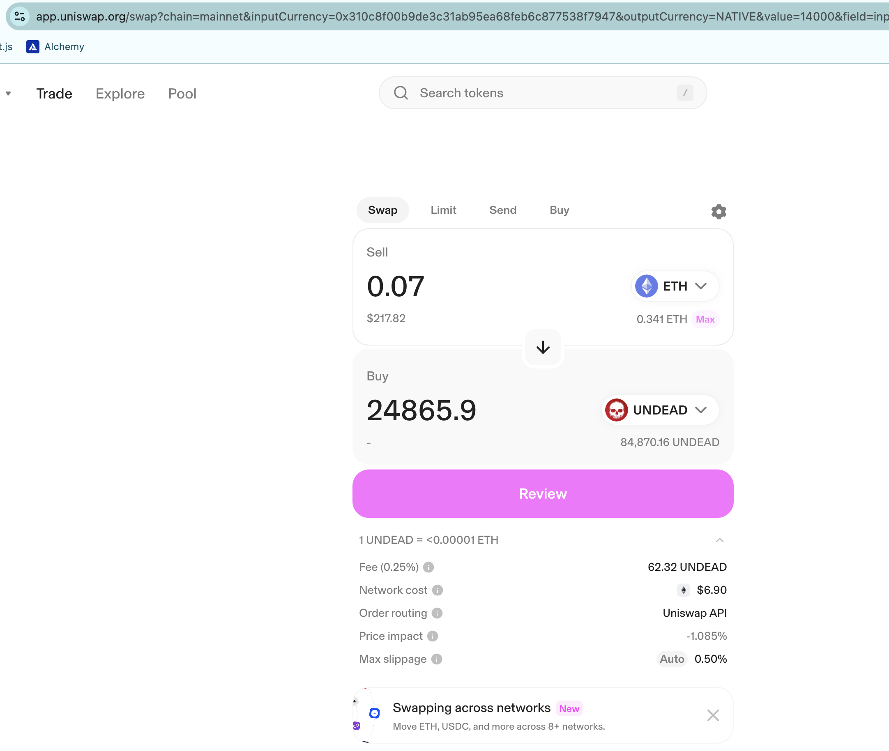
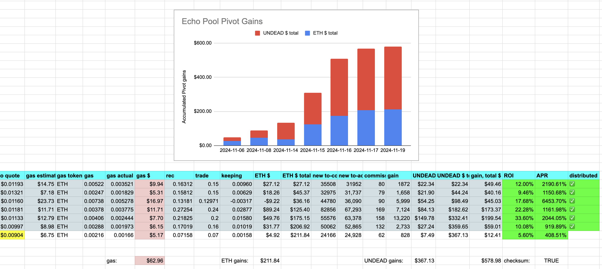
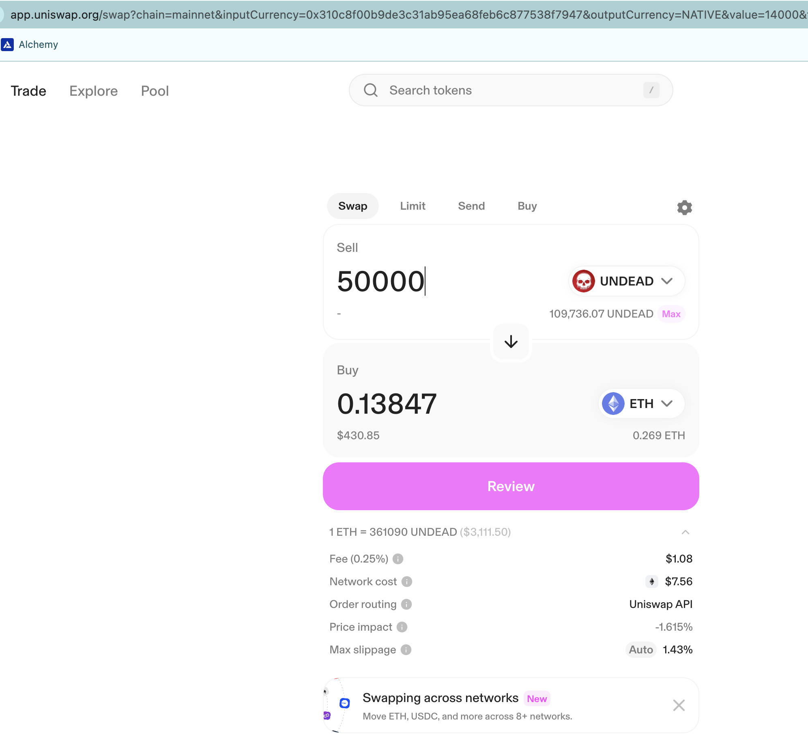
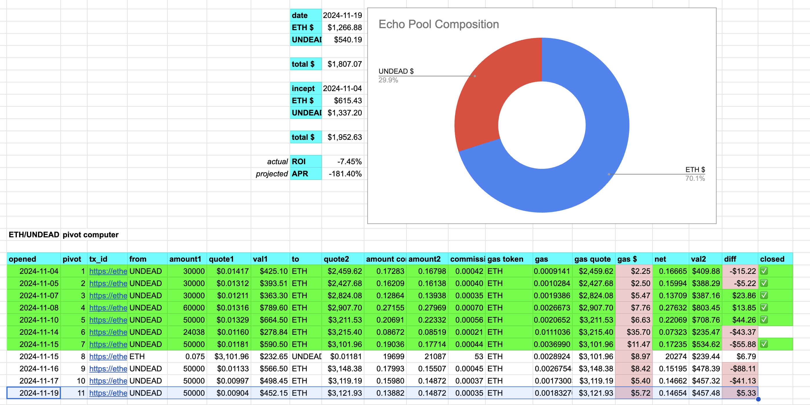

Did a meh-echo-pivot. That is to say, I created a pivot to absorb the (small amount of) reserve, and the gain here was 'meh,' but I pivoted just to get this meh-ness off the books.

Petty of me? Sure. Will the automated system be so petty? No, it'd keep this 'forever' on the books, or at least until there's a 10% ROI.

But, meh. Tiny pivot gone. I feel good, knowing I'm more meh than an automated system: two birds with one stone, I say!

(And I did make a little bit of $ETH and $UNDEAD in the pivot, so there's that.)

I'm not going to distribute these meh-gains until another pivot makes distribution, and their pre-calculations, viable.

I open a new echo pivot. 

