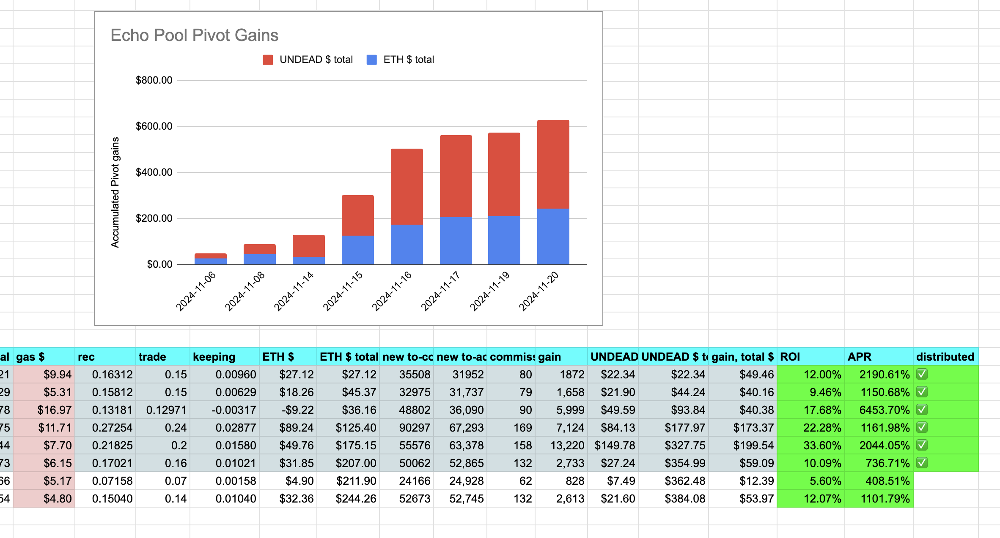
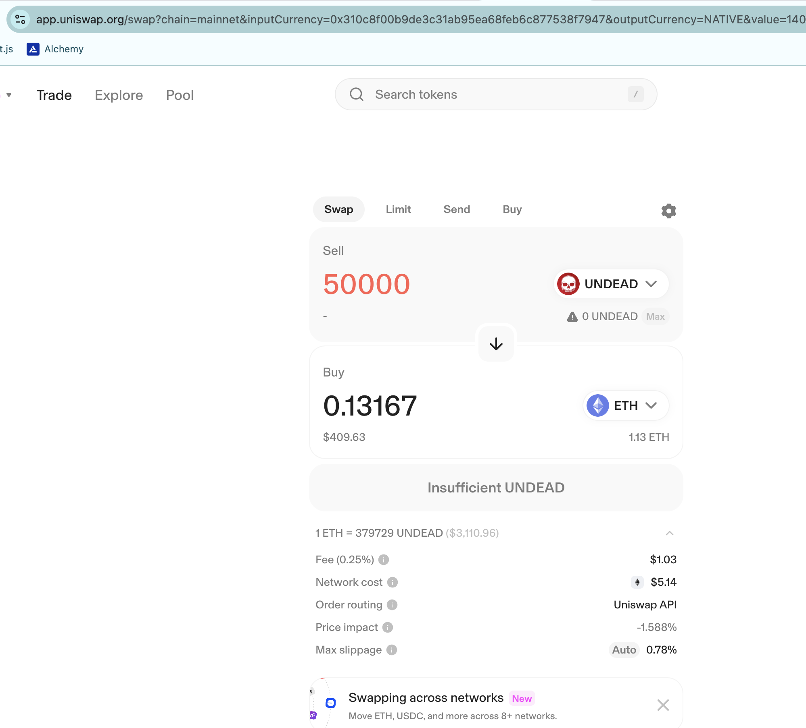
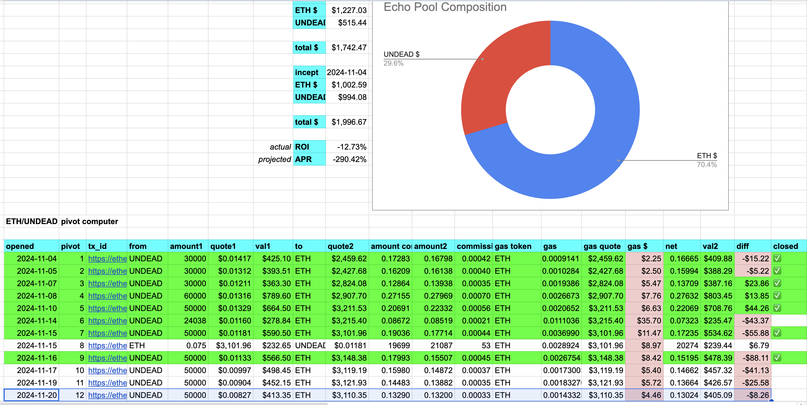
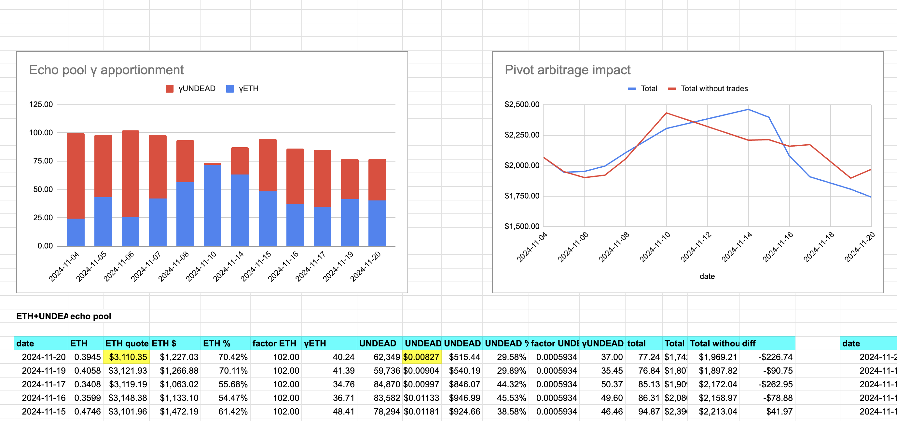

2024-11-20: I close an echo pivot at 12% ROI / 1.1k% APR and life is good! 

I open a new echo pivot and record that pivot. 

Here is the echo pool's status.

# Pivot pool activations

* The BTC+BNB pivot pool is now activated ... with 0.1 BNB. So I'm looking forward to Donors coming forward to fund this pool! YAY!

I bridged ~1 $ETH to Binance to activate the BTC+ETH pivot pool. I swapped 0.5 $ETH (half) for 0.017 $BTC ... our first bit o' $BTC!

... I'll update the stats on the protocol this morning.

(... none too soon, apparently! 😅)
