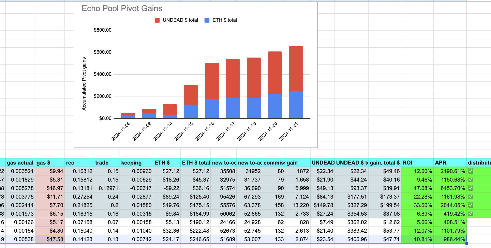

2024-11-21: I close an echo pivot for a 10% ROI / 984% APR.

I open a new pivot. 

I started with 0 $ETH in this pool. Pivot by pivot I'm BUIDL'n a stronger $UNDEAD position (by buying $UNDEAD with $ETH, ... but I'm also keeping a wee bit o' $ETH at each pivot, as well). 
