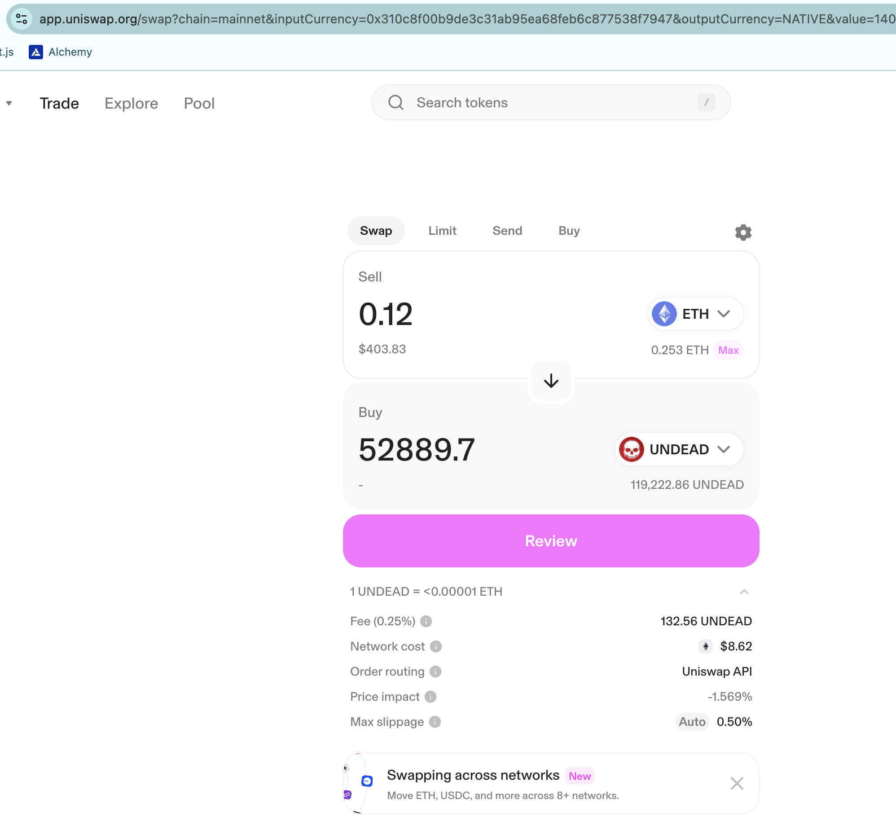
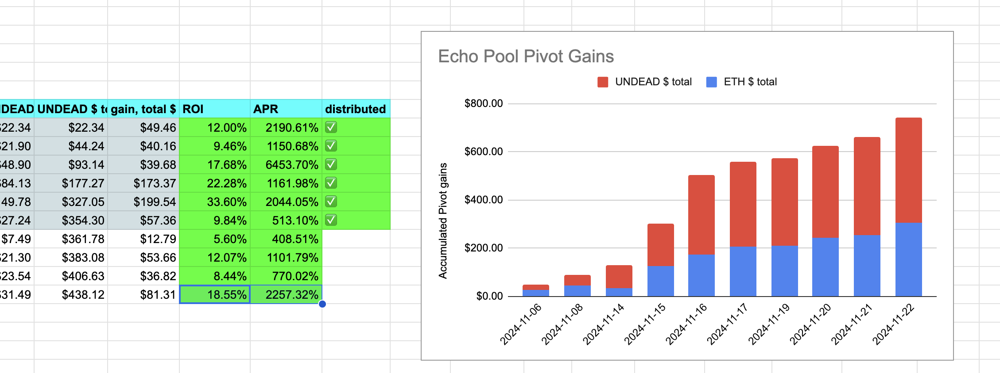
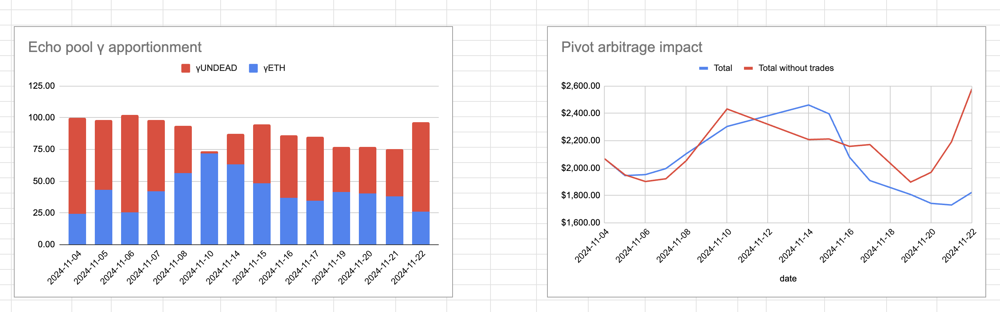
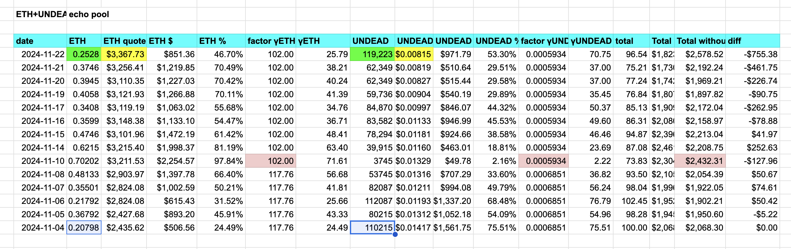

I closed another pivot this morning for a nearly 20% ROI. What's interesting here is that we started with 0.2 $ETH and 100k $UNDEAD in the Echo pool, and now, today, we have more of both.

That's the magic of pivoting. Over time, both your assets grow, slowly but surely, and by slowly, I mean 10%-20% ROI. 🤣

# Meeting

Part of the work of the protocol is evangelization, or getting the word out. [Met with a potential client](https://github.com/pivoteur/biz/tree/main/meetings/2024/11/22).
