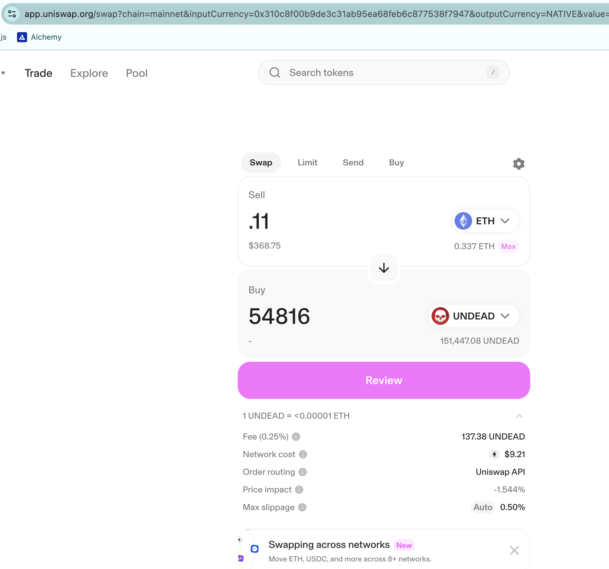
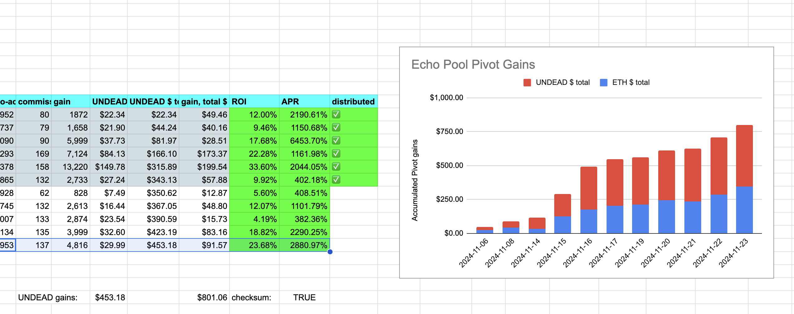

2024-11-23: The first thing the protocol does is to transfer some of the reserve $UNDEAD to $ETH for one of the pools (in this case: BTC+DOGE pivot pool)

AND THEN! I close a pivot on the Echo pool for an ROI of 23% / 2.9k% APR. Not bad! Not bad!

