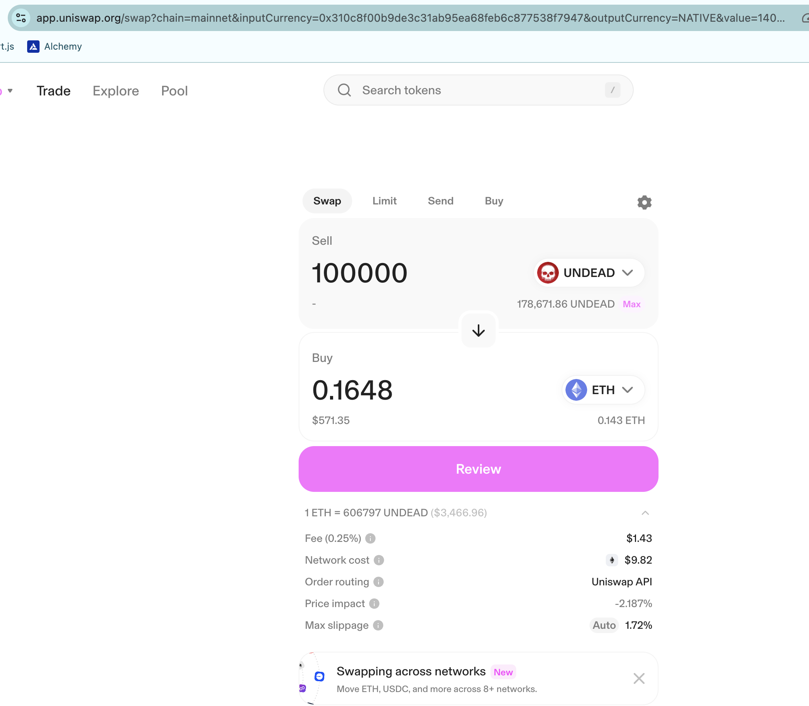
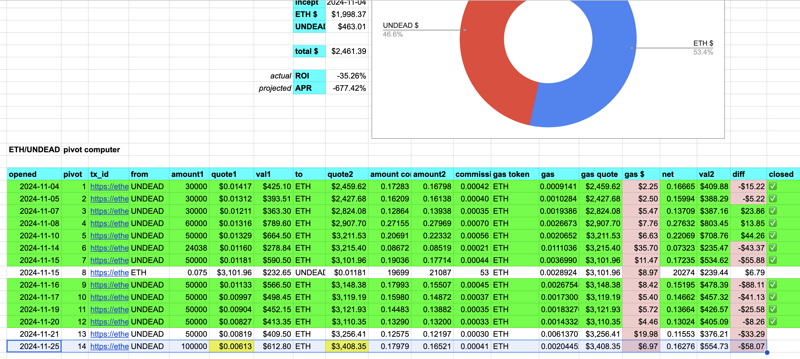
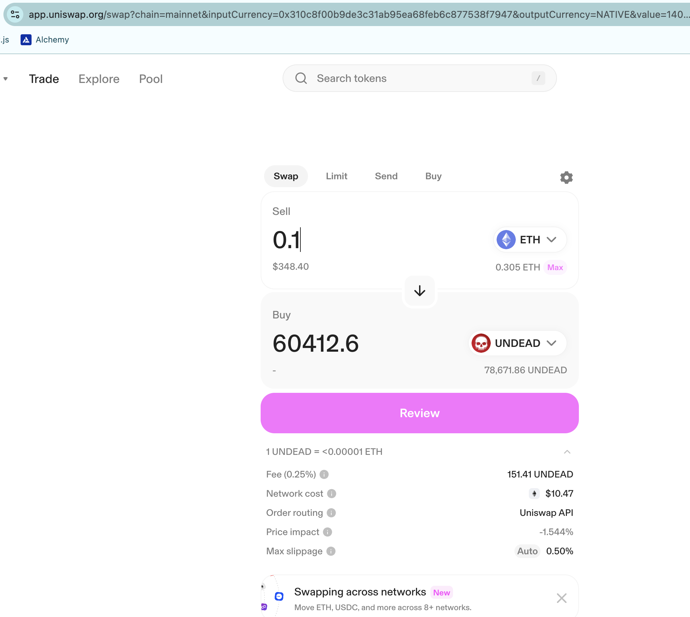
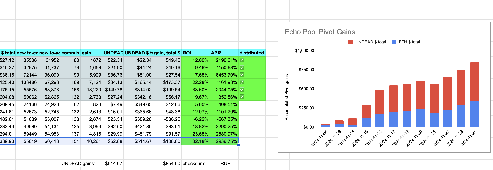
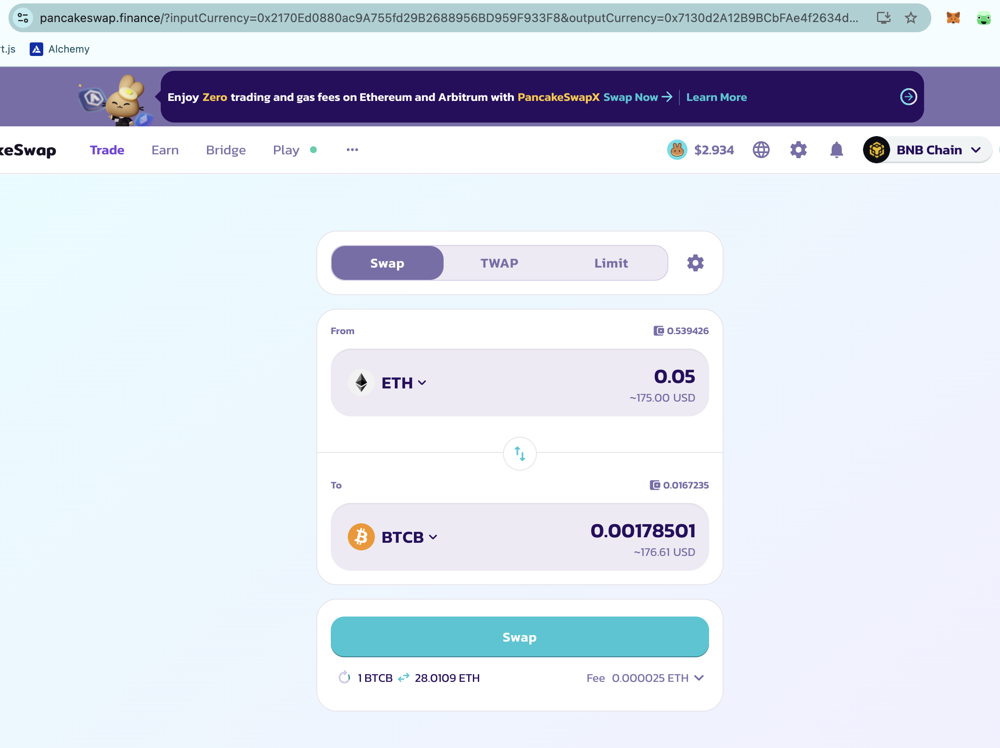
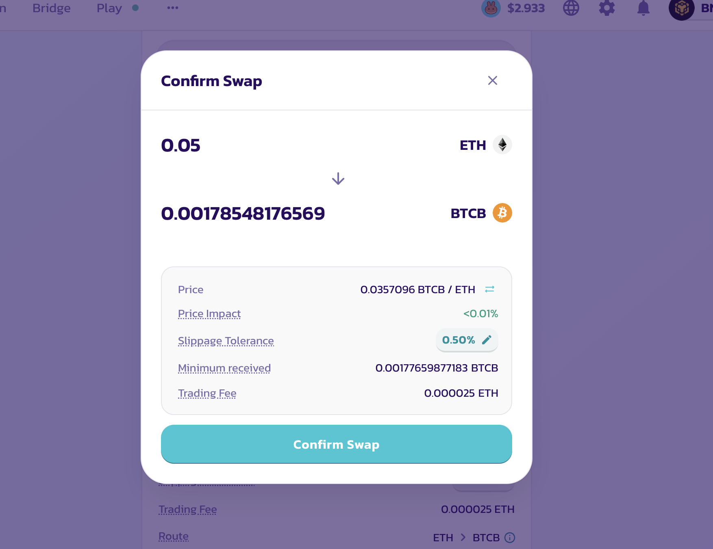
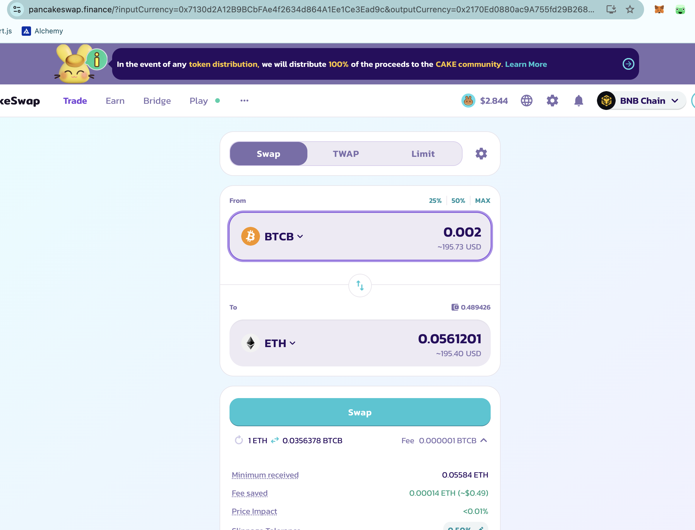
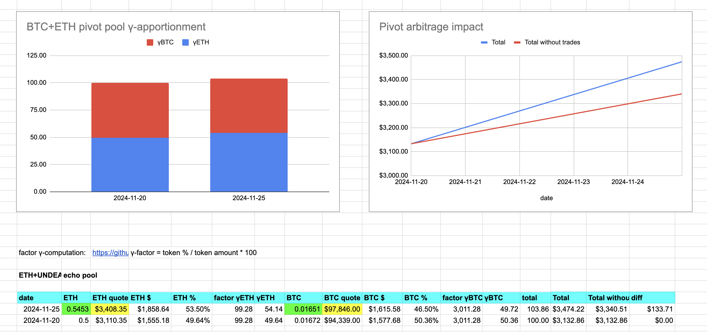

# `./otto`

2024-11-25: first thing we do is ./otto-convert $UNDEAD to $ETH. There's high slippage at $1000-swap, so I dial it back to $800-worth of $UNDEAD.

# Open Echo Pivot

I did a simulation to close the last open Echo pivot, and it went well (the simulation). Since I know I'll close that pivot, then, I open a new Echo pivot, keeping the pipeline primed. 

I record the open echo pivot information into my spreadsheet.

# Close Echo pivot

So, now I close the prior echo pivot for a HOLY SCHNITZENGRUBEN 32% ROI?!?!? 

Yeup. 

# TODOs

So, echo pivots are working, consistently. Great!

Lots to be done:

1. uniformize presentation of website
2. Create a donors-page from data
3. move staker's page (actually: the pools' page) to data-driven display (automate)
4. templatetize pool-page from data
5. Create video of HOWTO donate and HOWTO stake into the protocol
6. Move converted liquidity from reserve wallets to pool wallets
7. start pivots on converted liquidity in pools.
8. represent triple-pivot-pools, e.g.: BNB-LTC-LINK Æsthetically.

Hm. Maybe I can look at 7, in the BTC+ETH pivot pool right now...? Yes, I'll open a pivot for each asset right now.

BTC+ETH Pivot pool established on BSC with first two open pivots done on Pancake swap, which gets better returns than Uniswap.

Now to do the remaining pivot pools! YAY! 🎉
