# `./otto`

2024-11-26: TUESDAY? of THANKSGIVING WEEK???

I swap 170k $UNDEAD to $ETH. Unfortunately, 'acceptable slippage' on Uniswap is now more than $100 on what should have been $800 worth of $ETH. Oh, well.

I do the swap, anyway, to BUIDL self-generating liquidity within the Pivot protocol.

# Open Echo Pivot

I see a good close echo pivot when I simulate it, so, before I close a pivot, I open a new echo pivot and record the transaction.

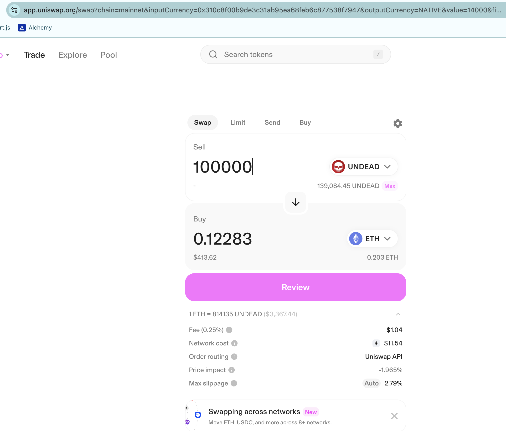
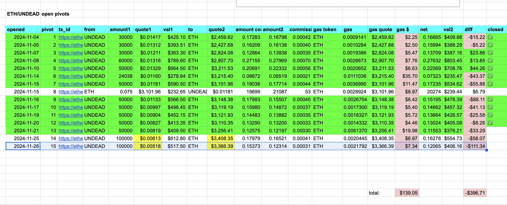

# Close Echo pivot

So, now I close the echo pivot for a 12k $UNDEAD gain. I'm growing my $UNDEAD in this pool, which is good, as that is the point of the Echo pool. 

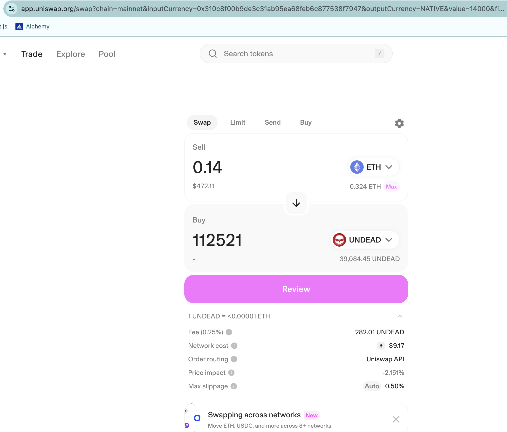
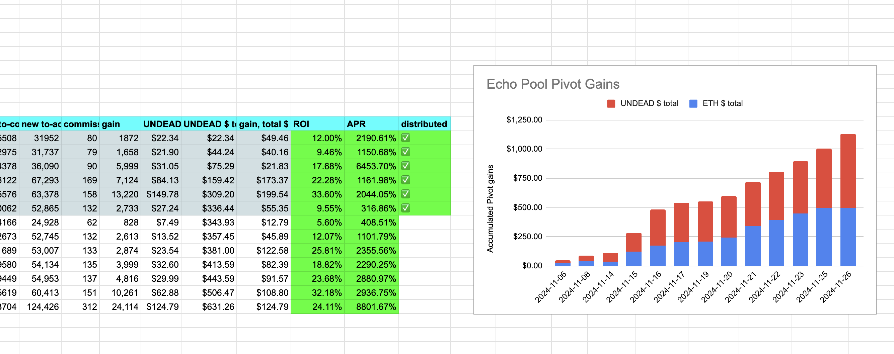
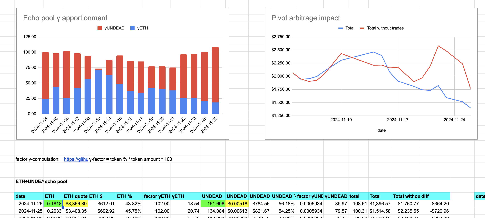
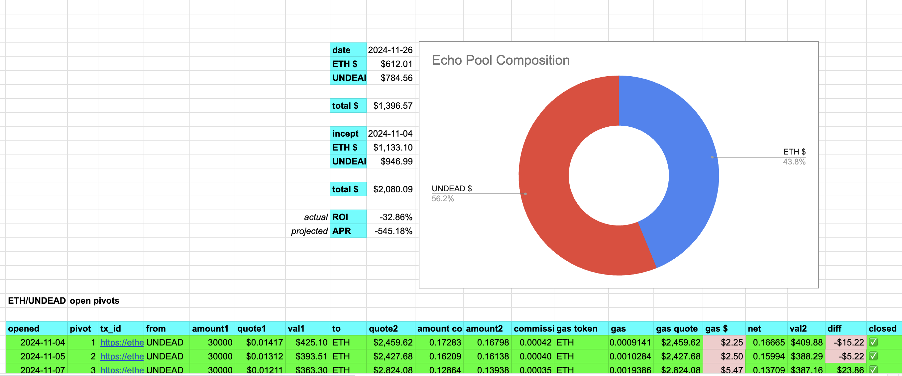

Next: to grow value of the $UNDEAD token, and that will start when I'm buying more $UNDEAD than what I'm selling, which means after the pivot pools are established.

# Establishing new Pivot pools

There's no pivot on the BTC+ETH pivot pool. 

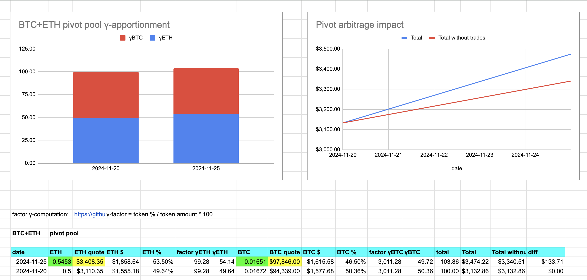

Let's move onto establishing the other pivot pools!

## BTC+BNB Pivot pool

Establishing the BTC+BNB pivot pool:

1. I move the liquidity from the reserve-wallet to the pool on Ethereum

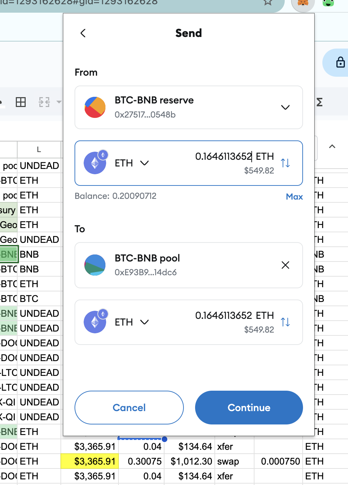

2. (I say, 'yes, transfer liquidity.')

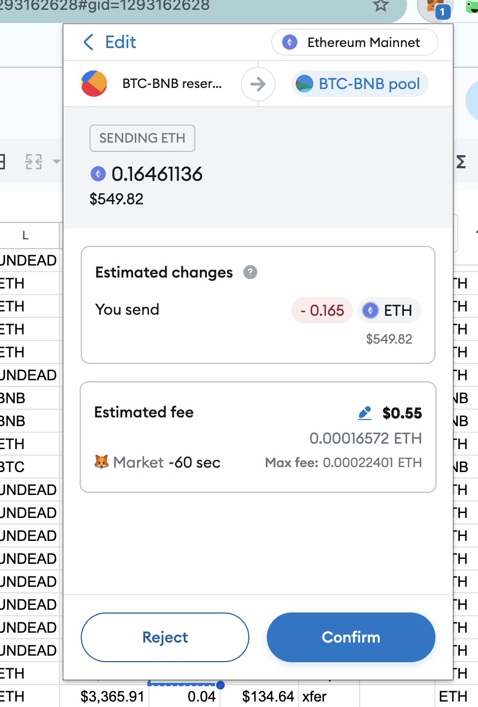

3. I bridge the liquidity to Binance

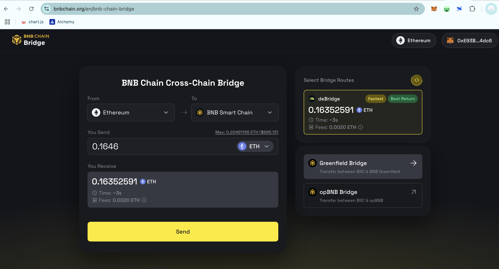

4. Assets on BSC: confirmed. 

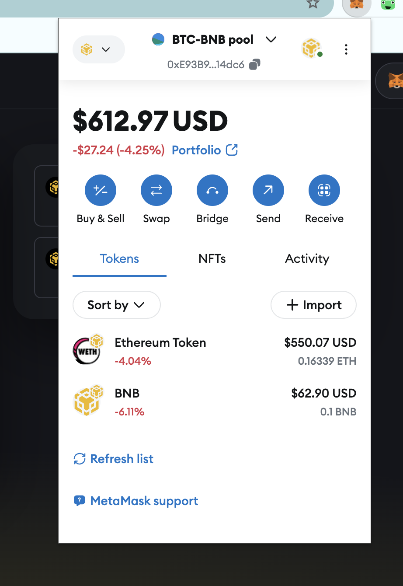

I open a pivot for both $BTC and $BNB to prime the pump, record those pivots, then tabulate everything on my protocol summary sheet.

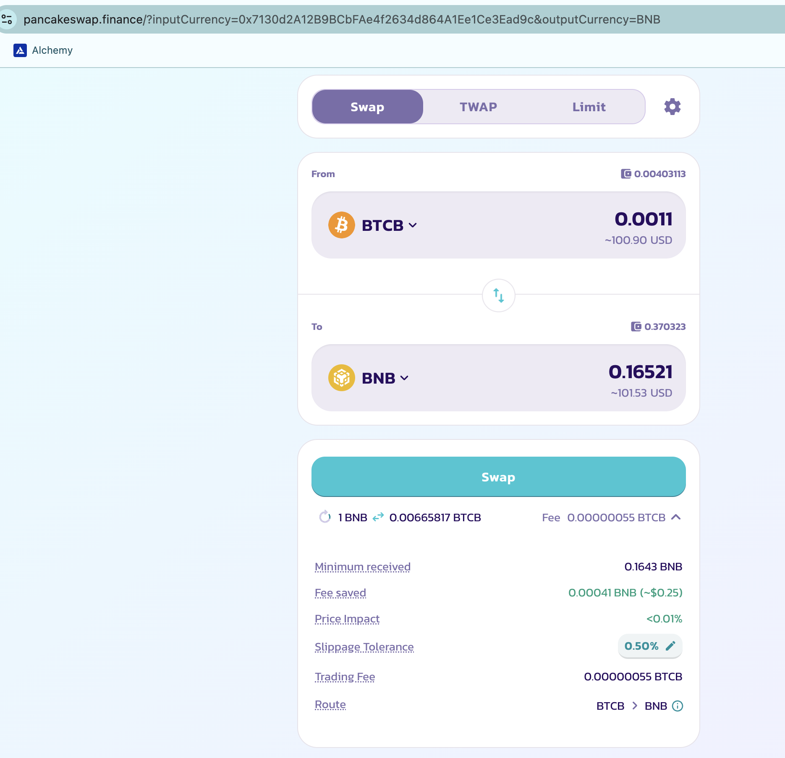
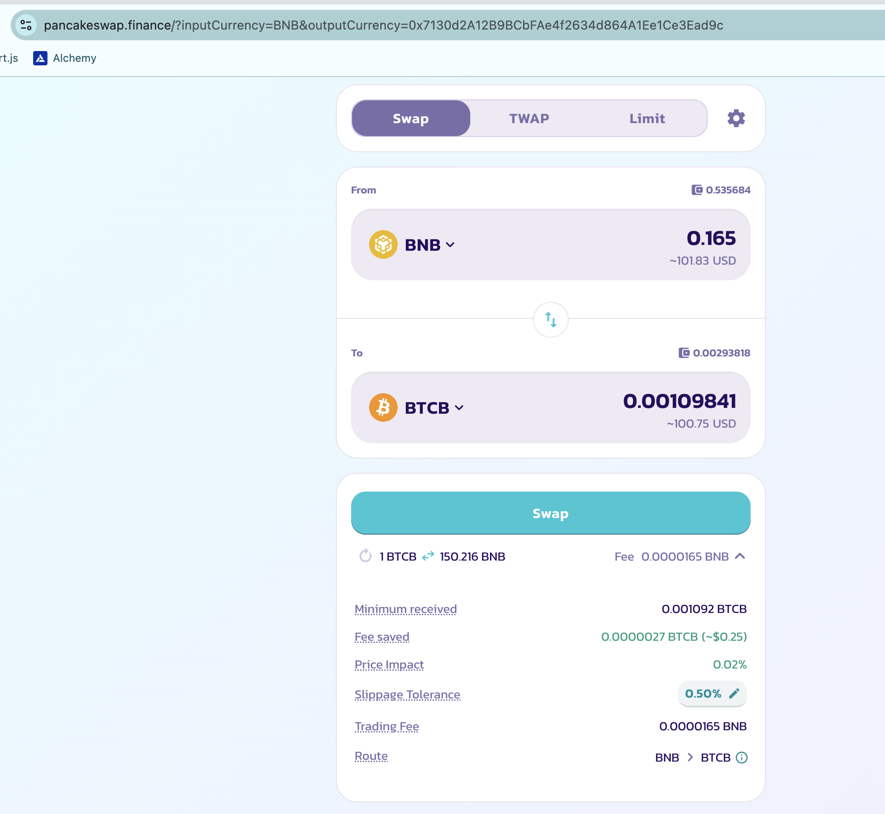
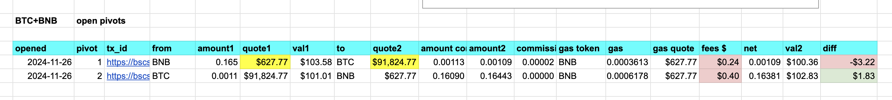
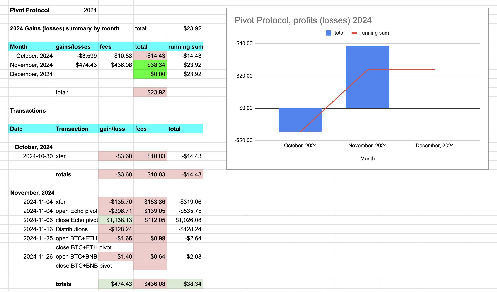

I 'LOVE' how Ethereum fees are over $400 already and Binance fees are just over $1. That's why the pivot pools are off the Ethereum blockchain.

This work --^ establishes the BTC+BNB pivot pool, which is now active.

Three more pivot pools to establish, ... but first: A NAP! AHA! 😎
