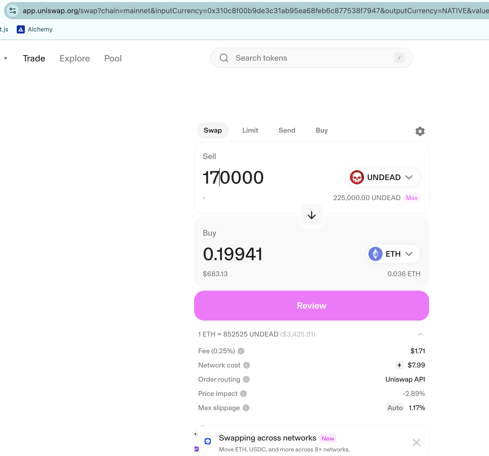
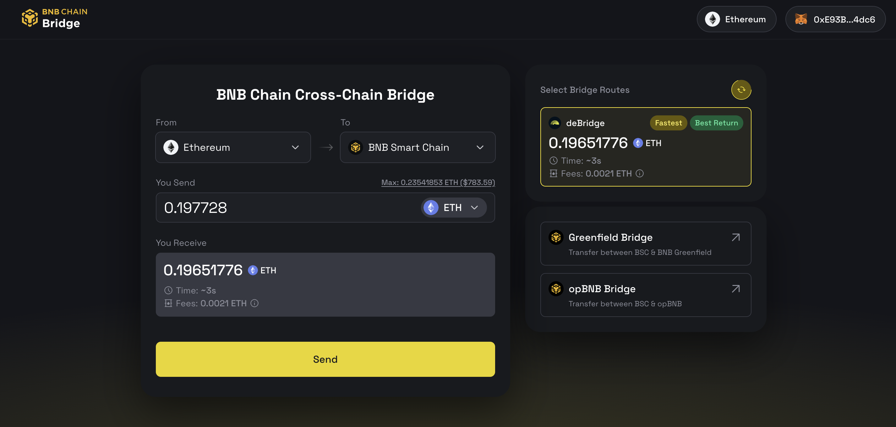

No Echo pivot today. I swap some $UNDEAD to $ETH and bridge it off-chain. Not shown, but I also transfer liquidity to Binance for the BTC+DOGE and BNB+LTC+LINK pivot pools and the AVAX+QI pivot pool on Avalanche. 

I'll establish those pools later this morning.
