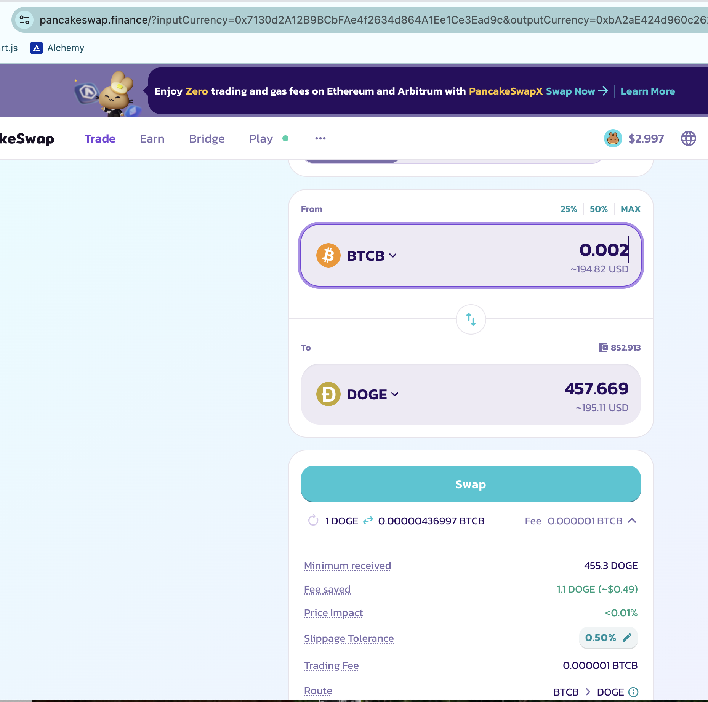

# BTC

I just saw [this chart on twitterz](https://x.com/MarketPalmer_/status/1862300447362441342) ... let's climb our way to the top 1%, eh? The pivot protocol will help us to do that.

# `./otto`

`./otto` transfers the last 55k $UNDEAD liquidity to $ETH for the BTC+BNB pivot pool; ... four more pools to complete. 

# Echo pivots

I simulate a close Echo pivot: looks good, so first I open a new Echo pivot, THEN close the pivot and record the results. 

The close pivot was 14% ROI / 1.7k% APR, btw. I'm quite pleased about that. I still must transfer liquidity and open pivots on the pivot pools. Once that becomes a well-oiled machine, I can start buying-back $UNDEAD in the Echo pool, which will put buy-pressure on $UNDEAD. This will take some time, but then we will chart growth from both pivots and $UNDEAD price re-gains.

# Establishing Pivot Pools

## BTC+BNB pivot pool

From the liquidity transferred from @ethereum to the BTC+BNB pivot pool on @binance, I swap half to $BTC and the other half to $BNB.

No close pivots for BTC+BNB today. 

## BTC+DOGE pivot pool

For the BTC+DOGE pivot pool, I convert the transferred $ETH to $BTC and $DOGE in equal parts (after I lend myself some $BNB for gas fees). 

After setting up the BTC+DOGE pivot pool, I open the first two pivots, one for $DOGE and one for $BTC.

This establishes the BTC+DOGE pivot pool with its calculated apportionment.

## BNB+LTC+LINK Pivot Pool

I set up the BNB+LTC+LINK pivot pool by swapping $ETH liquidity to each of the above assets on @binance @PancakeSwap. This gives the pivot pool apportionment as charted. 

Now, since the BNB+LTC+LINK pivot pool is a triple-asset pool, I need to establish the pool with 6 open pivot-trades, not 2 open pivot-trades, as for a two-asset pivot pool.

I'm not going to show the trades on @PancakeSwap, so, here are those recorded 6 establishing trades.

## AVAX+QI Pivot Pool

I take the $ETH-liquidity transferred from @ethereum to @avax and swap it to $AVAX and $QI on @LFJ_gg. This sets up the AVAX+QI pivot pool.

With the $AVAX and $QI I open their respective pivots in the pool. The pool apportionment settles thusly.

We now have 5 active pivot pools.

TODO: a data-driven summary page for these pivot pools.
