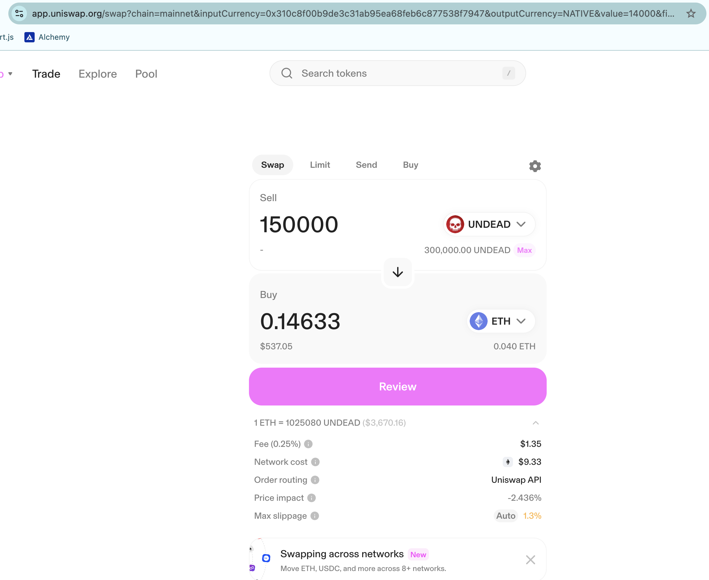
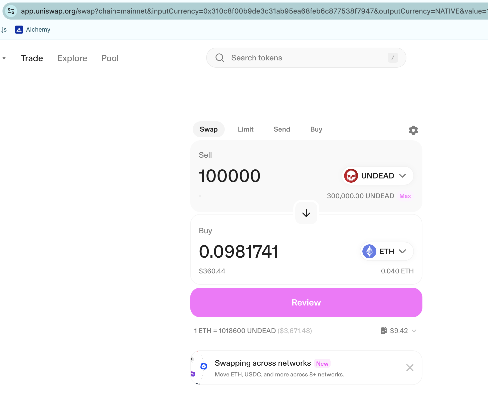
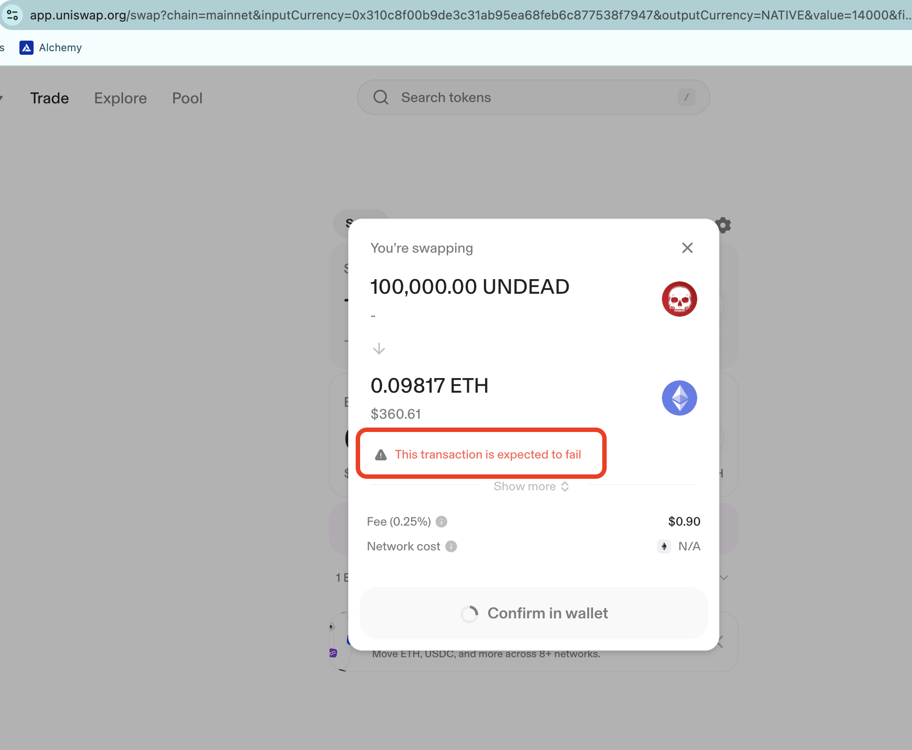

# No $UNDEAD swap on Uniswap

This is an unfortunate development. I'm now no longer able to swap $UNDEAD for $ETH on Uniswap. I get a 'transaction expected to fail' for both 150k and 100k $UNDEAD swap to $ETH. Swaps of less $UNDEAD are infeasible with Ethereum fees.

Luckily for me, I don't need to rely on fortune. I have 5 pivot pools established, both with $UNDEAD swaps and with donations, ...

AND I can continue to donate assets by pivoting my own private liquidity off-chain and off-protocol, doing (effectively) OTC swaps of assets I'll donate for $UNDEAD from the reserves.

So: an unfortunate development, but not one that is going to slow me down in the slightest.

