# Our first close pivots

## Close $BNB-on-$LINK pivot

2024-12-02: Our first pivot closed

0.16 $BNB -> $LINK -> 0.178 $BNB

ROI: 18.26% / 2221.11% APR

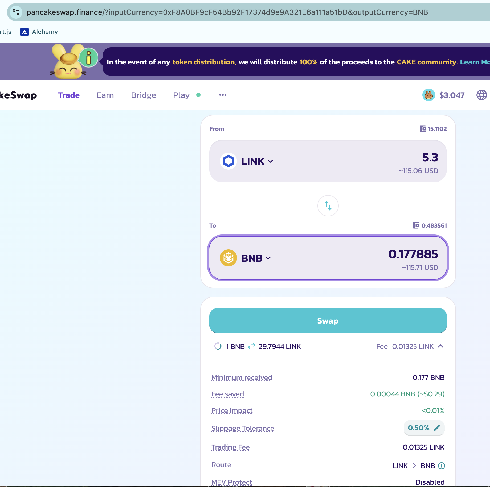

After closing the above pivot, I open a new $LINK on $BNB pivot and a new $BNB on $LINK pivot at this new min δ (-8.62).

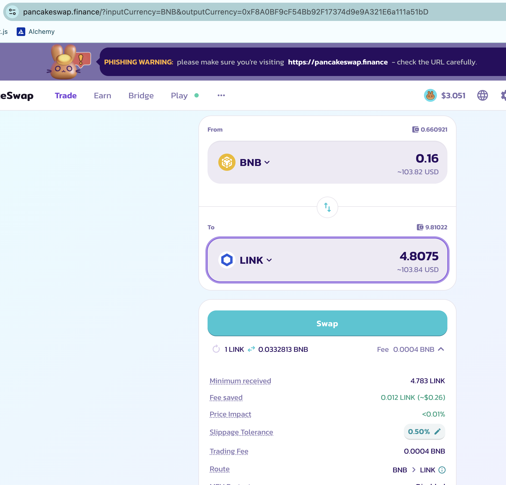

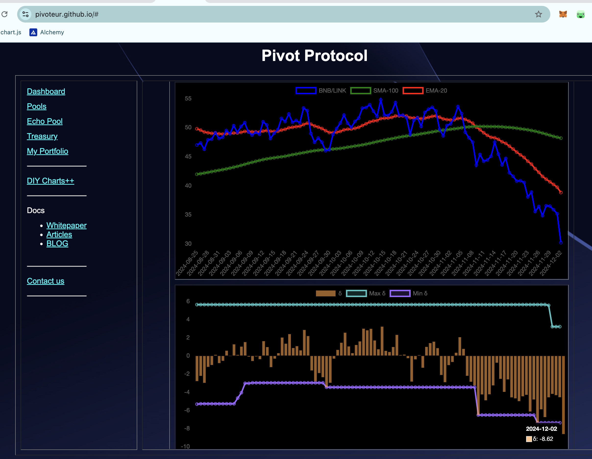

The markets are doing great. Pivots make them even greater.

## Close $BNB-on-$LTC pivot

Fast on the heels of the first close pivot is the second:

0.16 $BNB -> $LTC -> 0.1883 $BNB

ROI: 19.67% / 2393.24% APR

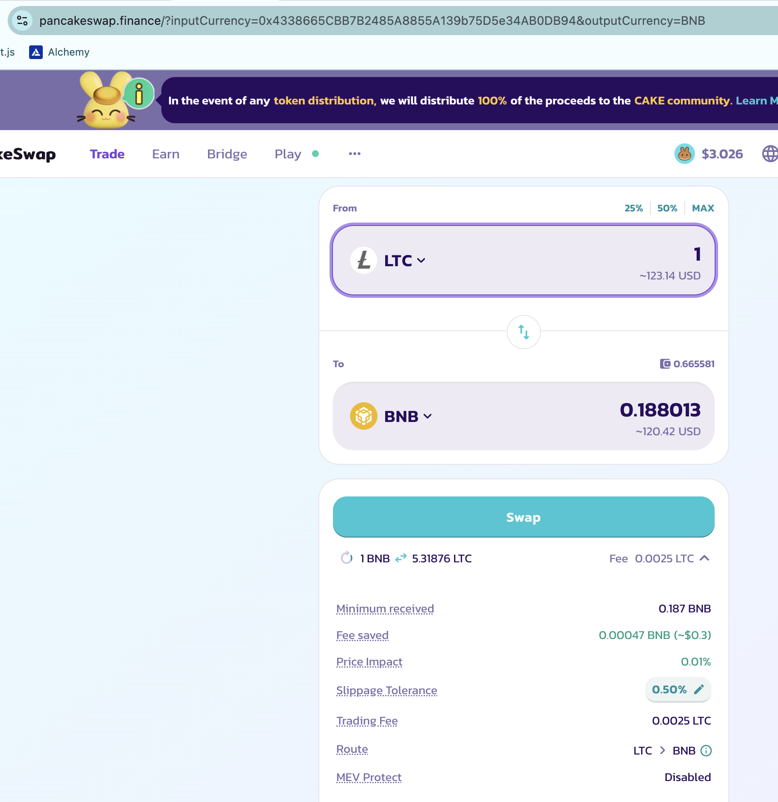

And, same: after closing this pivot, I open a new $BNB-on-$LTC pivot and a new $LTC-on-$BNB pivot with new min δ of -1.629.

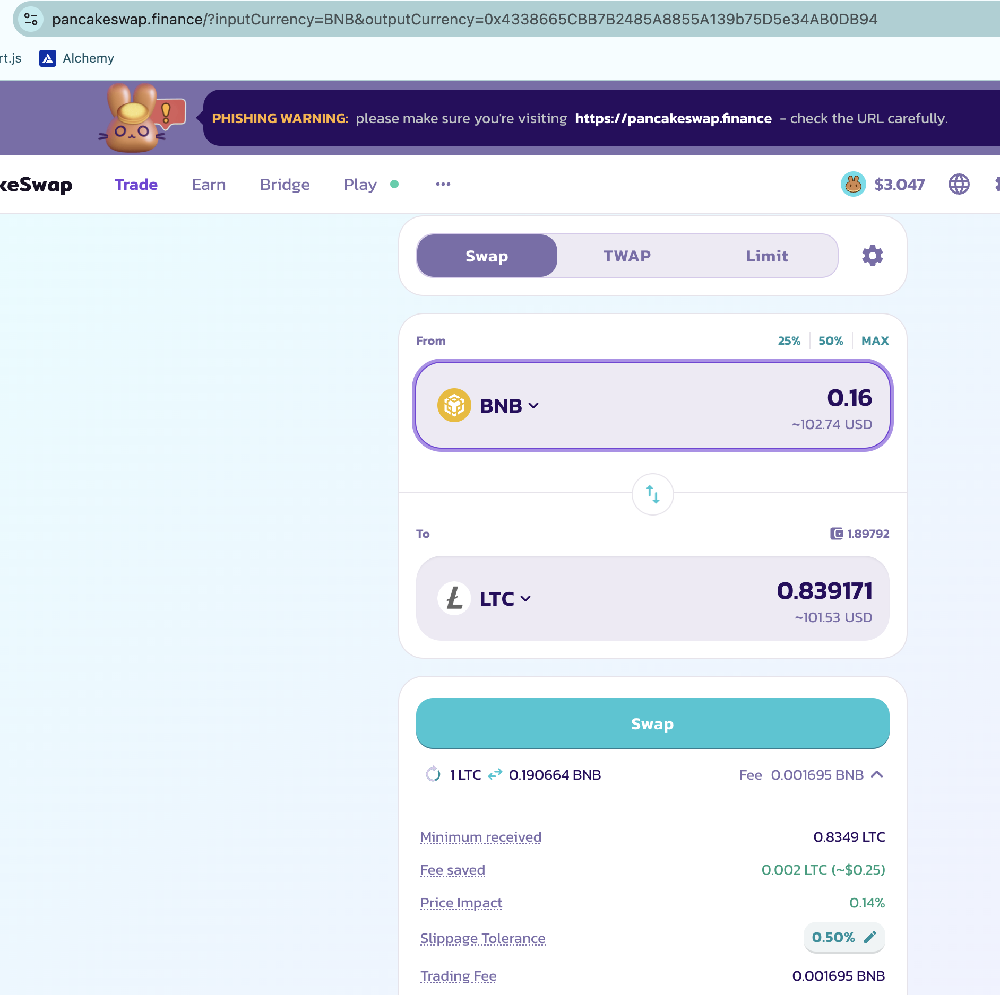
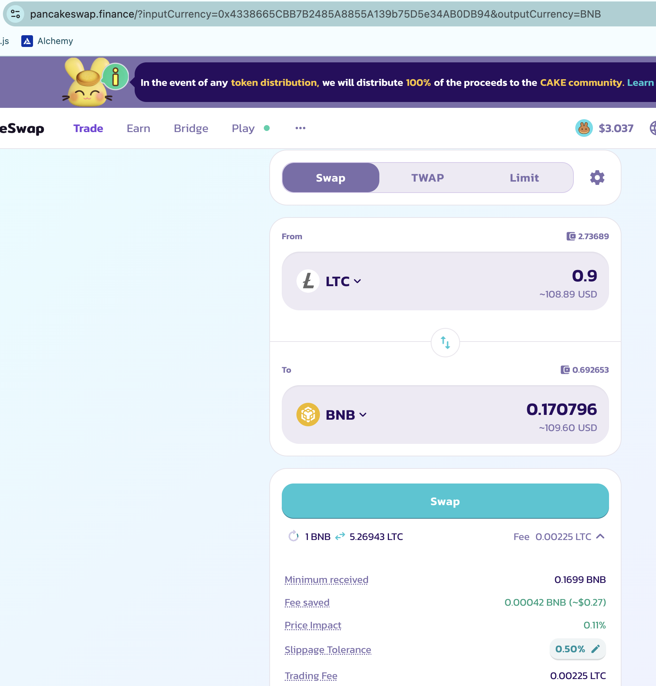
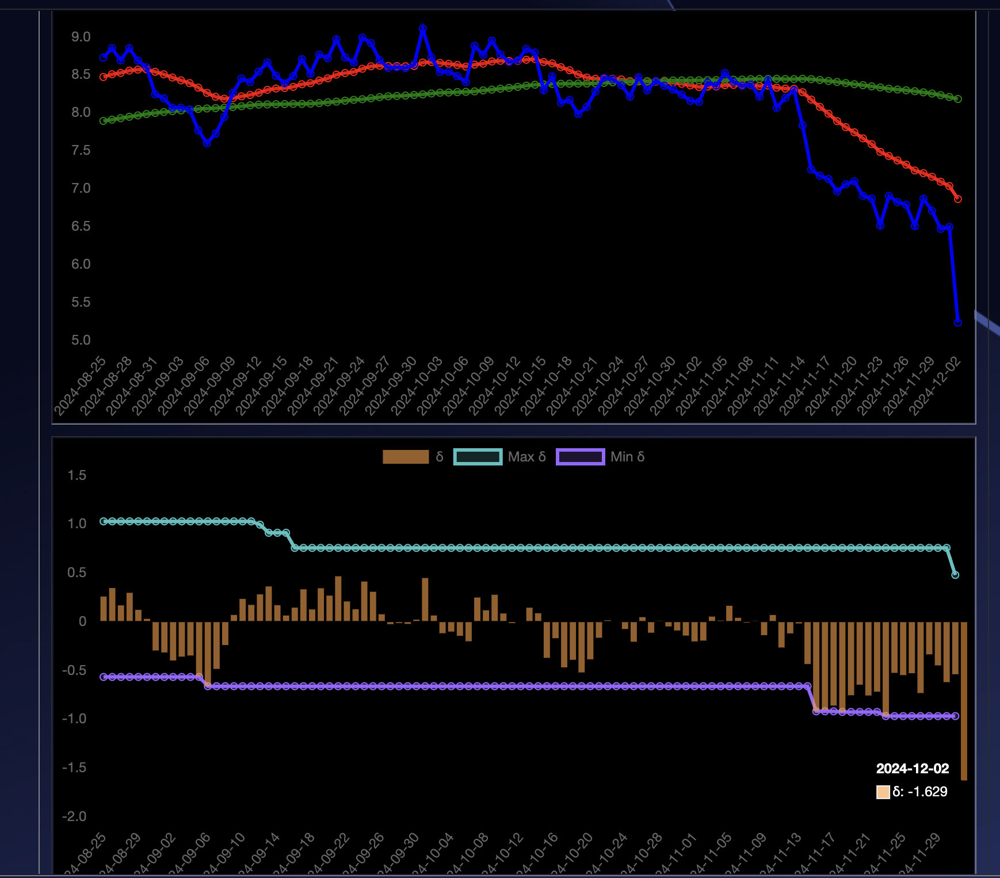

Pivots: they just work, fam. 

## Gains, Composition, Apportionment

After closing the pivots, and opening new ones, the gains and apportionment of the BNB+LTC+LINK pivot pool are as shown below.

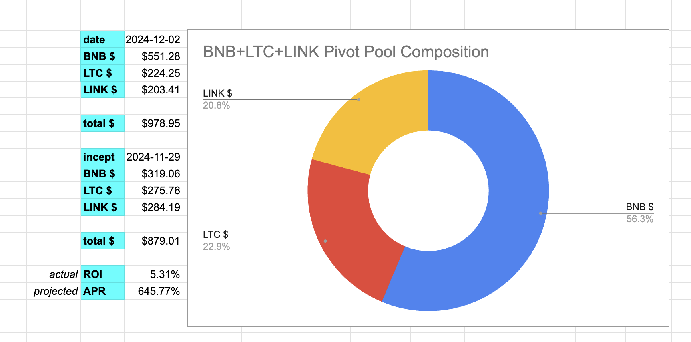
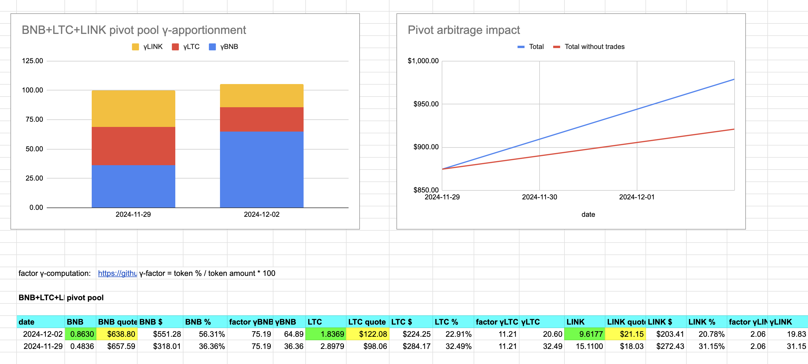

Now let's distribute the gains. 

## Distribution

Distributing the token-gains is per [this article](https://github.com/pivoteur/biz/blob/main/articles/distributions.md). I have a spreadsheet that computes the distributions. 

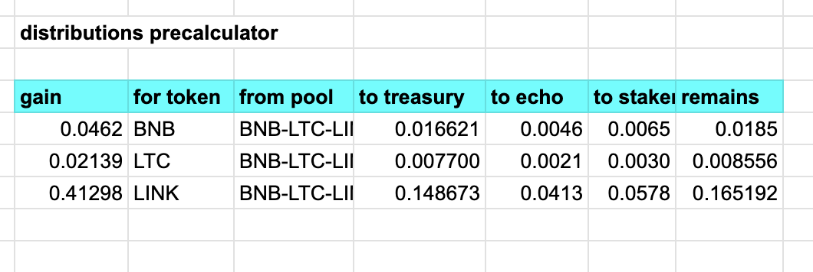

### Some problems with distribution

There are a few problems with 'distribute the tokens' that complicate the seemingly simple statement (... and now we know what 'S3' stands for).

1. First up, I don't have multiple-token send ...yet, so now I have to transfer the $BNB, $LTC, and $LINK transaction-by-transaction.

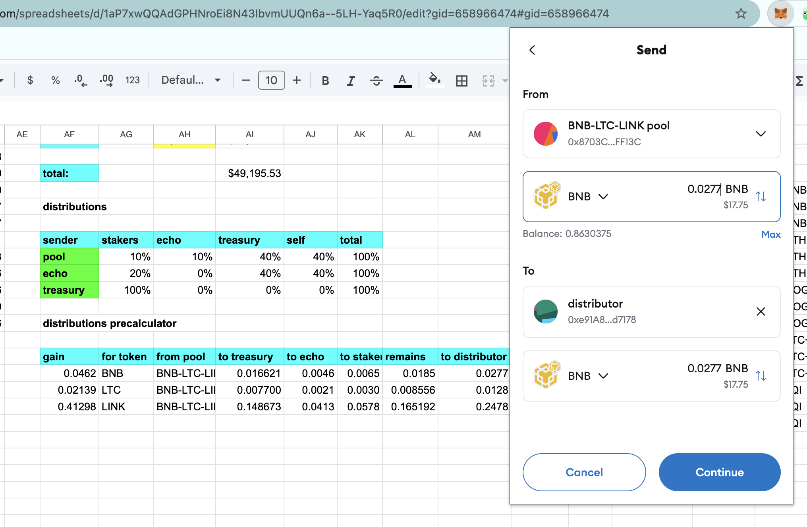

2. Secondly, once I got the $BNB (at least) to the distributor, I realized I have a dearth* of $BNB in my ecosystem. This vexed me more than it should, and I spent all night trying to figure a fair way to disiminate $BNB to all my addys. Then I realized donor has $BNB to spare.

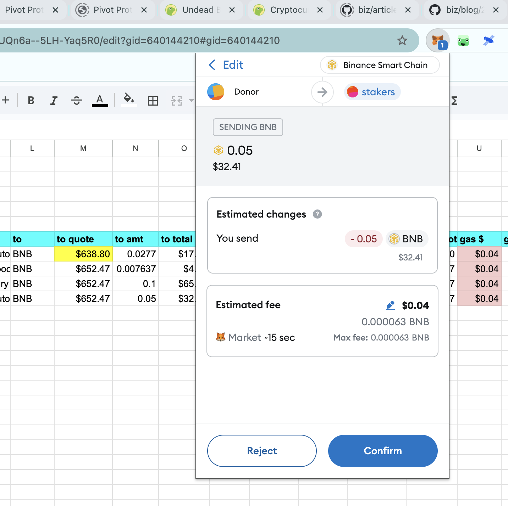

> side note: *Do you realize the etymology of 'dearth' is 'dear' (or 'expensive' or 'valuable' ... 'in the past' ('th' is 'ð' is modern-day 'ed').

So I simply SNED $BNB from the donor-addy to the various addresses in the protocol.

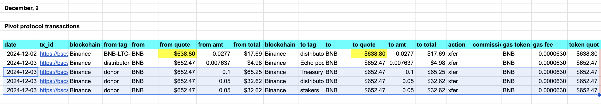

Since I don't have 'send-to-multiple-addresses', ... yet, I send some $BNB to each address, transaction-by-transaction. 

Okay, so that takes care of the $BNB. What about the $LTC and $LINK. Well, since their gains are less than $4.00, and transaction fees are ~4¢, I'm not going to distribute dust.

Distributions must be > 100x gas fees.

Distributions: done. It took a day, but still: done. ✅

This leads to the next problem.

3. The Echo pool is ETH+UNDEAD on @ethereum, so I need to convert the distributed $BNB to $ETH then bridge that to @ethereum. The problem with that are swap and bridge fees. I need at least $100 to make this a viable transaction.

So, for now, I'll let the $BNB in the Echo pool wallet, on @binance, sit. When it grows to more than $40, I'll swap. When the pooled $ETH grows to, say, more than $1,000, I'll bridge that back to @ethereum to pivot within the Echo pool.

The. End.

# TODOs

(so, not quite 'The. End.')

1. Represent pivot pools from data on protocol website
2. Represent triple-asset pivot pools
3. update and upload data sets

