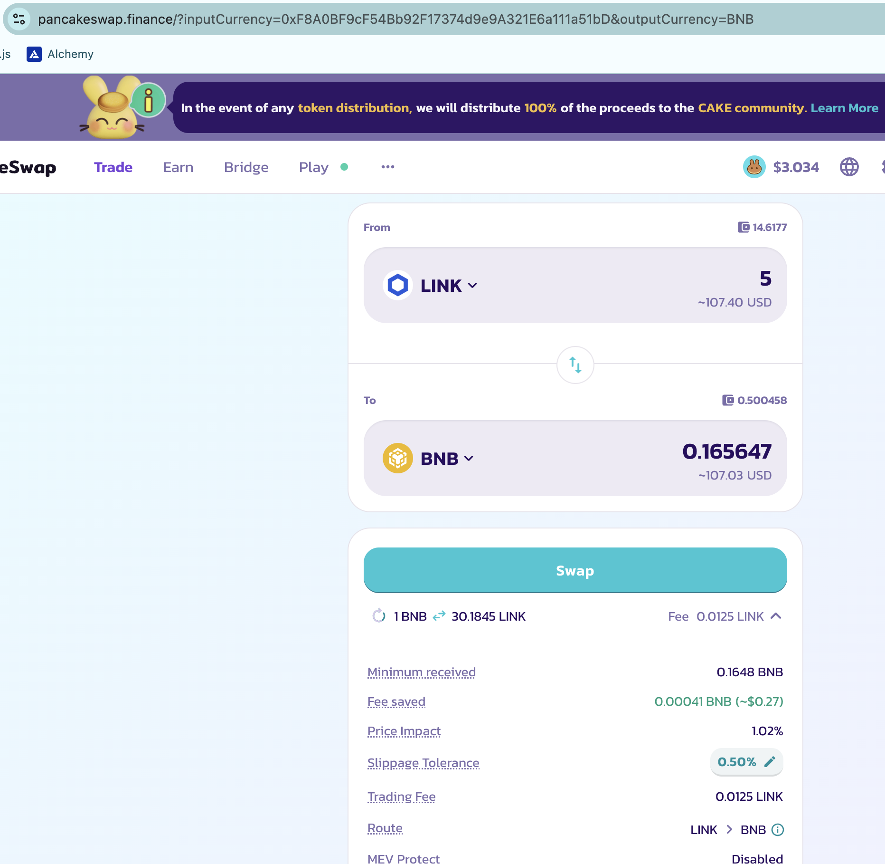
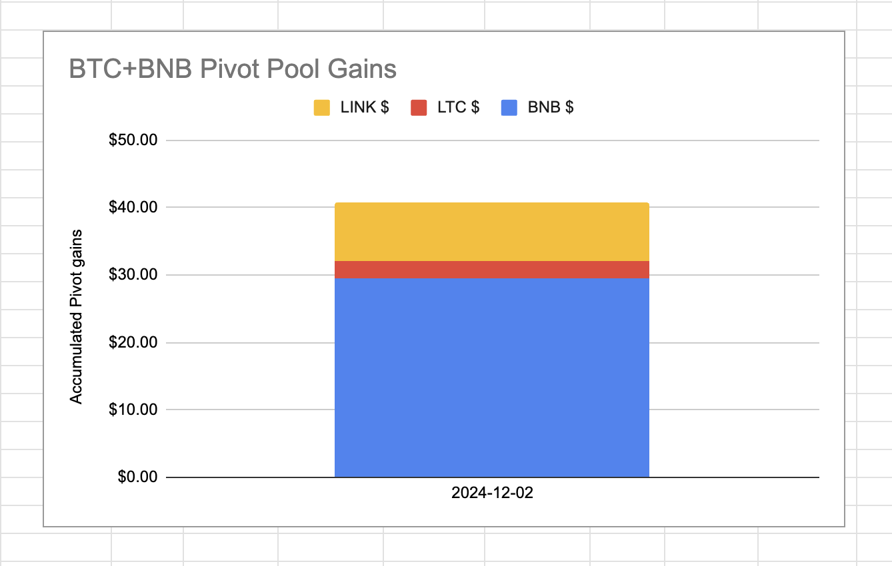

# Our first close pivots

## Close $BNB-on-$LINK pivot

2024-12-02: Our first pivot closed

0.16 $BNB -> $LINK -> 0.178 $BNB

ROI: 18.26% / 2221.11% APR

After closing the above pivot, I open a new $LINK on $BNB pivot and a new $BNB on $LINK pivot at this new min δ (-8.62).

The markets are doing great. Pivots make them even greater.

## Close $BNB-on-$LTC pivot

Fast on the heels of the first close pivot is the second:

0.16 $BNB -> $LTC -> 0.1883 $BNB

ROI: 19.67% / 2393.24% APR

And, same: after closing this pivot, I open a new $BNB-on-$LTC pivot and a new $LTC-on-$BNB pivot with new min δ of -1.629.

Pivots: they just work, fam. 

## Gains, Composition, Apportionment

After closing the pivots, and opening new ones, the gains and apportionment of the BNB+LTC+LINK pivot pool are as shown below.

Now let's distribute the gains. 

## Distribution

Distributing the token-gains is per [this article](https://github.com/pivoteur/biz/blob/main/articles/distributions.md). I have a spreadsheet that computes the distributions. 

