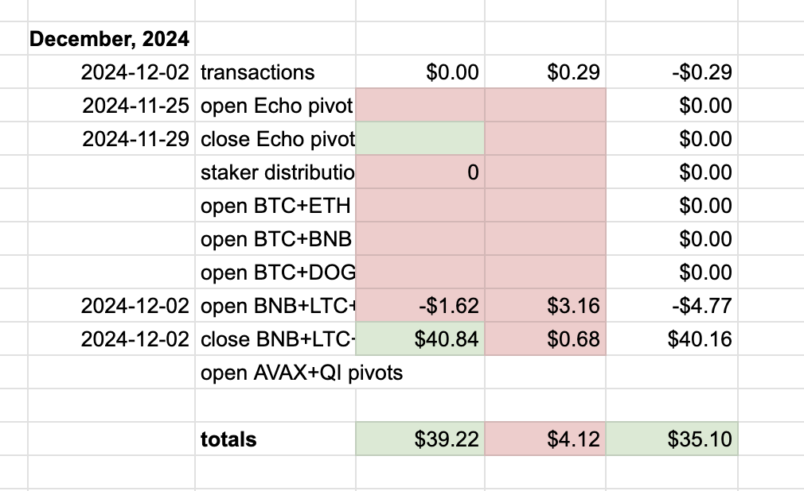
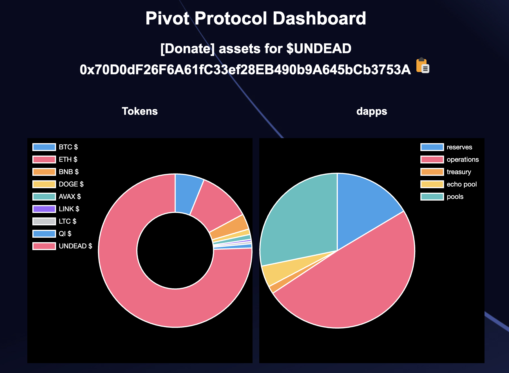
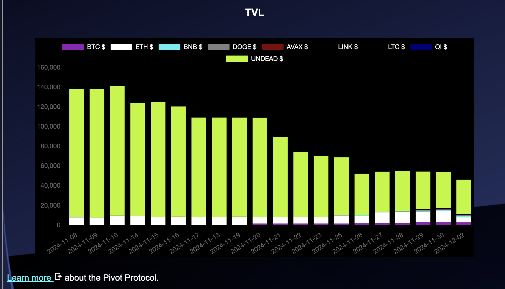
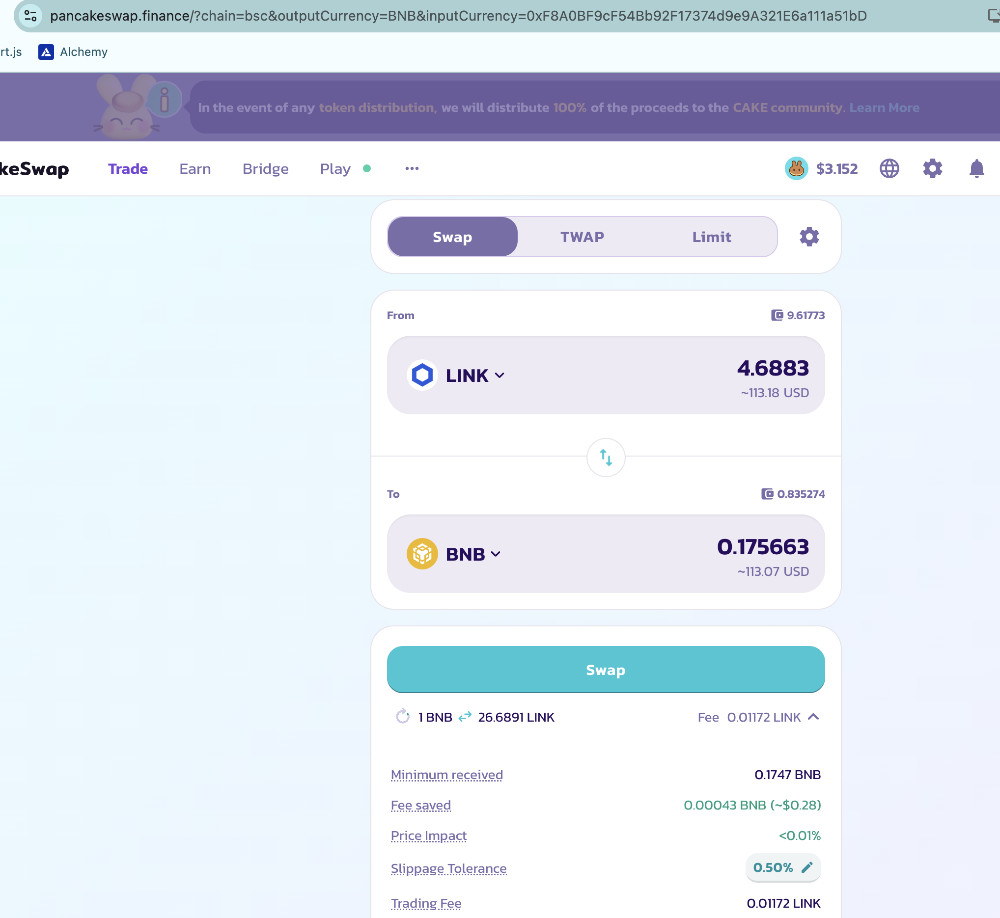
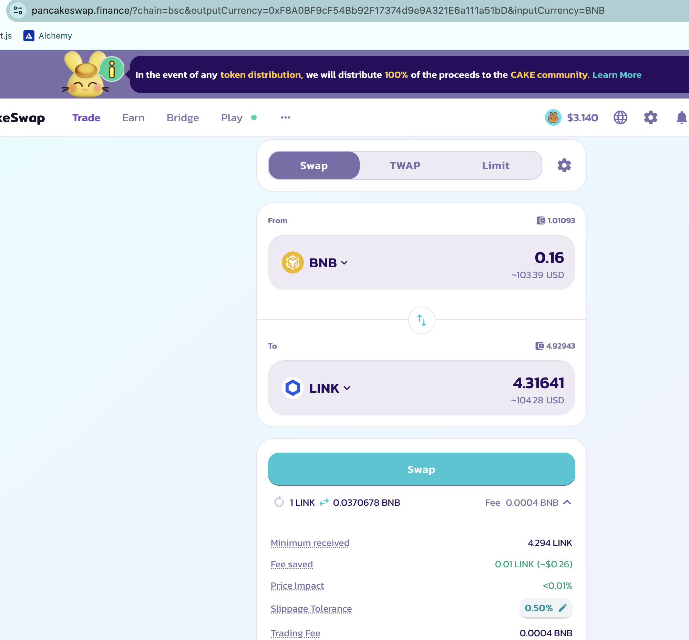
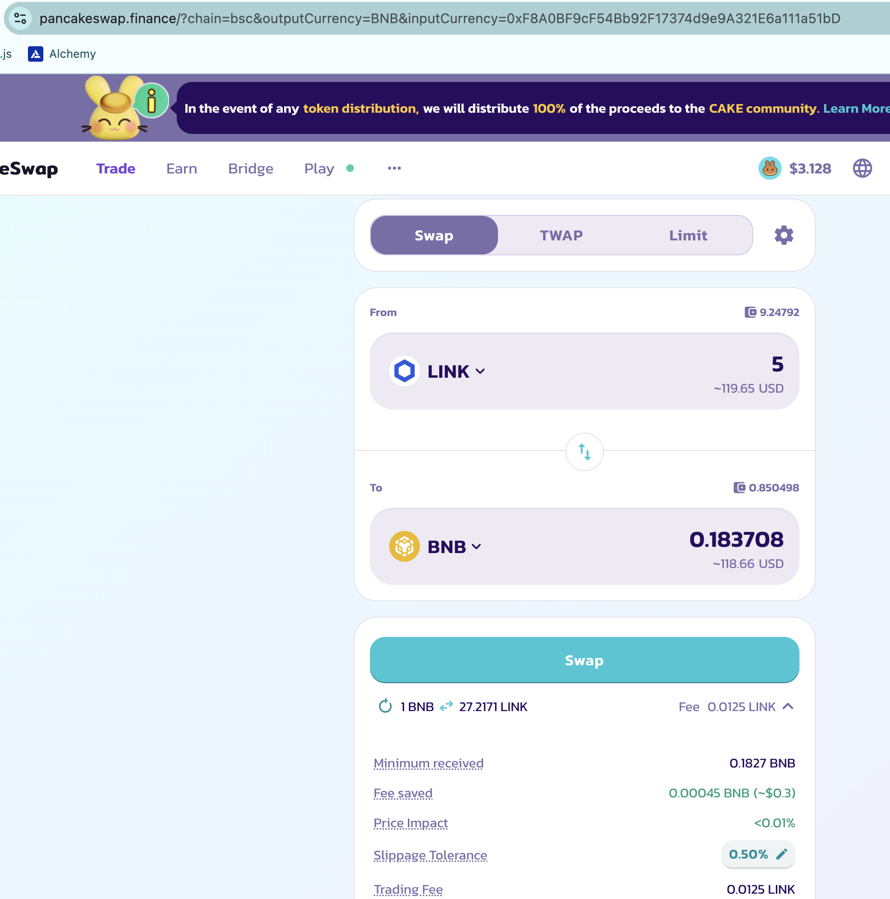
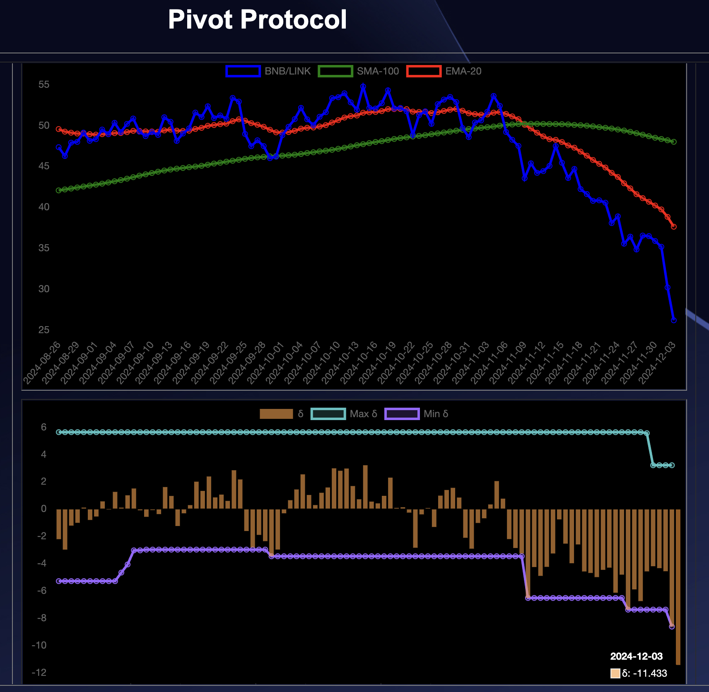
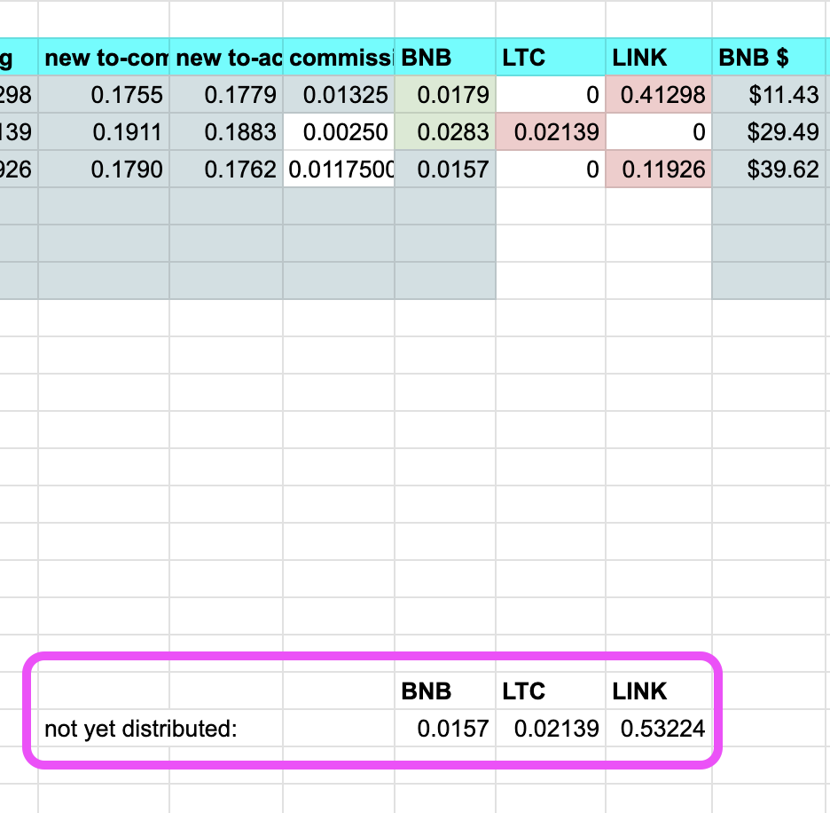

# Updates

## 2024-12-03 TODOnes:

* started December gain/loss report ✅

* update and upload data sets ✅
* including updating token-quotes to today ✅ 

[Protocol URL](https://pivoteur.github.io/#)

# Pivots

I'm going to work on updating the website later to reflect:

* donors
* distributions to stakers
* stakers
* pool ROIs / APRs
* triple pools

But for now, let's do the pivots for today. #LFG 

## BNB+LTC+LINK pivots

First close pivot: BNB-on-LINK.

ROI: 12.26% / 4473.98% APR

I open two new pivots, BNB-on-LINK and LINK-on-BNB, based on the plummeting BNB/LINK δ. 

## No distributions

There are no other pivots on @binance, and the gains are below distribution levels (minimum $40 of a token to distribute it), so I record the gains-in-reserve and move on. 

I'll distribute gains when they exceed $40-per-token-distributed. 
