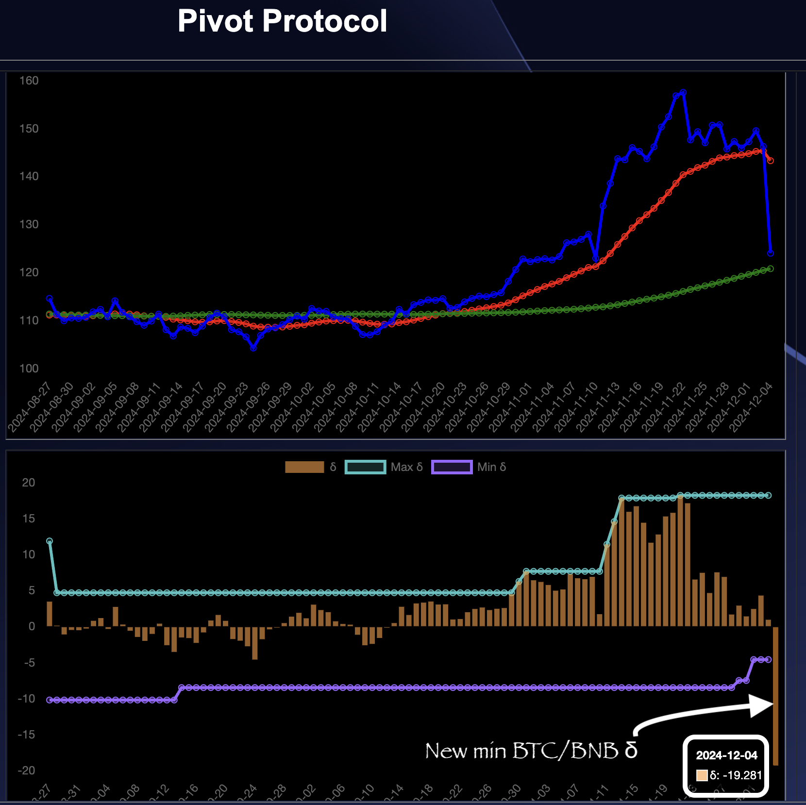

Good morning, everyone!

And innit a LOVELY MORNING???

# Pivots

2024-12-04: Let's start off with reviewing the pivot pools.

## BTC+BNB pivot pool

* Question 1. When is it a good idea to trade $BTC for $BNB?
* Question 2. Where can you make 18% ROI actual / 820% APR projected on your $BTC?
* Question 3. Are questions 1 and 2 the same?

3. Yes
2. [Pivot Protocol](https://pivoteur.github.io/#)
1. 2024-11-29, open pivot; 2024-12-04 (today), close pivot.

I close the 2024-11-26 $BTC pivot by swapping (back) $BNB for $BTC on @PancakeSwap on @binance.

I open two new pivots – BNB-on-BTC and BTC-on-BNB – based upon the new min BTC/BNB δ.

Read [the whitepaper](https://github.com/pivoteur/biz/blob/main/README.md) about pivots and the pivot protocol. 

## BTC+ETH pivot pool

BTC+ETH pivot pool

Closing an open BTC-on-ETH pivot nets me a lovely:

ROI: 10.51% / 426.22% APR

Giving the pool these characteristics. 

Not only is the BTC+ETH growing price-wise, but the apportionments of both are growing at ROI: 5% / 131% APR. 🎉

So, I do close the BTC-on-ETH pivot, then turn around and open two new pivots – ETH-on-BTC and BTC-on-ETH at this new δ-band. 

More to follow after I do my daily protocol updates.
