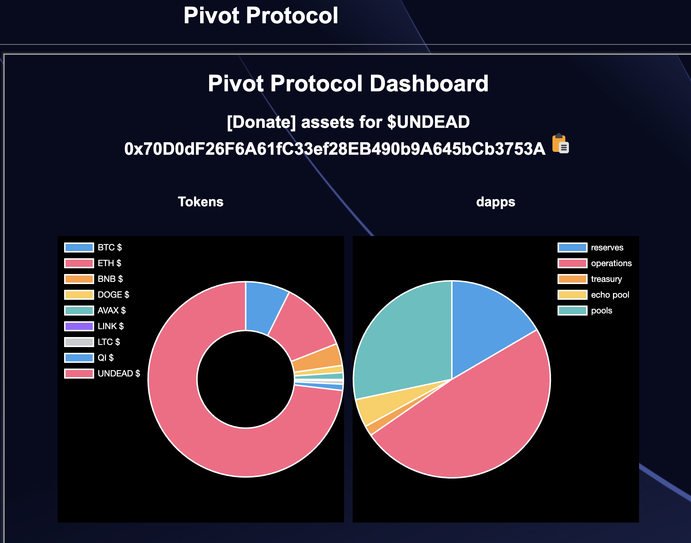
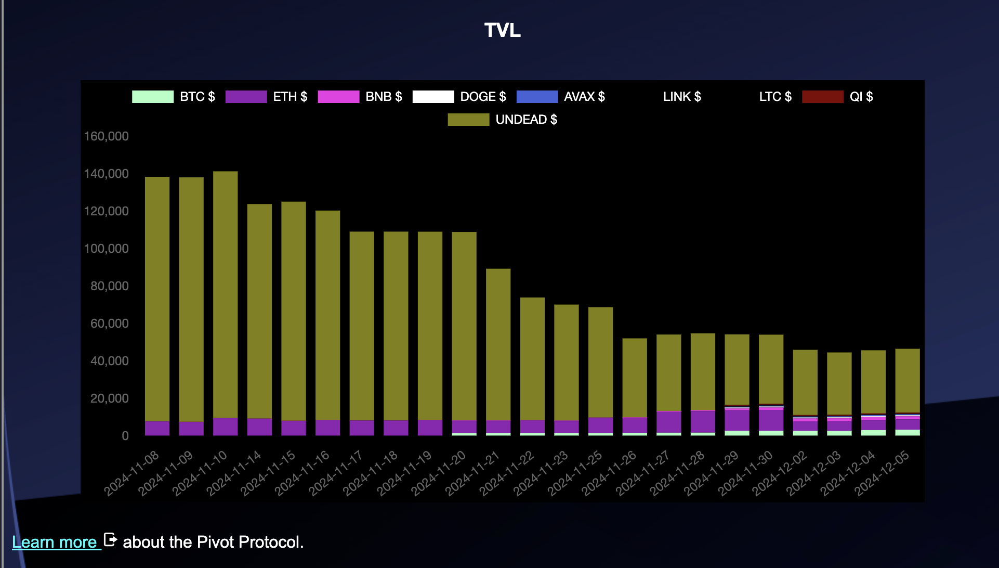

# Pivots

2024-12-05: Let's do our daily pivots!

## Thoughts on opening a new LTC+LINK pivot

There are no pivots for BTC+ETH, BTC+BNB, nor BNB+LTC+LINK. There're some interesting price-movements, however, so: do we open a new pivot for, say LTC+LINK?

The δs for when I opened the LTC+LINK pivots and now are both meh, so I'll hold off until the max/min δs are substantial.

## *Different* thoughts on opening new AVAX+QI pivots

There are also no AVAX+QI pivots (meaning: no pivots today, which is ...fine), but the δs tell a different story.

When I opened the first AVAX+QI pivots the δs where non-extant (not good for pivots), 

... but now they're at a new min AVAX/QI δ.

I open two new AVAX+QI pivots here.

# Update Protocol data

I update the protocol-data, which updates the charts on the [Pivot Protocol](https://pivoteur.github.io/#), ... 'automagically'! 

