# Triple Pool Pivot Management

2024-12-06:

My handling of triple-pools has been a learning experience.

I grouped all open pivots together. This made determining which pivots to close and which new ones to open overly complicated.

So, for triple pools, I now have three pivot tables instead of one.

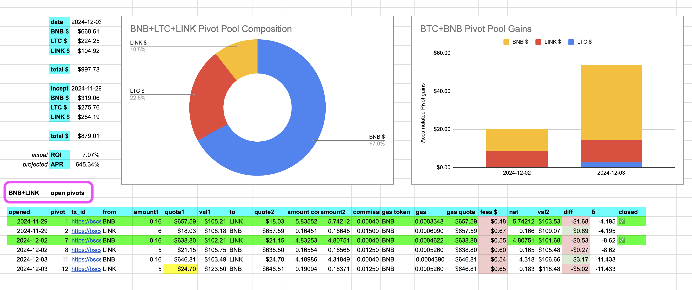

For triple pools, the composition and apportionment remains unified. 

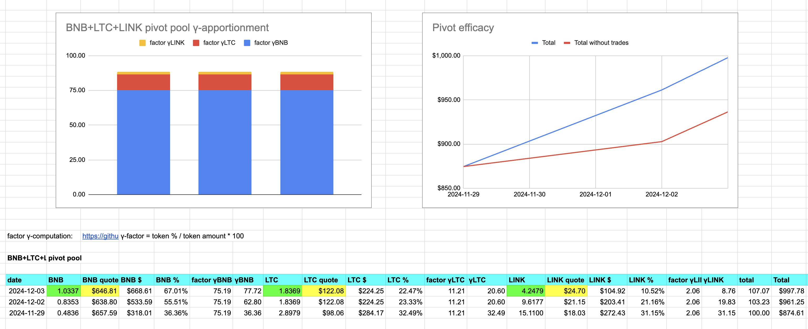

# Pivots

Let's do the pivots.

## BTC+BNB

No close pivots today, however, the min δ-band is not covered, so I open two new pivots here. 

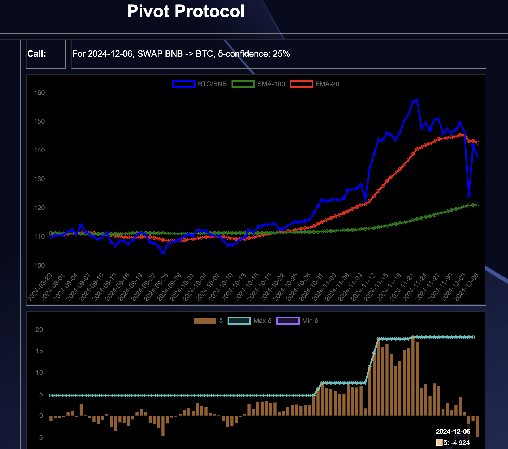
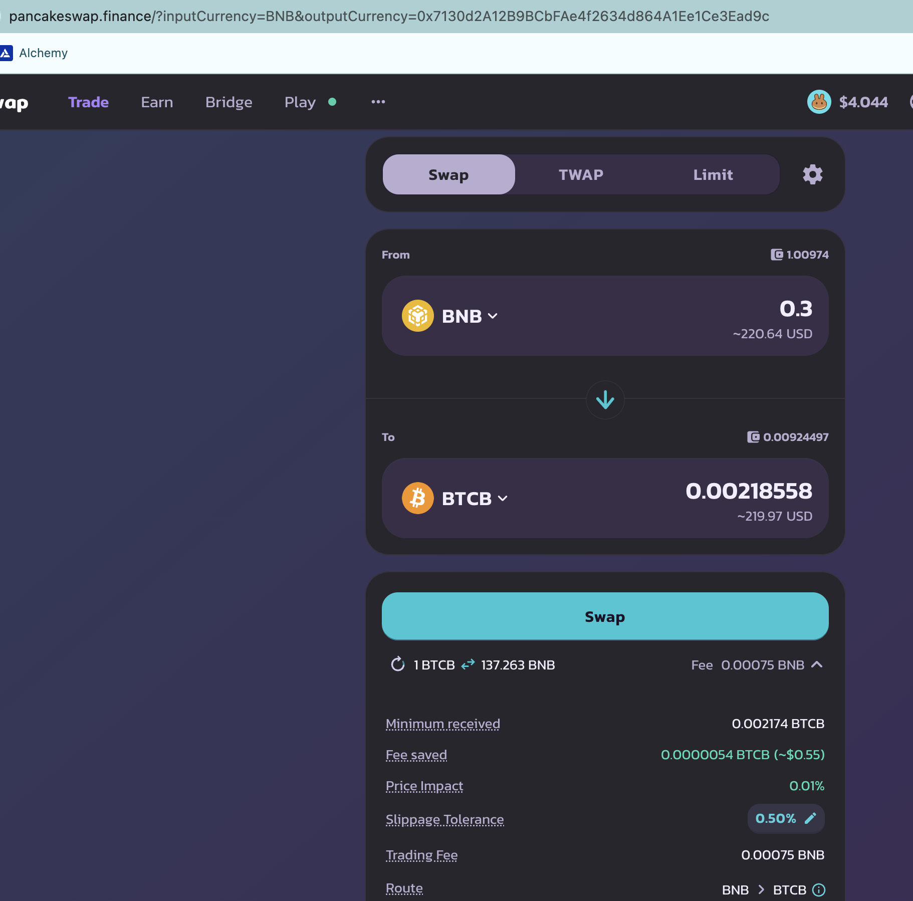

## BTC+ETH

Similarly, there are no close pivots today, but the min δ-band suggests two new pivots here, which I open. 

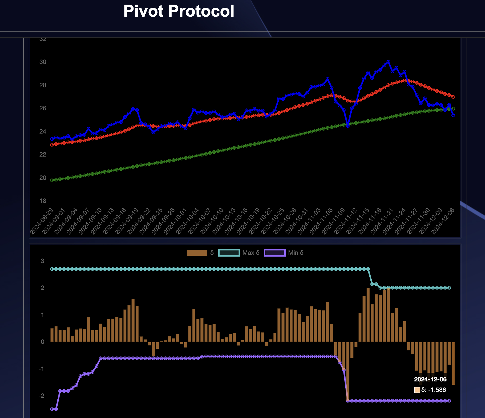
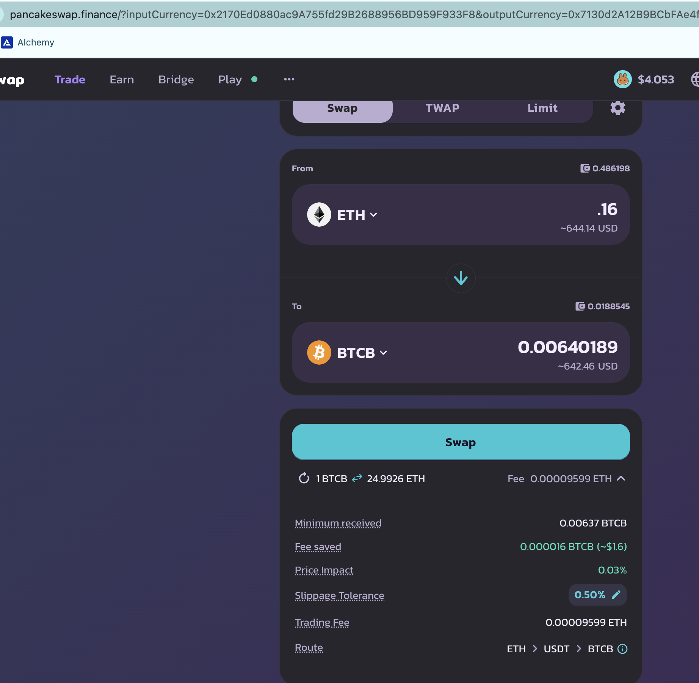

I record these open pivots. Here is the BTC+ETH composition and apportionment.

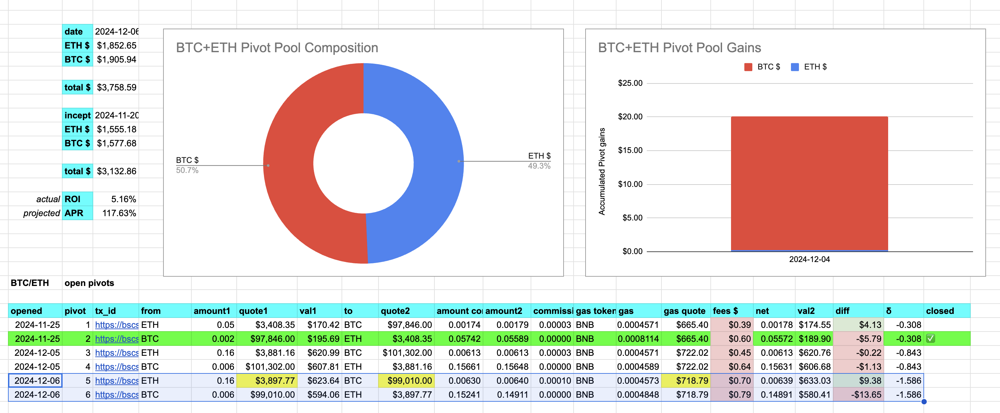
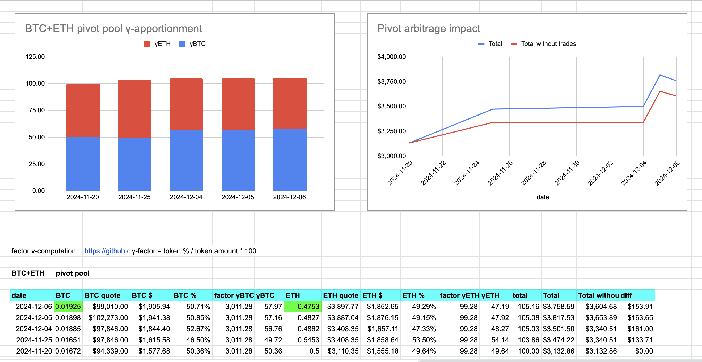

$BTC and $ETH are doing well, ...
BTC+ETH pivot pool is doing better. 

## BTC+DOGE

There's no close pivot for BTC+DOGE, but also no open BTC+DOGE open pivot as the δ is very meh. 

## BNB+LTC+LINK

Nothing happening for the BNB+LTC+LINK triple pivot pool.

## AVAX+QI

For AVAX+QI, we close our first pivot!

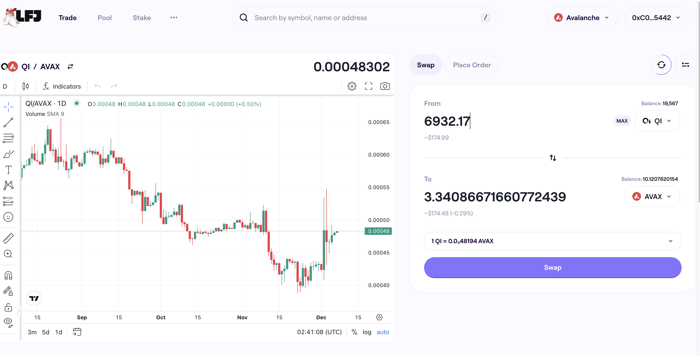

ROI: 11.23% / 585.43% APR

The δ is at a new minimum, so I open two new pivots here. 

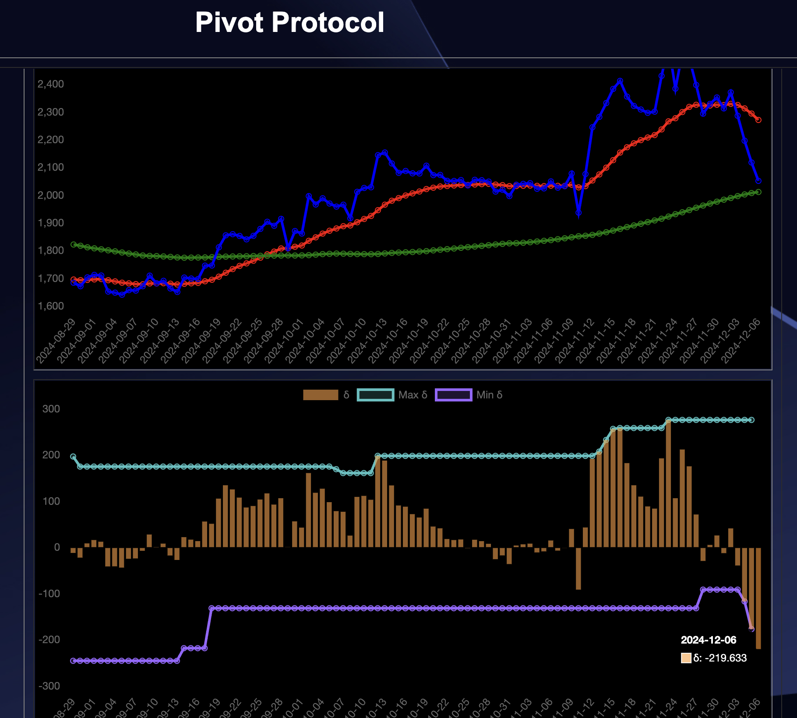
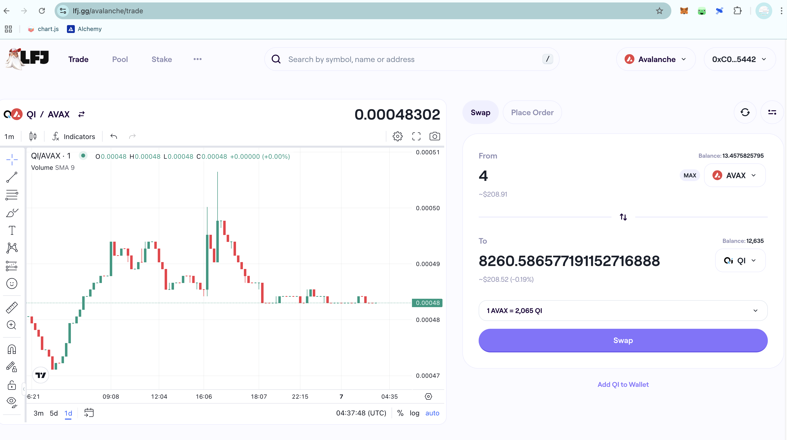
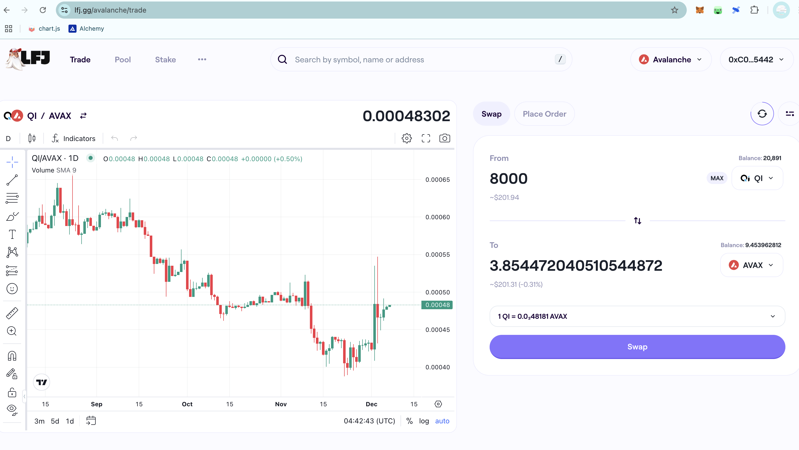

The AVAX+QI composition and apportionment settles thusly. 

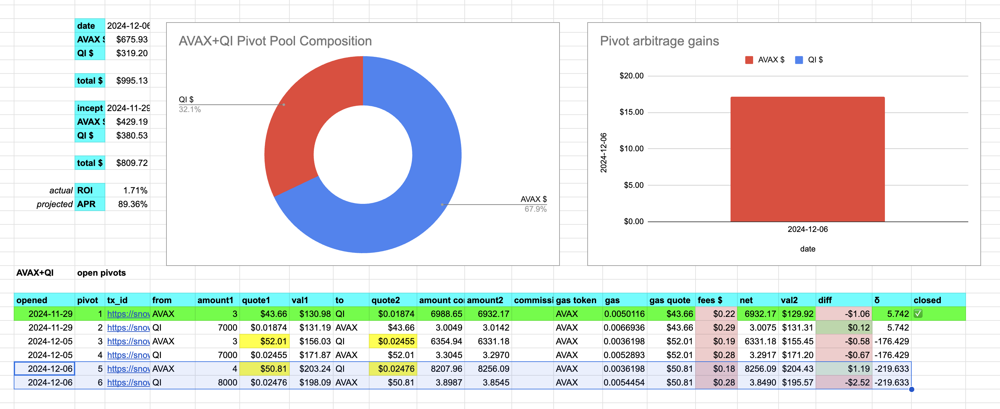
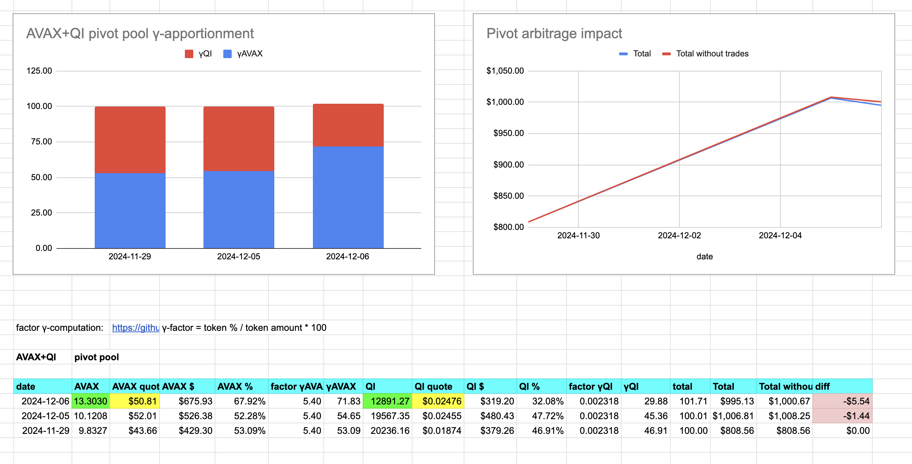

You see a bias toward $AVAX, which is good, as $AVAX is currently undervalued.

I update the spreadsheets and upload the data to the [Pivot Protocol](https://pivoteur.github.io/#).
