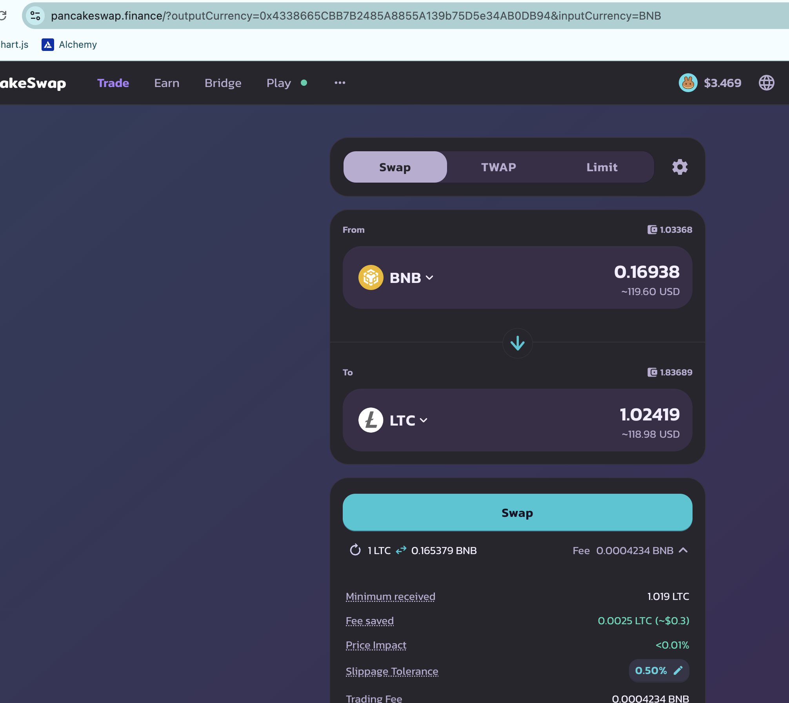
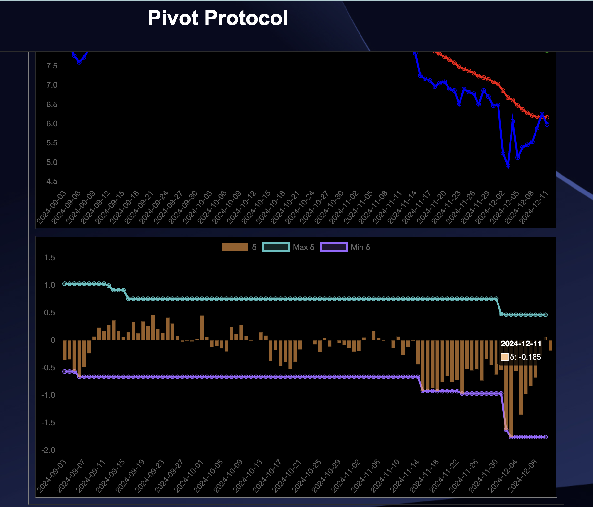
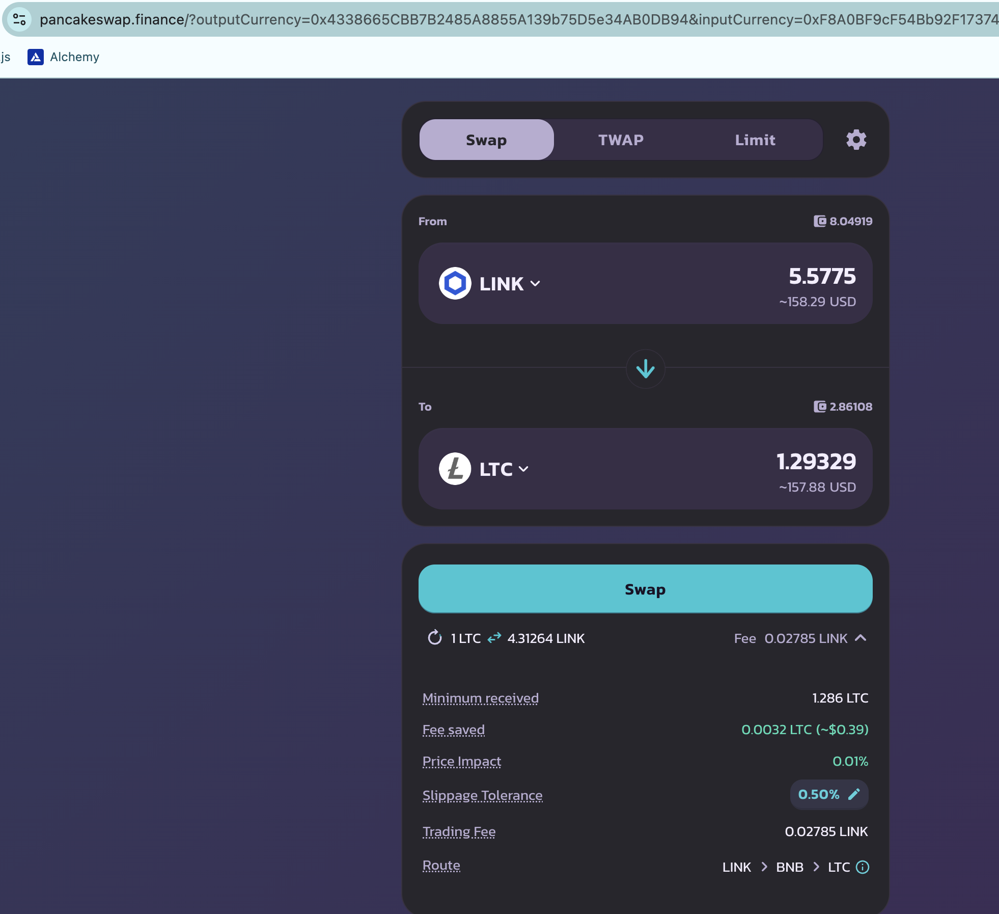
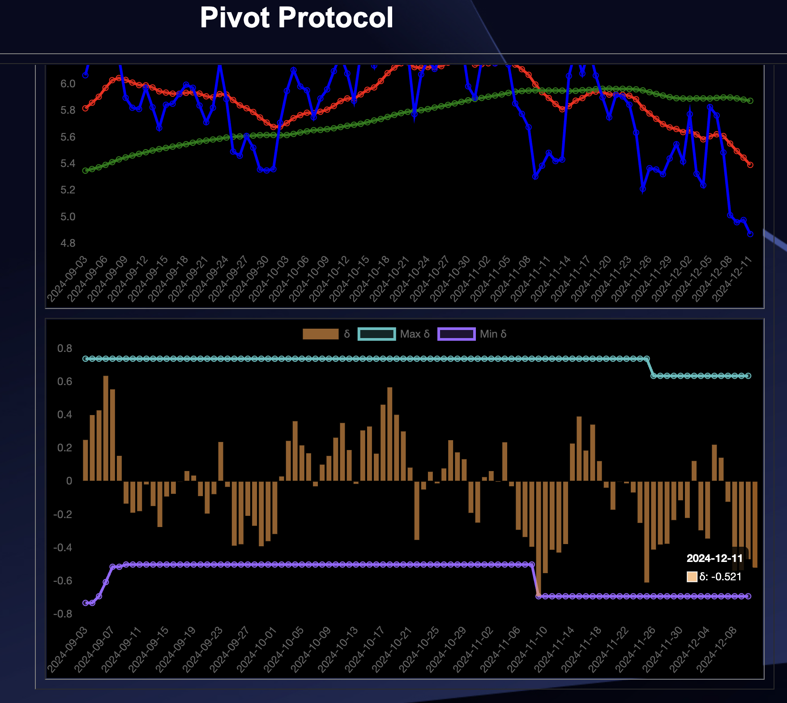
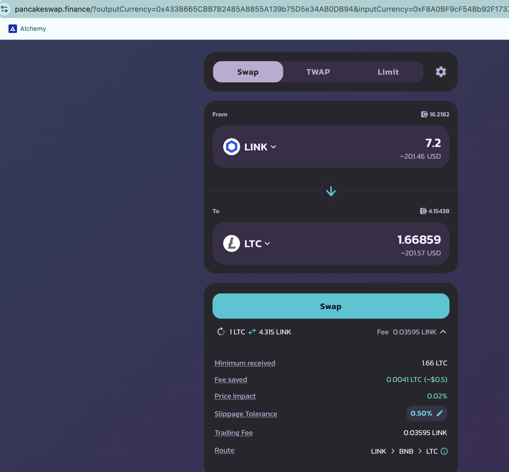
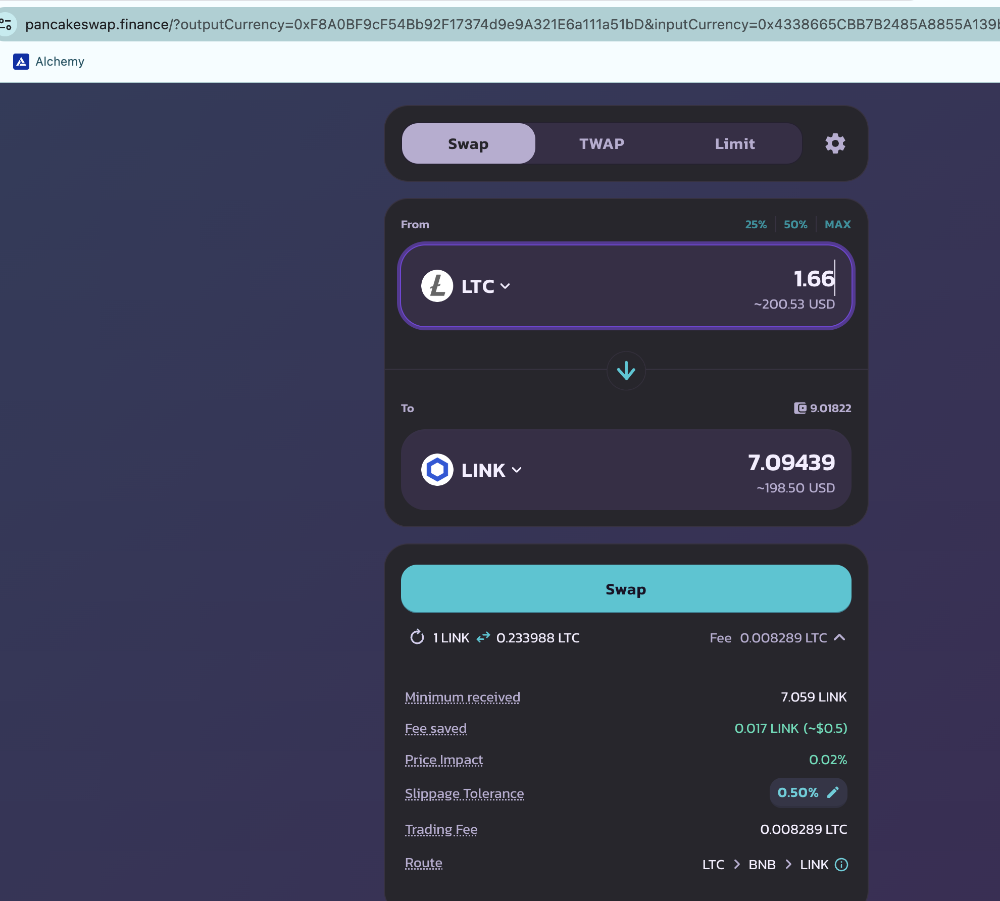

WOOT!

Hello, all. I've been busy with administrivia for the protocol the last couple of days.

# Pivots

BUT TODAY!

## BTC+BNB

2024-12-11: close BNB-on-BTC pivot for 

ROI: 11.62% / 605.90% APR 💥

The δs are positive but meh, 

...so I do not open new pivots in the BTC+BNB pivot pool today.

## BNB+LTC+LINK

For BNB+LTC, I close an LTC-on-BNB pivot for

ROI: 13.80% / 1678.86% APR

The δs are meh, here, too, so I don't open any new BNB+LTC pivots. 

For the LTC+LINK part of the triple pool, the LTC-on-LINK was successful, thanks to a $LINK price-surge.

ROI: 29.83% / 837.42% APR

The δs here are good to open new pivots, so I do that as well. 

