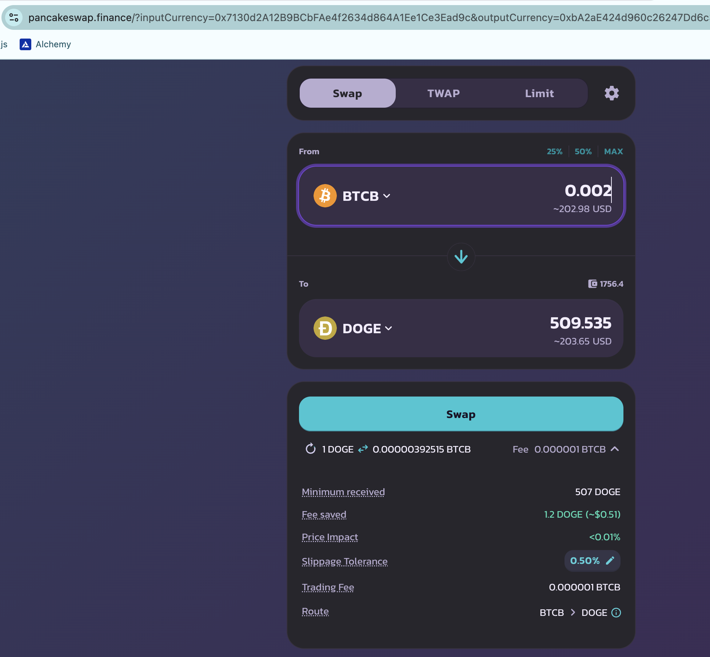
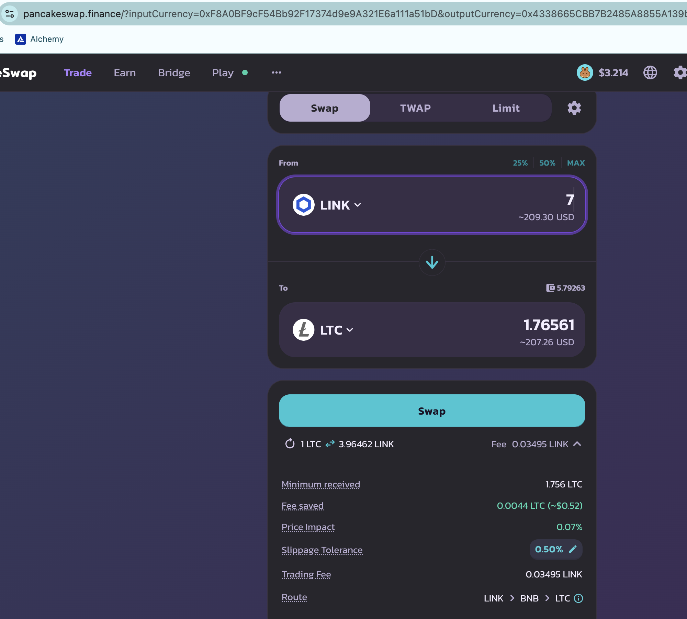

2024-12-14

# Pivots

## BTC+DOGE

BTC+DOGE had it first successful pivot close!

ROI: 11.55% / 280.99% APR

Even the δs are meh! That means a strong swing, positive or negative, will generate profit from here.

I open two new BTC+DOGE pivots. 

## BNB+LINK

I close another BNB-on-LINK pivot for:

ROI: 12.83% / 390.14% APR

The δs are good, but I also already have (one) open-pivot at this δ, so I open just one new open pivot.

Records-keeping: very helpful for successful pivot arbitrage. 

## BNB+LTC

There's no close for BNB+LTC, however, the (meh-)δ is outside the bands of the currently open pivots.

I open two new BNB+LTC pivots.

## LTC+LINK

I close an LTC-on-LINK pivot

ROI: 8.39% / 204.14% APR

I miscalculated here, thinking I had over 10% ROI, but it's all good. 10% or 8%: these are good returns.

The δs are at a new minimum, so I open 1 new LTC+LINK pivot. 

These are the gains seen, thanks to pivoting in this BNB+LTC+LINK pool: impressive!

