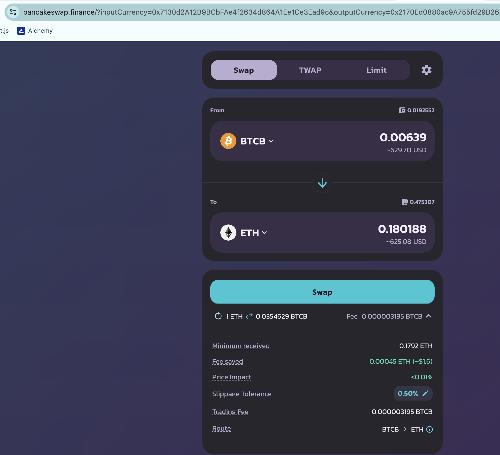
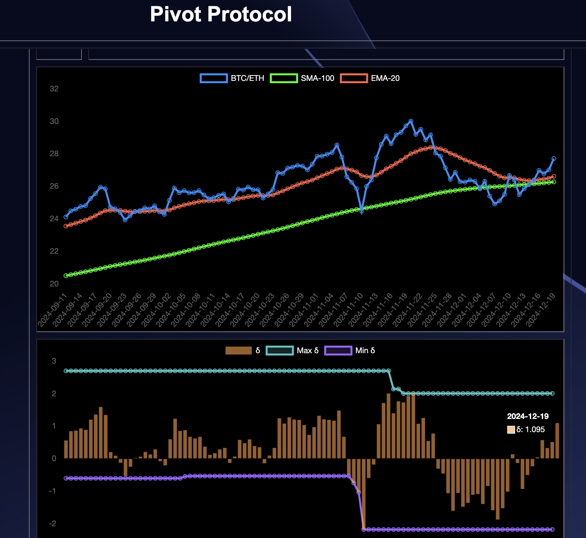
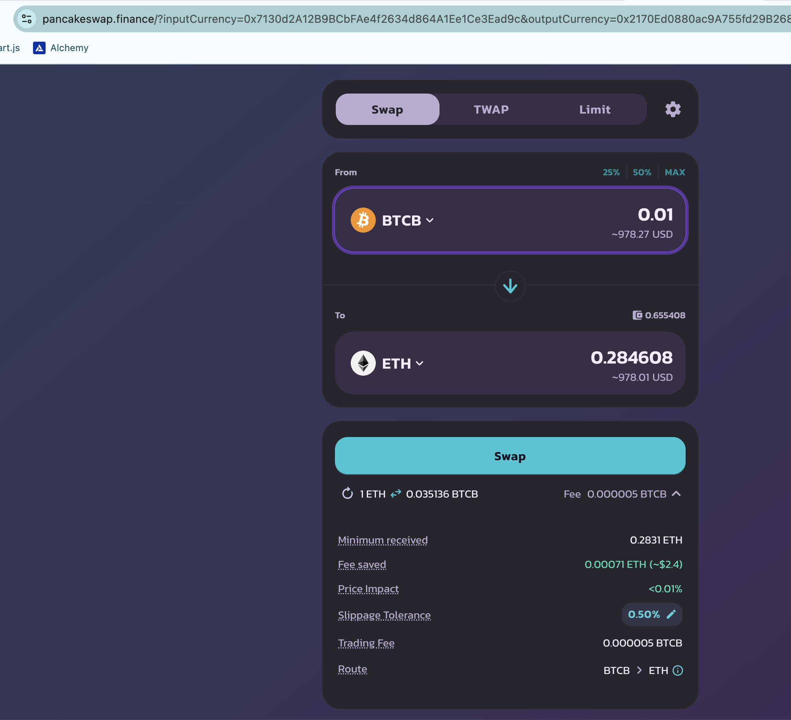
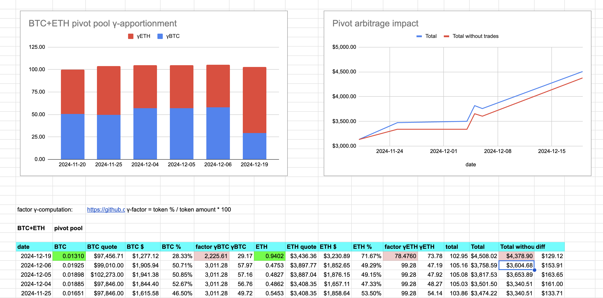
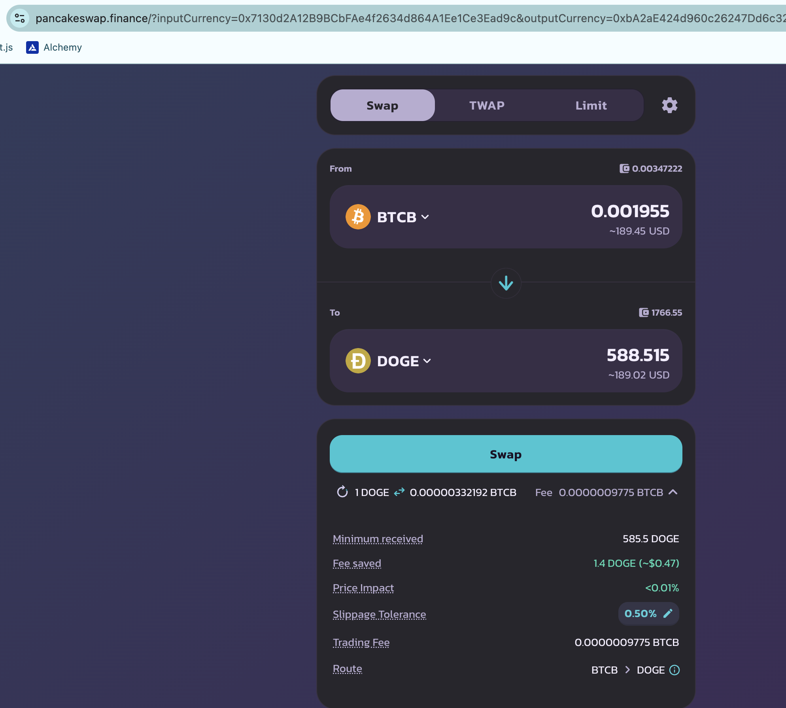
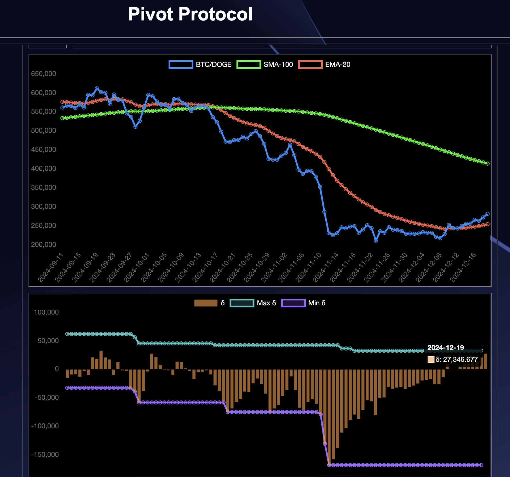
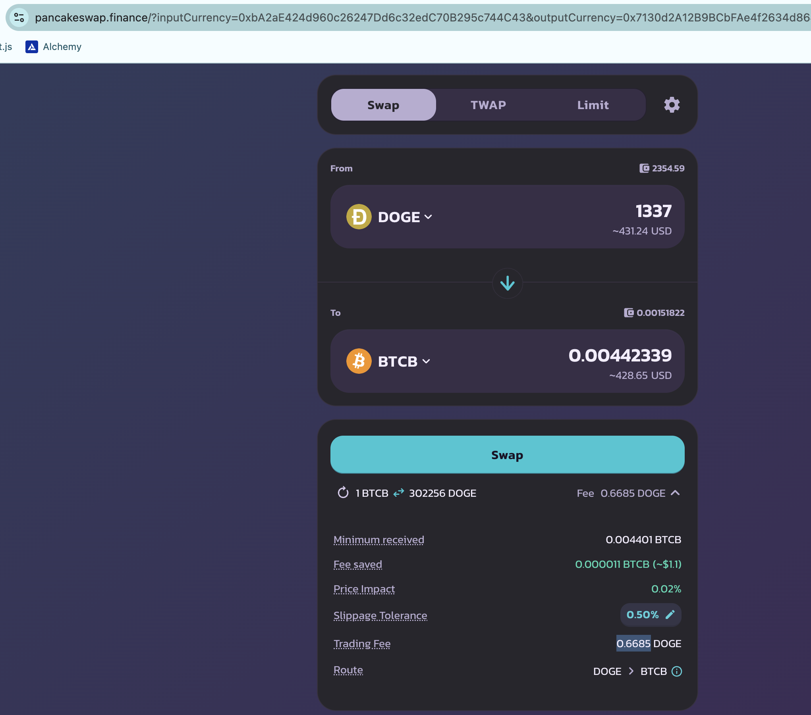
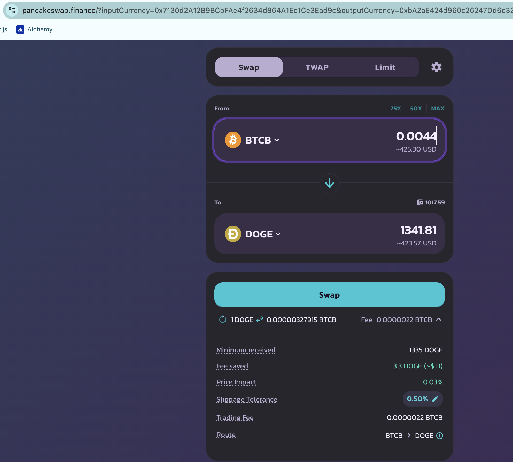
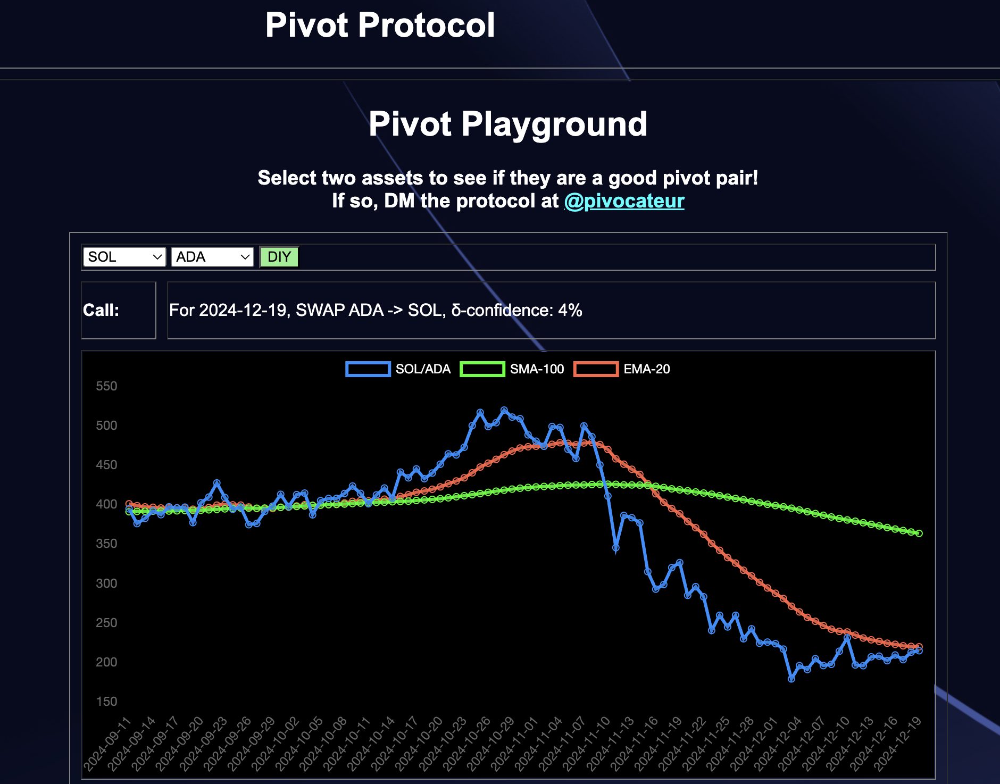

# Pivots

2024-12-19

## BTC+ETH

AHA! I close an ETH-on-BTC pivot for

actual ROI: 12.54% / 352.10% APR projected 💥

How are your $ETH returns? The Pivot Protocol $ETH returns are 352% (projected annualized) with NO (im)permanent loss.

As the δs are positive, I open a new BTC-on-ETH pivot.

## BTC+DOGE

A price-drop of $DOGE (relative to $BTC) prompts the closing of a DOGE-on-BTC pivot:

actual ROI: 17.66% / 1288.91% APR projected

SWEET!

The δs are positive, so I open two new BTC+DOGE pivots. 

# 🎉🎉🎉 ANNOUNCEMENT🎉🎉🎉

The Pivot protocol is now tracking an additional top-10 crypto for pivot arbitrage: @solana $SOL.

Some of you are saying: "ABOUT TIME!" but there it is.

DIY ["Do It Yourself"] pivoting is available on the
[Pivot protocol](https://pivoteur.github.io/#) -> DIY Charts++ tab.

