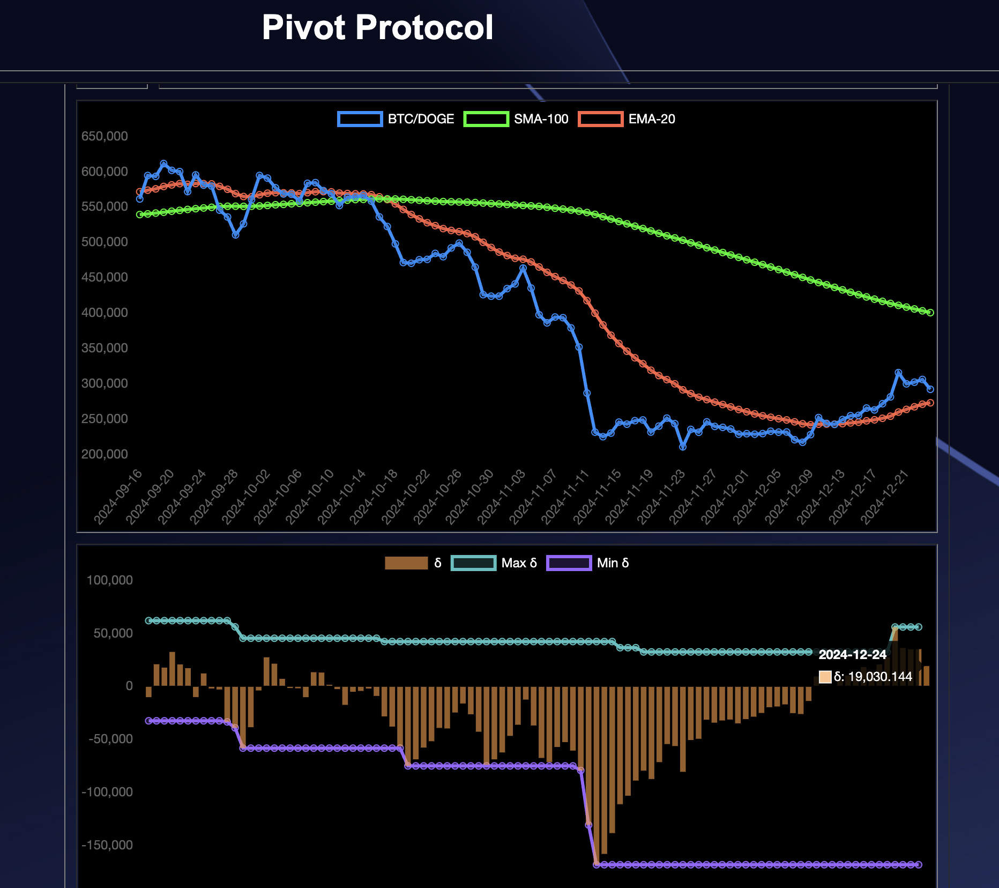
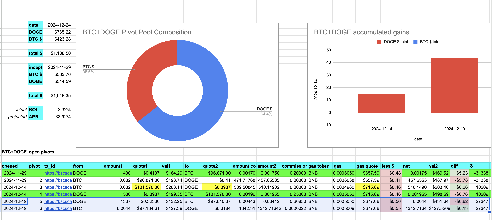
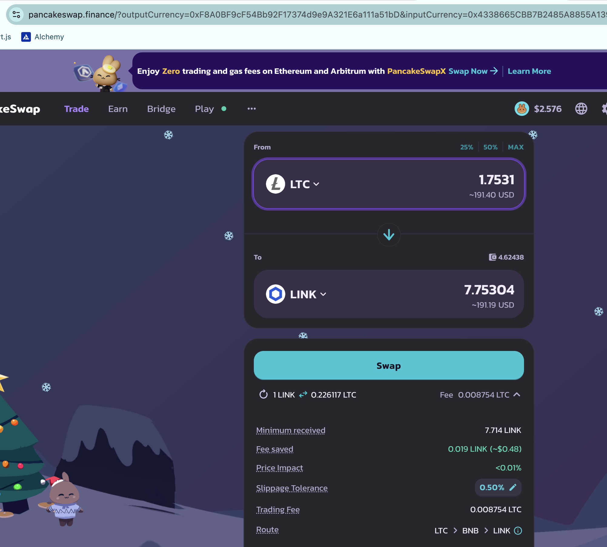
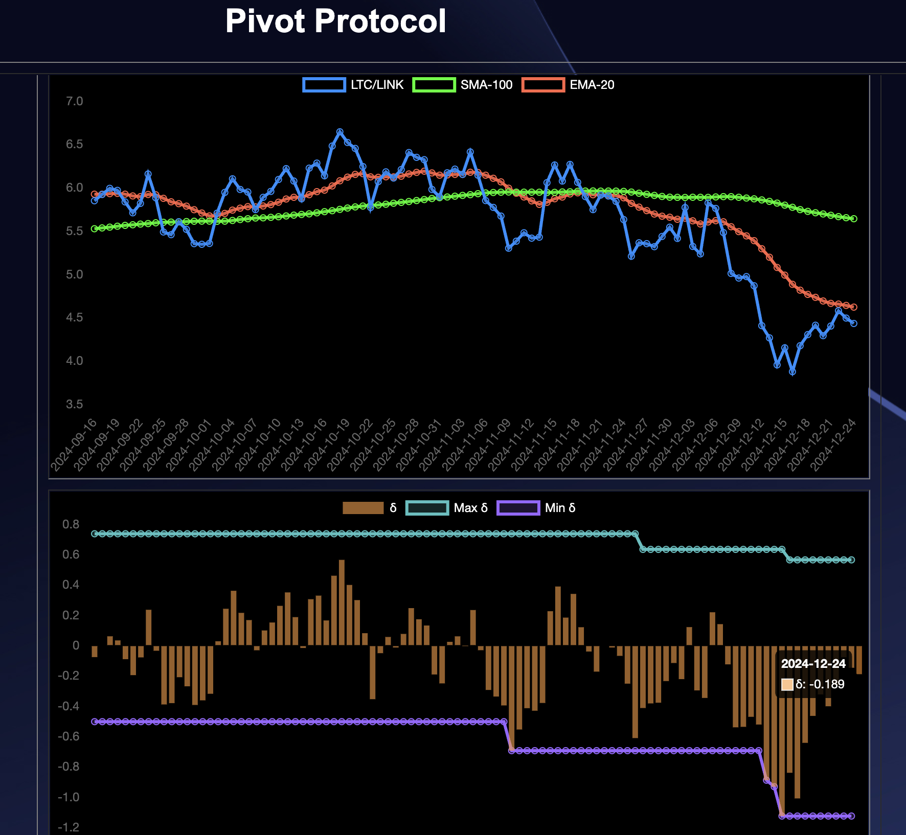
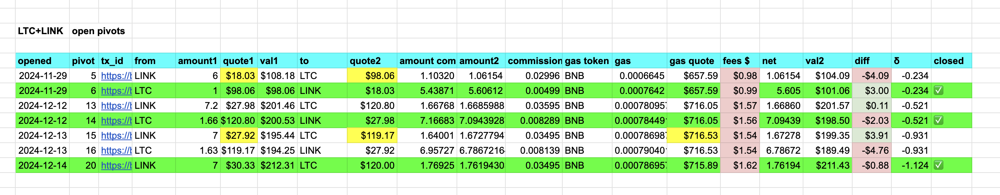
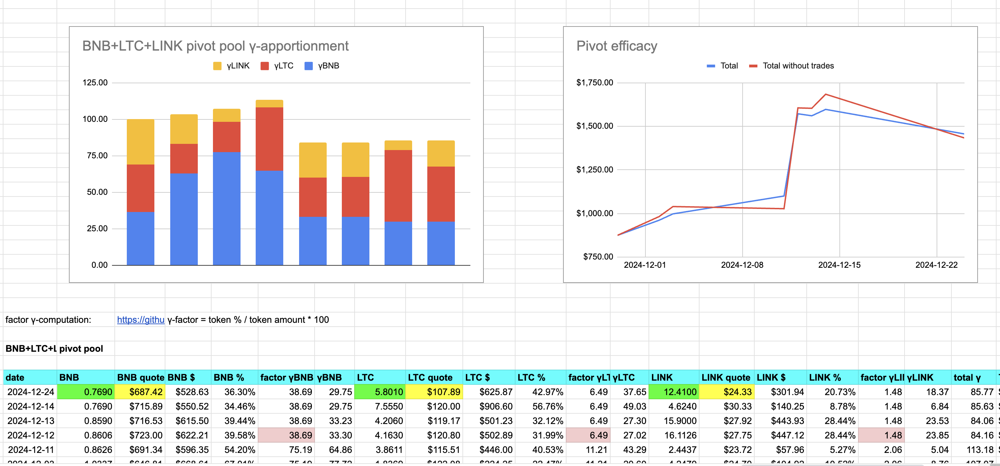

# Pivots

2024-12-14: Happy end of Advent, pivoteurs!

## BTC+DOGE

For the BTC-pivots, no close pivots today. There was a potential open pivot for BTC+DOGE, but today's δ returned to in-range of another open pivot, so no action necessary today.

## LTC+LINK

I close a LINK-on-LTC pivot for:

actual ROI: 11.70% / 427.21% APR projected

As the δ is negative and we have open pivots in both directions for LTC+LINK, we leave well enough alone.

The BNB+LTC+LINK pool composition and apportionment is as shown.

