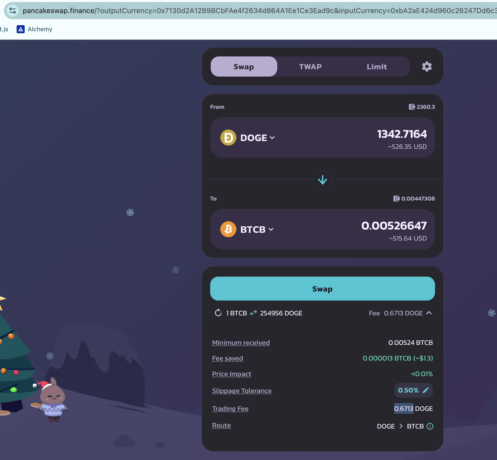
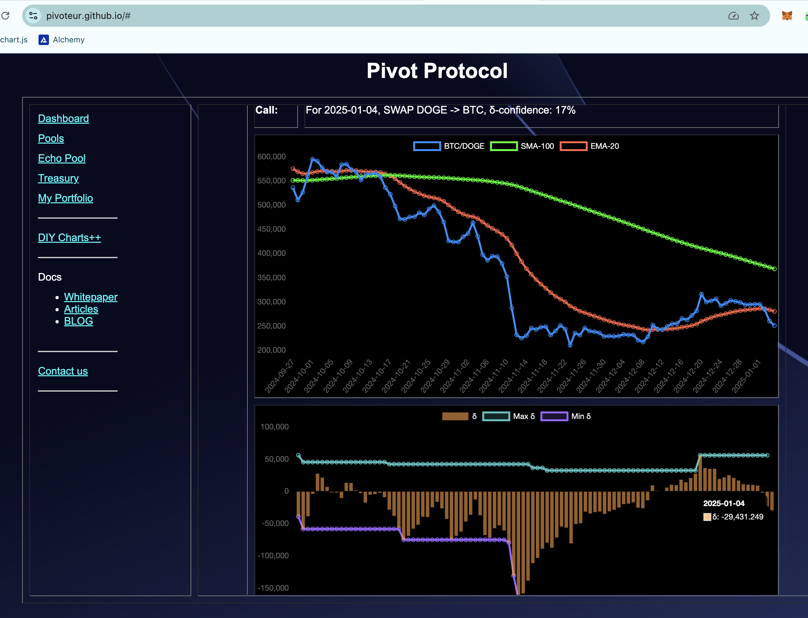
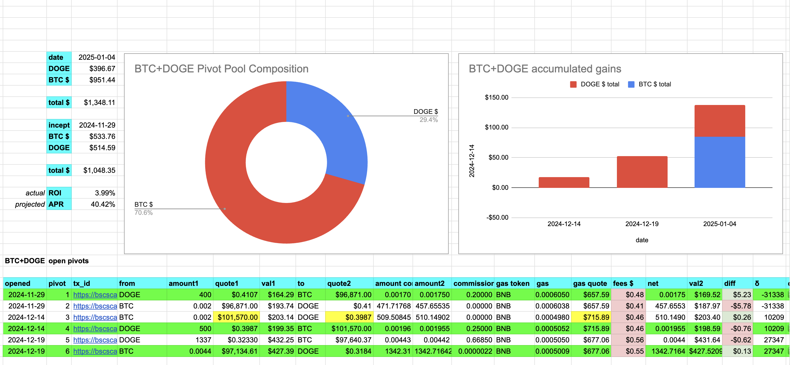
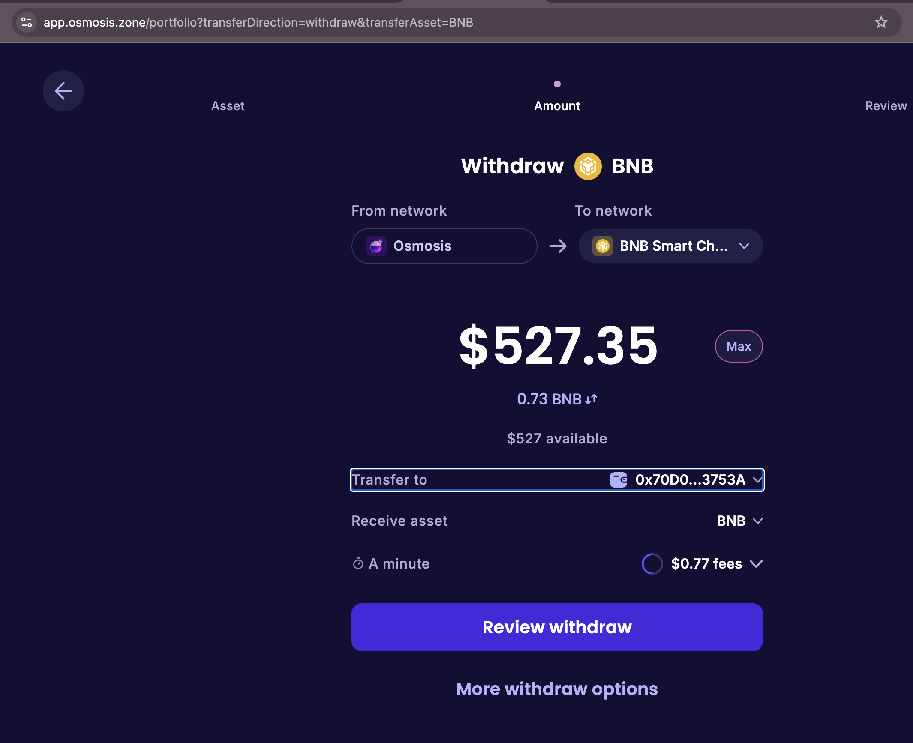
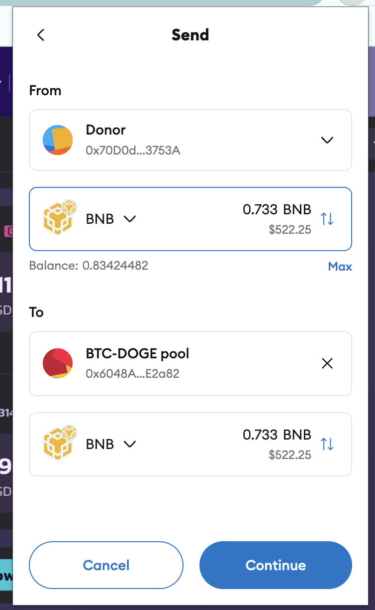
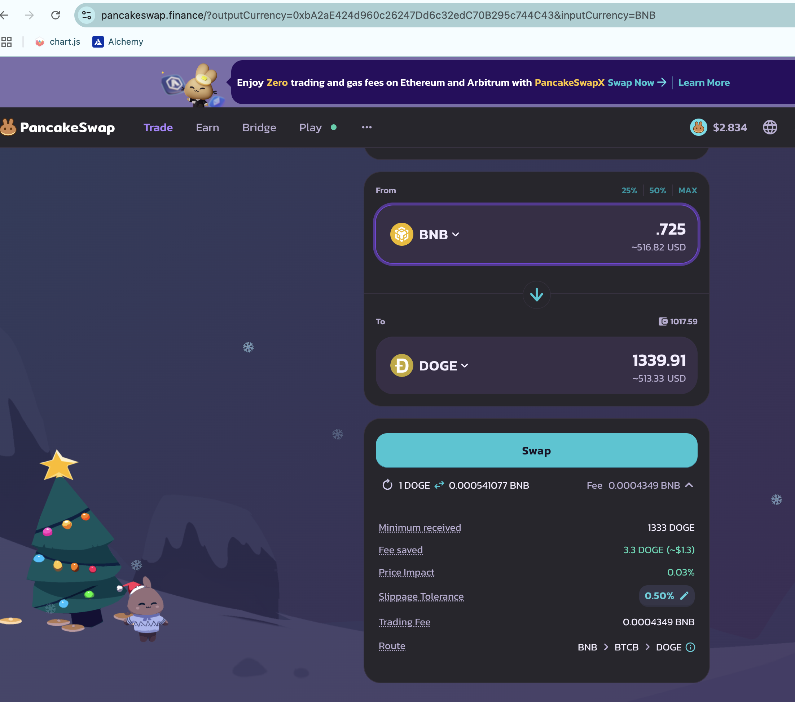
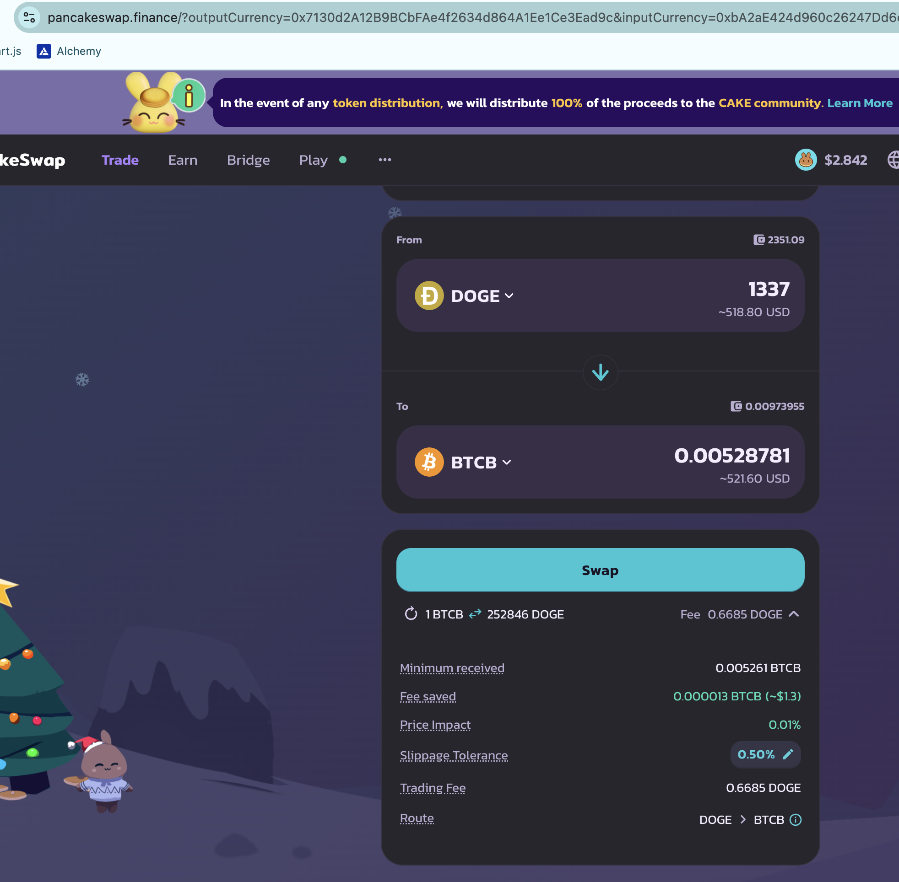
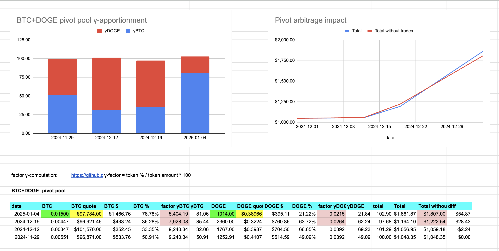

# Pivots

2025-01-04

## BTC+DOGE

WOOT! On a BTC/DOGE dip I close my BTC-on-DOGE pivot for a gain of $84 or

ROI: 19.74% / 450.38% APR 💥🎉

BTC/DOGE δ being negative indicates I should open a DOGE-pivot, however, all my DOGE is already committed in open BTC-on-DOGE pivots, so I must donate some DOGE.

So, I 

* donate 0.733 $BNB (to be repaid with $UNDEAD from the protocol reserves), 

* transfer that liquidity to the BTC+DOGE pool, 

* swap that to $DOGE in order to 

* open a new DOGE-on-BTC pivot, which I do.

donor addy: 0x70D0dF26F6A61fC33ef28EB490b9A645bCb3753A

After the donation and new pivot, the BTC+DOGE pivot pool apportionment is as below.

To date, the pool has created ~$137 in $DOGE and $BTC net gains from pivots.

* actual ROI 2.90%
* projected APR 29.40%

