# Pivots

2025-01-04

## BTC+DOGE

WOOT! On a BTC/DOGE dip I close my BTC-on-DOGE pivot for a gain of $84 or

ROI: 19.74% / 450.38% APR 💥🎉

BTC/DOGE δ being negative indicates I should open a DOGE-pivot, however, all my DOGE is already committed in open BTC-on-DOGE pivots, so I must donate some DOGE.

So, I 

* donate 0.733 $BNB (to be repaid with $UNDEAD from the protocol reserves), 

* transfer that liquidity to the BTC+DOGE pool, 

* swap that to $DOGE in order to 

* open a new DOGE-on-BTC pivot, which I do.

donor addy: 0x70D0dF26F6A61fC33ef28EB490b9A645bCb3753A

After the donation and new pivot, the BTC+DOGE pivot pool apportionment is as below.

To date, the pool has created ~$137 in $DOGE and $BTC net gains from pivots.

* actual ROI 2.90%
* projected APR 29.40%

## BNB+LTC+LINK ... and thoughts on triple-pool management

Next, the BNB+LTC+LINK pivot pool.

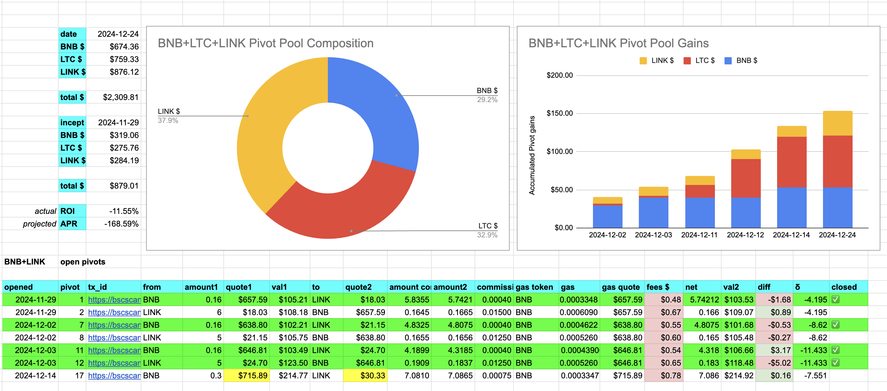

I've come to the conclusion that a triple pool, albeit profitable, is no more profitable than 3 pivot pools (of paired assets instead of tripled assets), so, I'm going to close out profitable pivots here then split this pool into paired pools.

## BNB+LINK

To that end, closing a LINK-on-BNB pivot is profitable, so I do that.

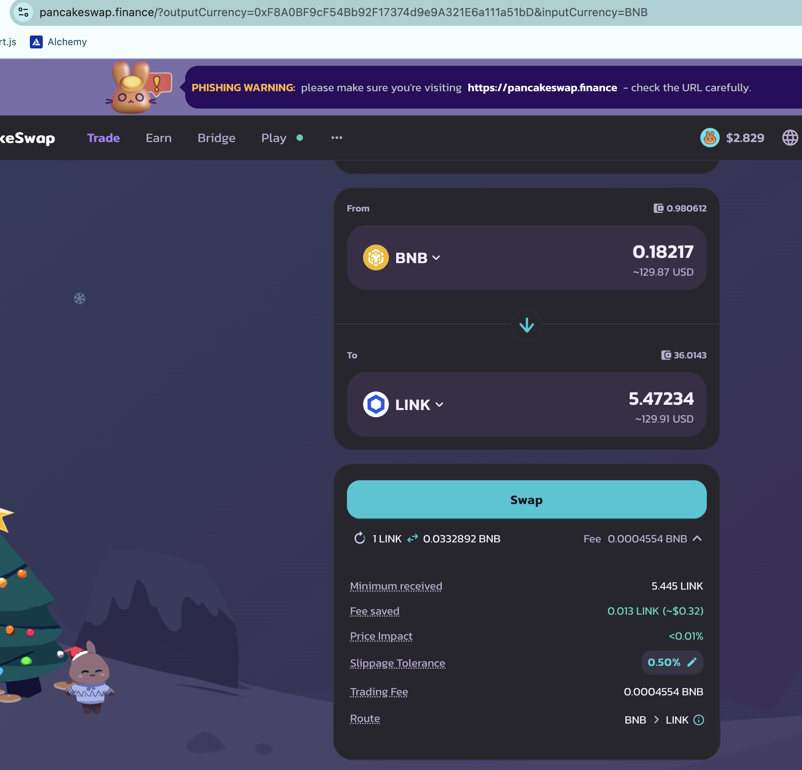

actual ROI: 9.44% / 82.00% APR projected

## BNB+LTC

I also close a LTC-on-BNB pivot for a modest gain of

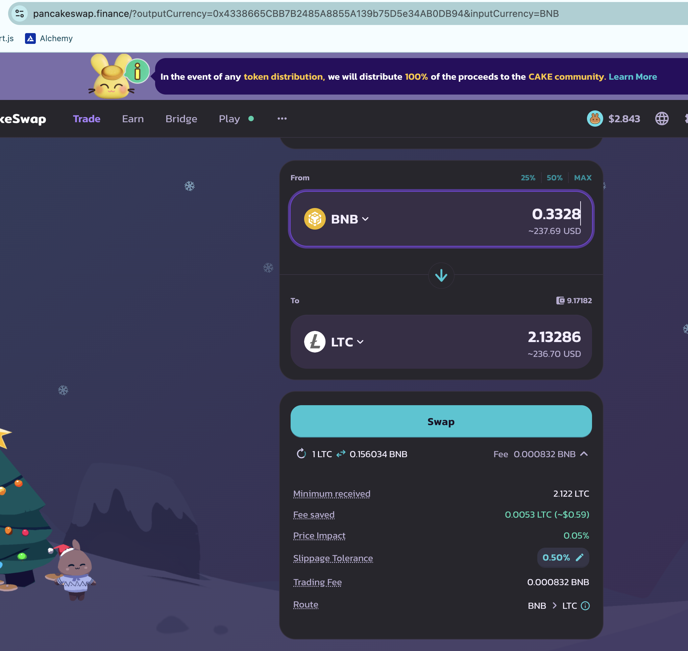

actual ROI: 6.30% / 109.52% APR projected

Or, from an inital 2 $LTC pivoted I get back 2.13 $LTC on the pivot close today.

## LTC+LINK

I close a LINK-on-LTC pivot for a gain of

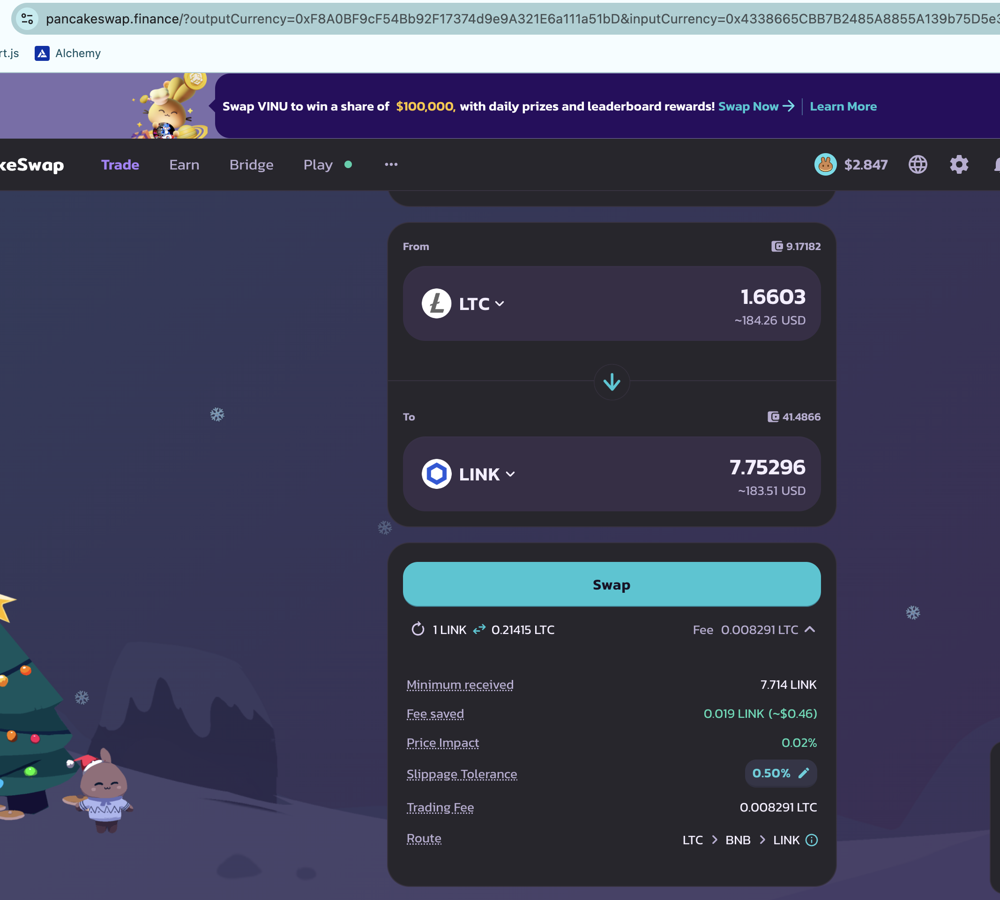

actual ROI: 7.74% / 122.76% APR projected

7.2 $LINK pivoted to $LTC to 7.75 $LINK

And that's how pivots are done, folks: we gain the pivoted asset, pivot-by-pivot. 

I have another open LINK-on-LTC pivot that's profitable to close, so I do that for a gain of

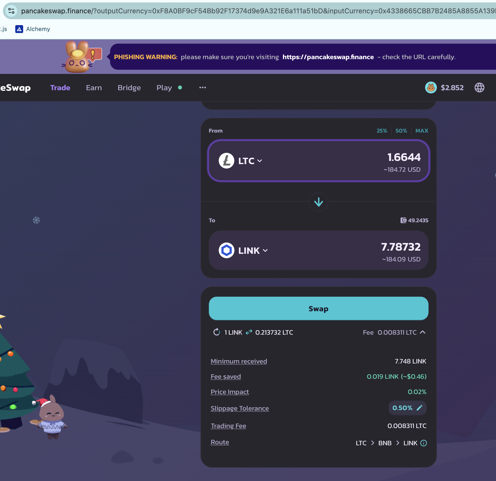

actual ROI: 11.25% / 186.63% APR projected

7 $LINK -> $LTC -> 7.8 $LINK 

This is the BNB+LTC+LINK pool composition and γ-apportionment after the pivots.

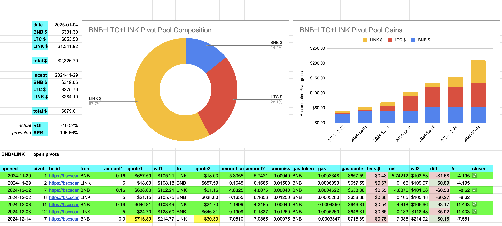
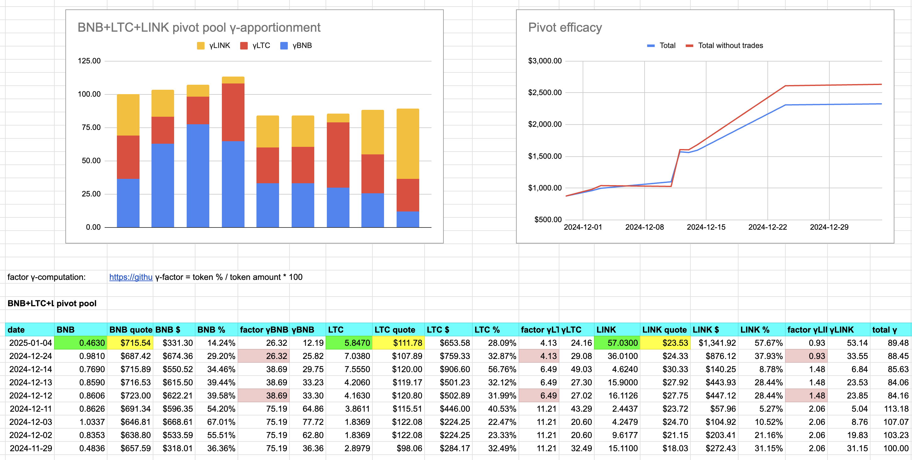

Net gains of $BNB, $LTC, and $LINK: ~$210

That's a 10% ROI in one month on a $2,000 pivot pool! 🎉🎉🎉 

I'll break this pool into paired-asset pools, but not now. I'll do that after all pivots.

## AVAX+QI

Finally we have our first close for a QI-pivot for a gain of

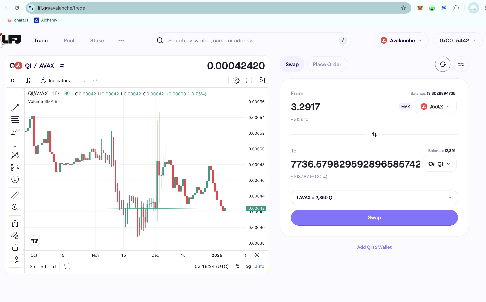

actual ROI: 10.51% / 127.90% APR projected

7,000 $QI -> $AVAX -> 7,737 $QI

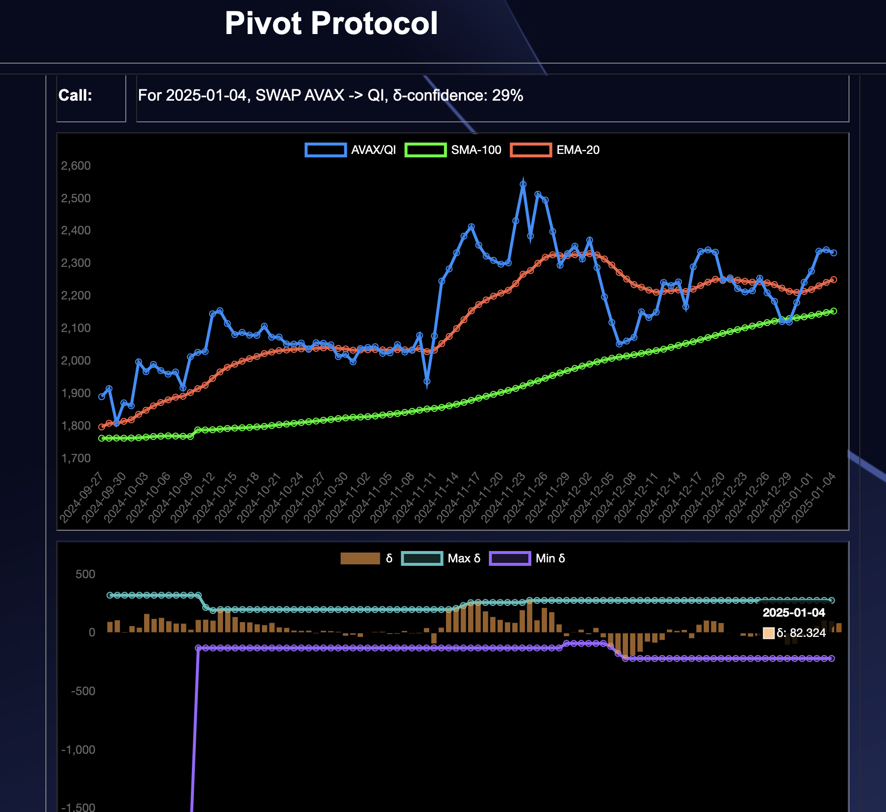

The δ is positive and there's no AVAX-pivot in this band, so I open a new AVAX-pivot here. 

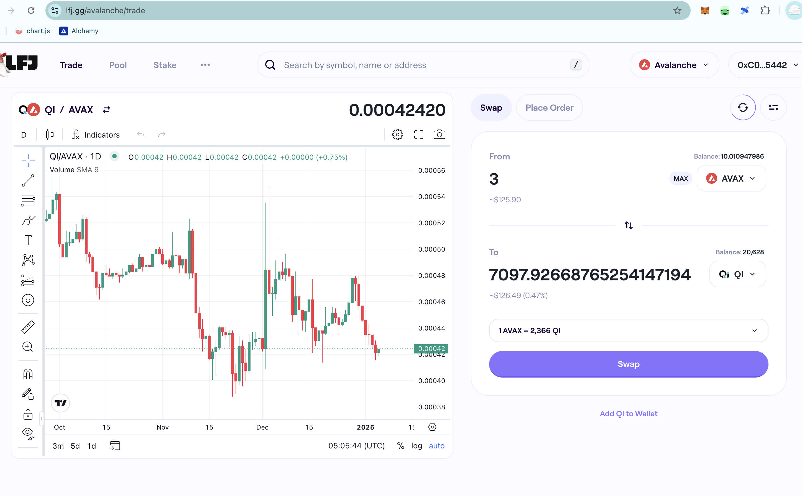

This is the state of play, the composition and γ-apportionment for the AVAX+QI pivot pool. 

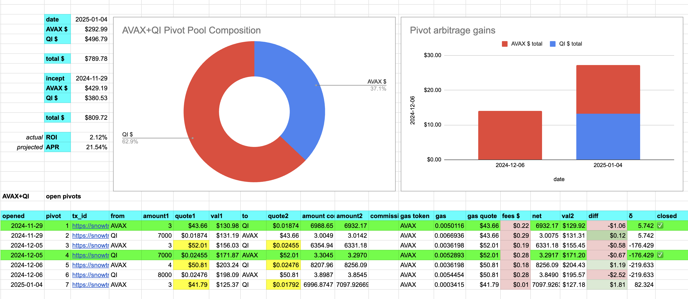
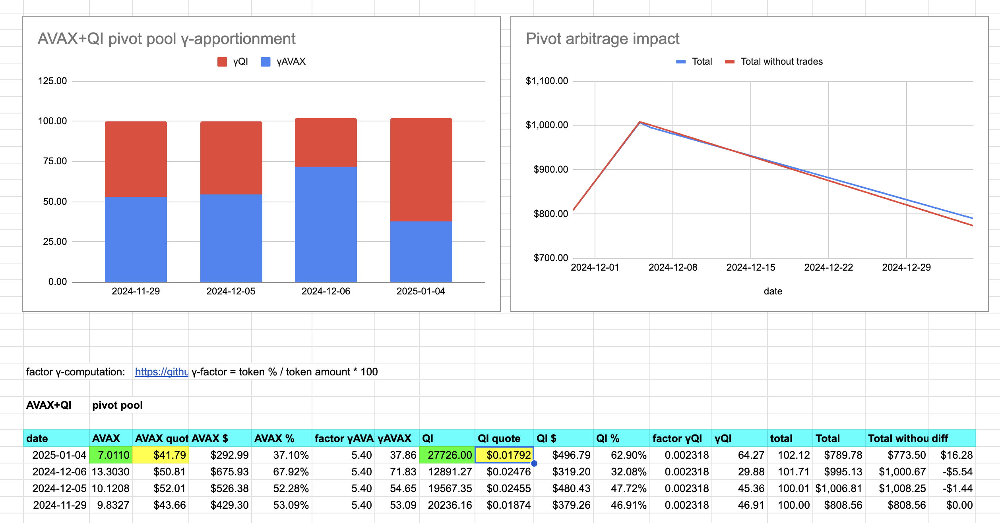

# The pivot protocol.

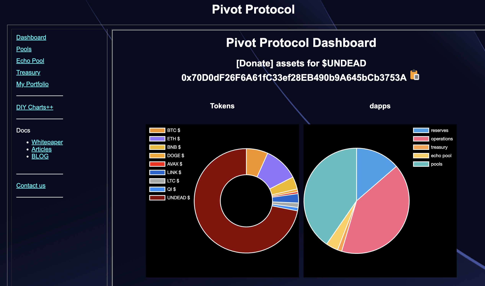
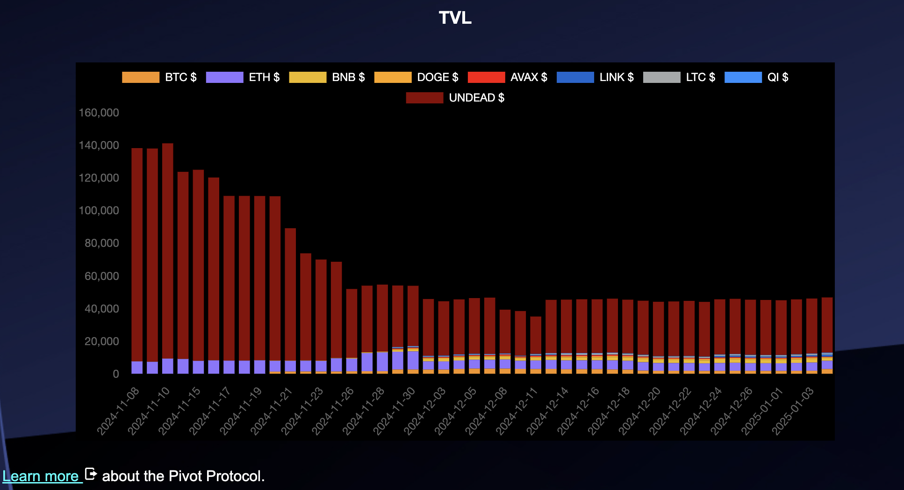

I did say I'd break apart the BNB+LTC+LINK pivot pool into paired-assets pools, but not today. I'll do that tomorrow.

The. End. 
