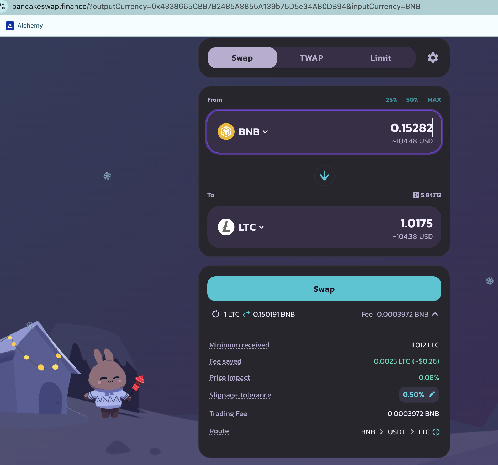

# Pivots

2025-01-09:

## BNB+LINK

Continuing the policy of simplifying all pivot pools to two-asset pools. In that light, I am closing all pivots on the BNB+LTC+LINK pool that are profitable closes as I move toward 3 two-asset pools (BNB+LTC, BNB+LINK, and LTC+LINK)

So, I close an open LINK-on-BNB pivot 

... for a gain of

* actual ROI: 13.88% / 133.34% APR projected, 

which is:

* 5 $LINK -> $BNB -> ~ 5.7 $LINK. WOOT!

## BNB+LTC

Next I close a LTC-on-BNB pivot for a slight gain of

* actual ROI: 2.18% / 19.38% APR projected

I say 'slight' as if a 20% gain (annualized) is slight. 🙄 It is for pivots, but I'm doing this to settle the triple-pool before subdividing it into 3 two-asset pools. 
