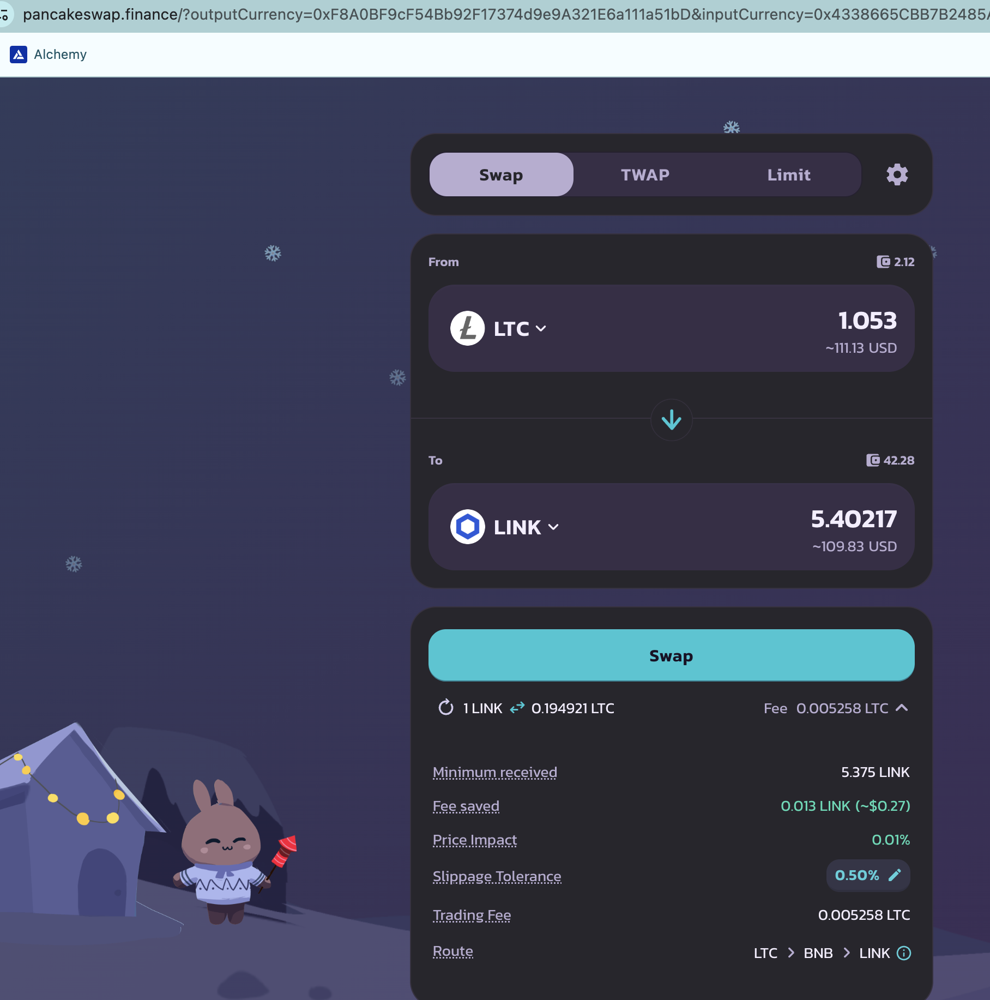

# Pivots

2025-01-10

Hello, all! I've separated the BNB+LTC+LINK into three separate pivot pools:

* BTC+LTC
* BTC+LINK
* LTC+LINK

## LTC+LINK

No close pivots on these today, but the LTC+LINK δ favors LTC-on-LINK pivot, so I open that.

# Website Automation

With the 3 separated paired-asset pivot pools, I update the data sets on the website. I still must make all pivot pools entirely data-driven. This will be easy to do, now that pivot pools are only paired-assets, but I still need to put into work to transition to full automation.

# Pivots (again)

## BTC+ETH

WOOT!

I close an ETH-on-BTC pivot for a gain of

actual ROI: 10.86% / 113.29% APR projected

0.16 $ETH -> $BTC -> 0.177 $ETH

Now, do I open a new BTC+ETH pivot here?

No. Why? The δ is meh, and we have pivots in both directions around this band. 

## BTC+DOGE

We have a good close on DOGE-on-BTC, gaining

* actual ROI: 12.09% / 200.67% APR projected

1337 $DOGE -> $BTC -> 1,498 $DOGE

That's a $50 net profit!

Do I open a new pivot? No. Why? δs are meh and I'm covered on BTC+DOGE pivots in both directions.

BTC+DOGE pivots are WORKING!

## AVAX+QI

Also a good close on a QI-on-AVAX pivot, gaining

* actual ROI: 17.12% / 178.58% APR projected

8k $QI -> $AVAX -> 9.4k $QI 

I will not open a new pivot on AVAX+QI, as existing pivots cover this δ-band. 

That's enough fun for the Pivot Protocol today. See you tomorrow!

