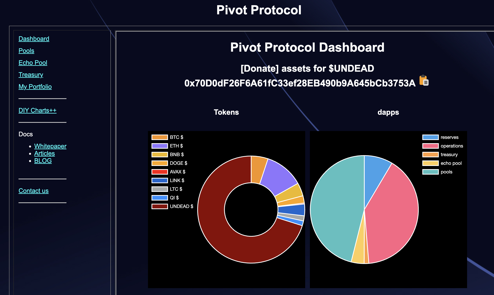
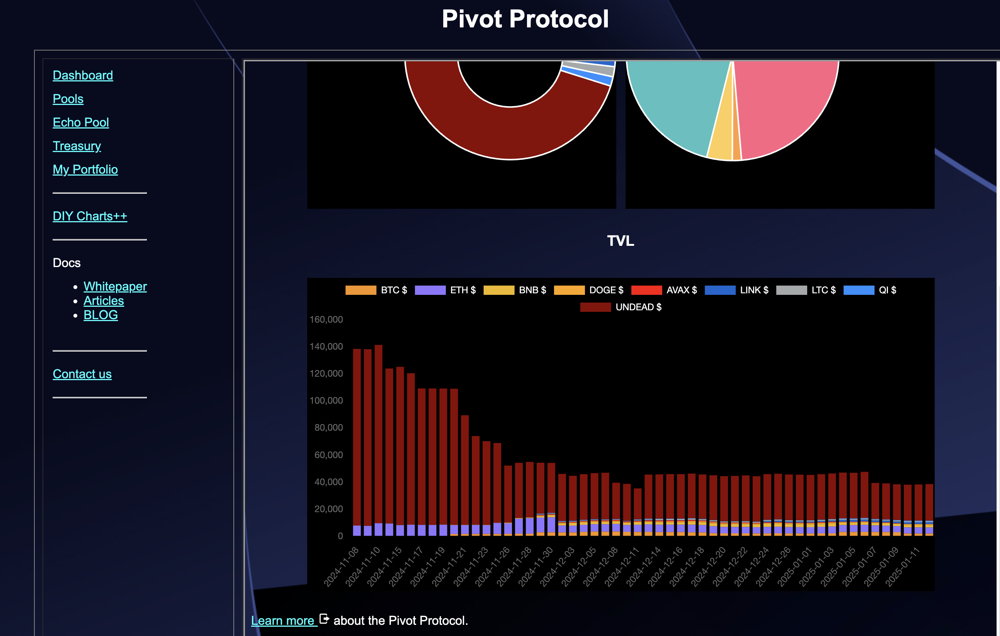
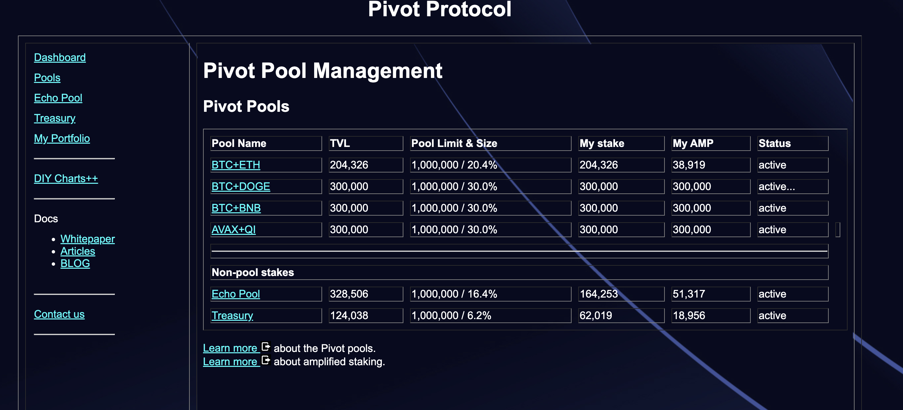
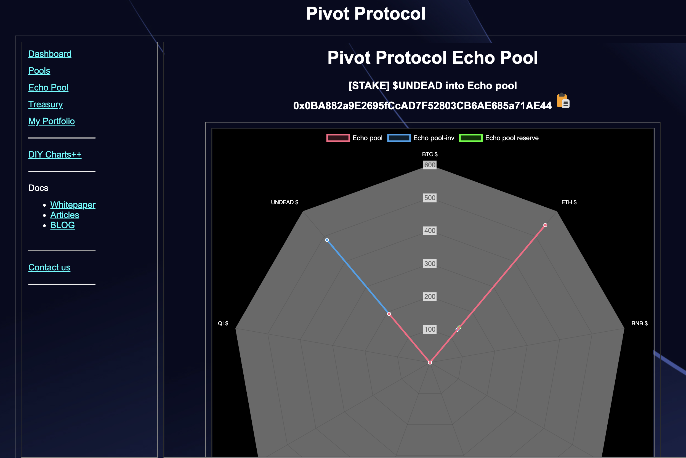
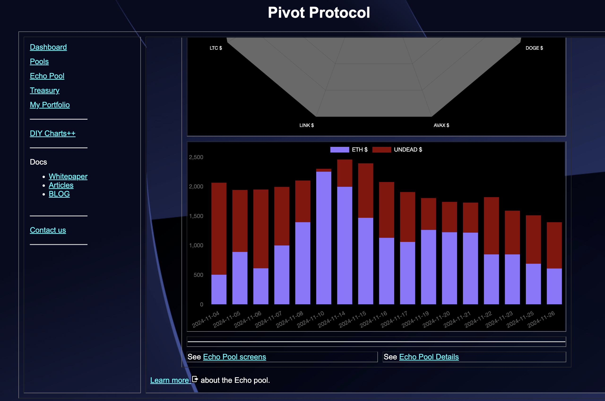
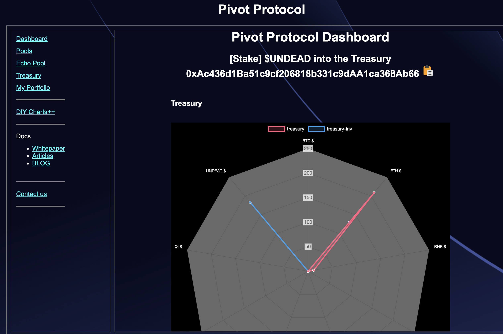
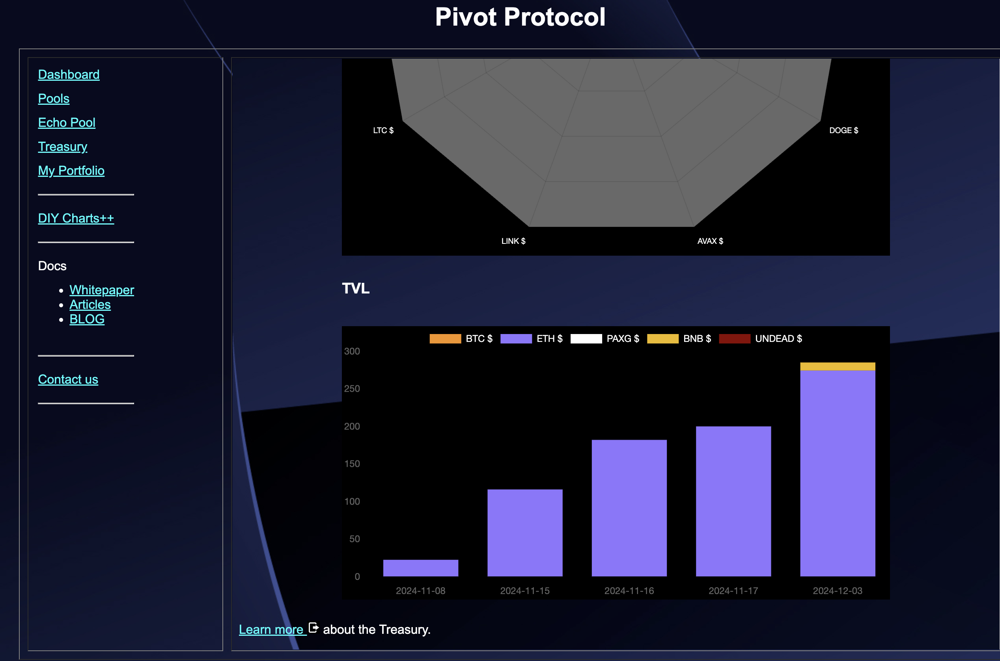
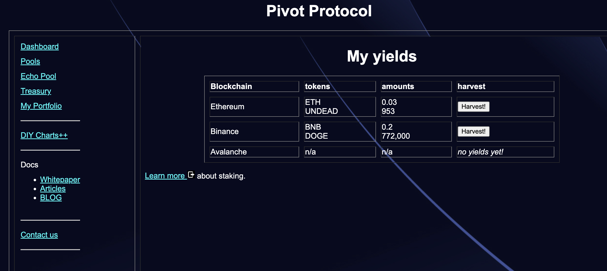
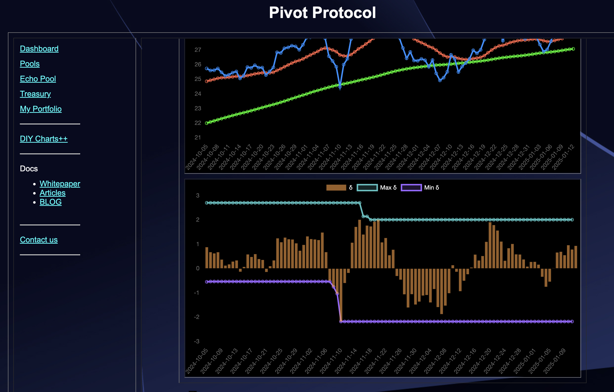

# Audit

TODAY (2024-01-12), I do an audit of the dapp. What's working; what's not, and what can be improved. I'll categorize by page-name.

## dashboard.html

First up, dashboard.html (as index.html provides the framing, although I have thoughts on the frame, itself, as well).

Improvement: Venn Diagram?

btw, the [dapp URL](https://pivoteur.github.io/#).

## pools.html

Next up, pools.html

It looks, eh, okay. The problem here is that it's entirely manually-constructed. This page needs to be automated and data-driven with computations for ROIs, APRs, addys, ... everything. 

## echo.html

Next up, I can go deep with each pivot pool or go breath-wise, which I do.

echo.html

The Echo pool is data-driven. We good. 

## treasury.html

The treasury is fully automated.

My issues here is that echo and treasury are the same, ... and each pool, when I get to them, follow the same pattern.

I should have one template that I simply fill with appropriate data here.

Also, I need to fill the treasury.

## portfolio.html

The less I talk about the "My Portfolio"-page, the better I feel.

Although: I'm thinking that each pivot pool could be treated like an incentivized LP, where you stake and get rewarded directly from the pool. Mechanisms exist for that, so I could leverage that.

## diy.html

diy.html

The "DIY Charts++" page just works for me. This is the 'secret sauce' of the protocol (and of pivot arbitrage, itself) and is easy for me to use. 

# Plan of Attack

Tomorrow I'll dive into each pool and fix what's broken there, maybe even generalize to a template-page, then make the pools-summary page data driven (that'll be the next tomorrow, or 'tomorrow and tomorrow,' as Shakespeare would write). Ja, na!
