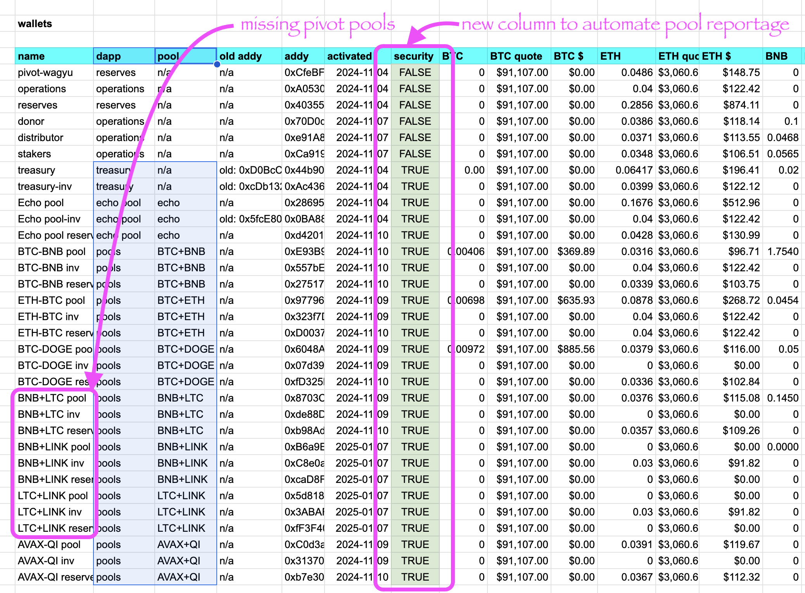

# Audit, part II, 2025-01-13

## $UNDEAD

Yesterday we left off auditing the tabs of the Pivot protocol dapp, but there is data on the dapp not being displayed, and that is the $UNDEAD 24h-volume, @coingecko place, and price.

I do track these internally. Should the dapp have a page for this?

# Balanced (fiat) account

A point of order.

The Pivot Technologies operating (fiat) account is balanced, because, yes, a protocol needs (fiat) money to operate.

# Audit, reprise

## Summary page automation

Back to part II of the audit, which is to focus on each pivot pool.

You see from the pools summary page, some pivot pools are missing, as the summary page is (currently) entirely manual.

I've added a 'security'-column to assist parsing pivot pools from address-data. 

## BTC+ETH

First pool, BTC+ETH

The UX for this pivot pool is broken. TODO: FIXME!

An ETH-on-BTC pivot has a favorable close, gaining:

* actual ROI: 7.98% / 59.41% APR projected

or 0.05 $ETH -> $BTC -> 0.054 $ETH

The δ is strongly positive, too, so I open a BTC-on-ETH pivot here. 

The BTC+ETH pivot pool composition and γ-apportionment.

I've uploaded the BTC+ETH data to the dapp, so when I templatize the pivot pools, the UX will update automatically upon upload.

## BTC+BNB

Next, BTC+BNB.

The UX is half-working: Radar chart works, bar chart does not.

There are no advantageous close pivots today, and the δ is meh, so I leave the pool as-is. 

## BTC+DOGE

Next, BTC+DOGE

The BTC+DOGE pivot pool UX is broken. TODO: FIXME!

There are no advantageous close pivots, and the δ is meh, so I open no new pivots.

Sometimes doing nothing makes the most sense in a market when doing pivot arbitrage.

## BNB+LTC

The next three pivot pools have no UX ... yet.

BNB+LTC

There's no good close pivot, but the δ is now positive, so I open a BNB-on-LTC pivot.

The pool composition and γ-apportionment are as charted (manual now; soon to be data-driven and automated). 

## BNB+LINK

There are no good close pivots here. The δ is positive, but I don't have any BNB to swap to LINK to start a BNB-on-LINK pivot, so I do nothing here.

## LTC+LINK

No good close pivots here, and, even though we have a positive δ, we already have an open LTC-on-LINK pivot open around this band, so we're good here.

## AVAX+QI

Finally, a working pivot pool UX, with both radar and bar charts working. This, then, becomes our template for other pivot pools (although radar panel could be smaller).

There are no good close pivots, and the positive δ indicates sell $AVAX, but all $AVAX is committed.

This concludes the audit.

Tomorrow I'll begin fixing the issues identified here.
