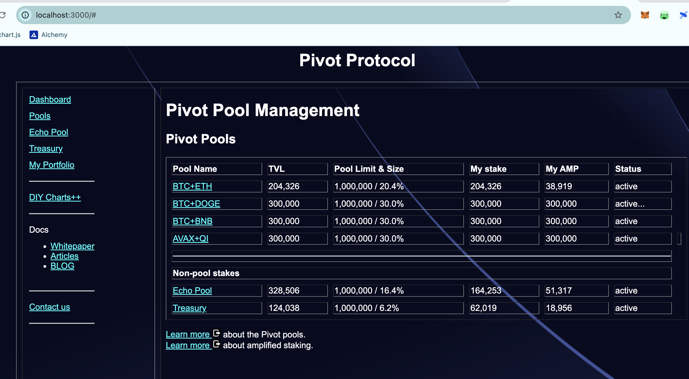
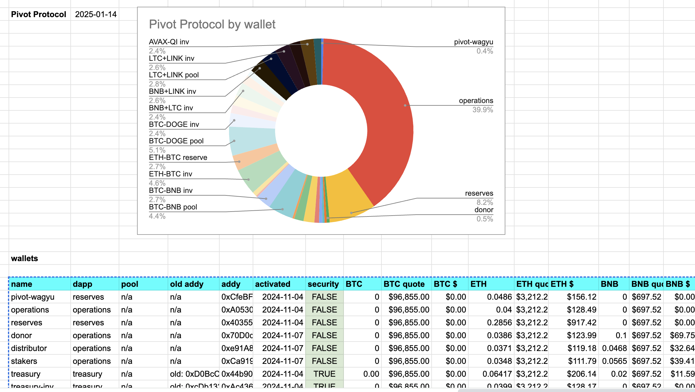

# Plan of Attack

2025-01-14

Hello, all! Yesterday's audit revealed some work to be done for a fully-automayted Pivot protocol dapp.

I was in a bit of a pickle, trying to develop an approach to fixing then rolling out solutions, as changes to automation appear to be comprehensive.

WAT DO??

Fortunately for me, and the world, entire, I've done this kind of thing before @logicalgraphs, taking a piece-wise approach, so, that's what I'll do here, in dev, and roll out working and integrated functional into prod.

Let's begin.

One area of growth, not mentioned in the audit, is to make the Pivot protocol an actual blockchain dapp, as it's currently just a bunch of (data-derived) webpages.

The problem is that I have no experience developing wallet dapps. This will take some time for me to learn.

## pools.html

So, the first problem I'll tackle is the pools.html-page: it's an obvious embarrassment as it currently stands, and, given the data exist, the transformation from wallets-spreadsheet to data-derived pools.html is tractable, ... albeit not trivial. 

My approach will be

* to improve the dapp incrementally in dev
* while I execute the daily trades in each pivot pool

This way I can get the daily operational work of the protocol done while also driving the protocol toward full automation. I tend to both and neglect neither.

