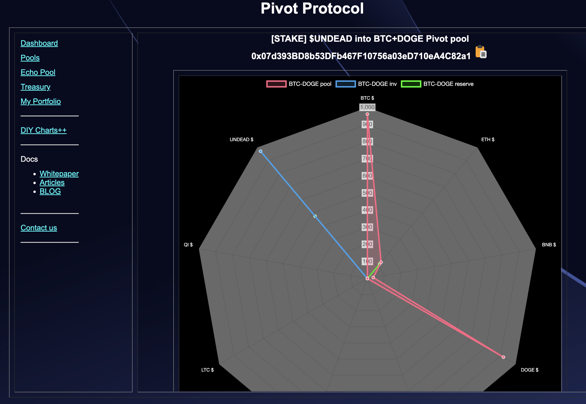

# Development

2025-01-15

The [pivot protocol](https://pivoteur.github.io/) is now reading pool-types from data, automated. 

Although the data-read is occurring, that has not (yet) translated into UX. #stepwiseRefinement 

# Pivots

Okay, now I'll look at the pools as I pivot. The 'zero'th approach is to copypasta the working pivot pool (AVAX+QI) to each pool, then, at some later time, I'll generalized to a template.

## BTC+ETH

No good close pivots, and the strong positive δ says "SELL $BTC," however, all $BTC is committed to open pivots already, so I do nothing.

UX now working for BTC+ETH pivot pool (via copypasta of AVAX+QI UX).

## BTC+BNB

No good close pivots today and I already have an open pivot higher up on this δ-band, so I do nothing today.

UX now working for BTC+BNB pivot pool (TVL was not working before today). 

## BTC+DOGE

I did this yesterday, but I didn't get around to posting. 

No close pivot activity for today, and the δ is meh, so I open no new pivots. UX is now working (copypasta from AVAX+QI).

So: all BTC-x pivot UX is working on the Pivot Protocol dapp. 

That wraps up pivot arbitrage for the day. Later today I'll work on pivots, focusing on the BNB+x UX.

