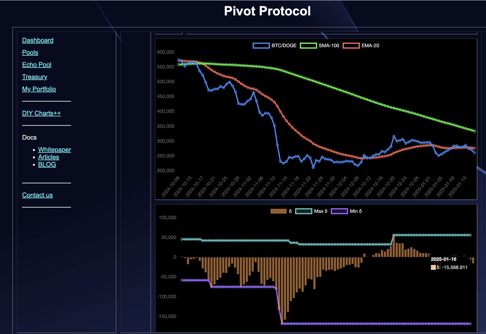
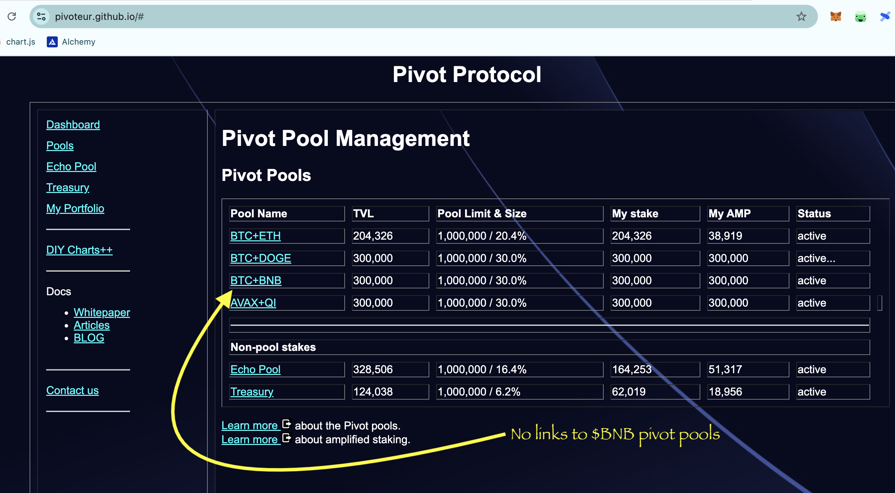

# Pivots

## BTC+DOGE

2025-01-17

Good morning, all!

I've automated the UX for the $BTC pivot pools. Today I'll be working on automating and indexing the $BNB pivot pools.

No good close pivots for the $BTC pivot pools. And the δ for the BTC+DOGE pivot pools doesn't tempt opening a new pivot there.

## BNB pools

Let's move onto the $BNB pivot pools.

Small problem with that.

There're no indices for the protocol's $BNB pivot pools. I have them, but they're not available on the UX.

Let's revise the index to be automated and data-driven now.

