# Pivots

2025-01-22

## BTC+BNB

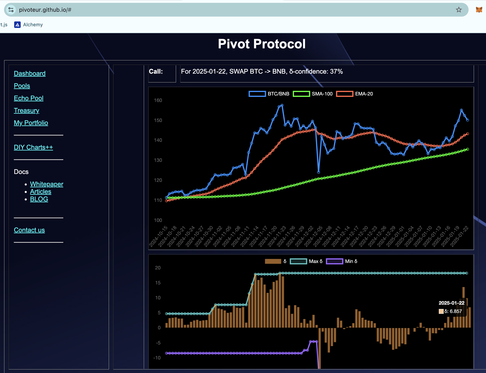

No good close pivots today. δ favors a BTC-on-BNB pivot, but all $BTC is already committed to trades.

No action.

## BTC+ETH

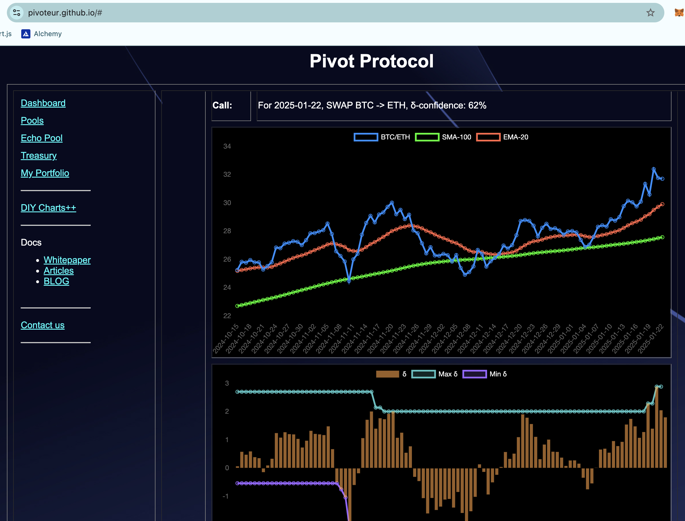

No good close pivots today. δ STRONGLY favors a BTC-on-ETH pivot, but all $BTC is already committed to trades.

No action.

Sound familiar to PT? It should. $BTC be skyin' ... 'n stuff. 

## BTC+DOGE

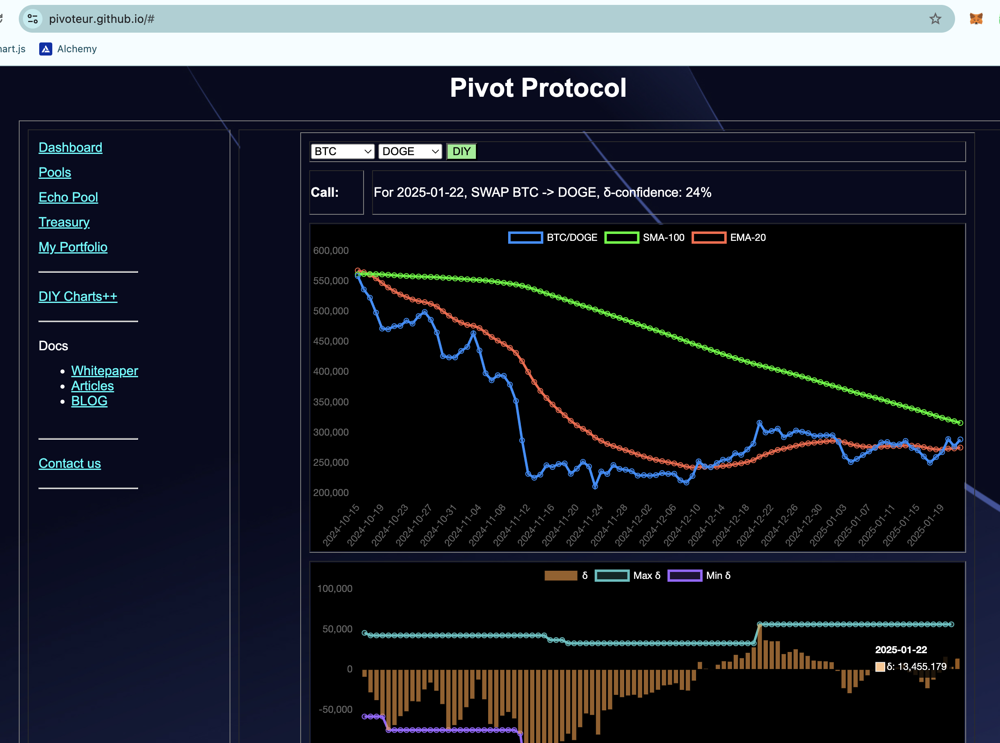

No good close pivots. BTC+DOGE δ is meh, and there's already a better-positioned open-pivot in this band.

No action. 

## BNB+LTC

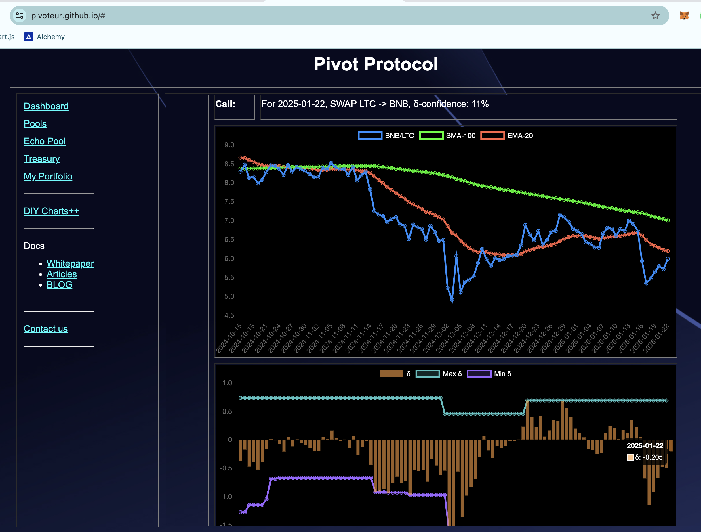

No good close pivots. I already have a better-positioned open-pivot in this δ-band.

No action. 

## BNB+LINK

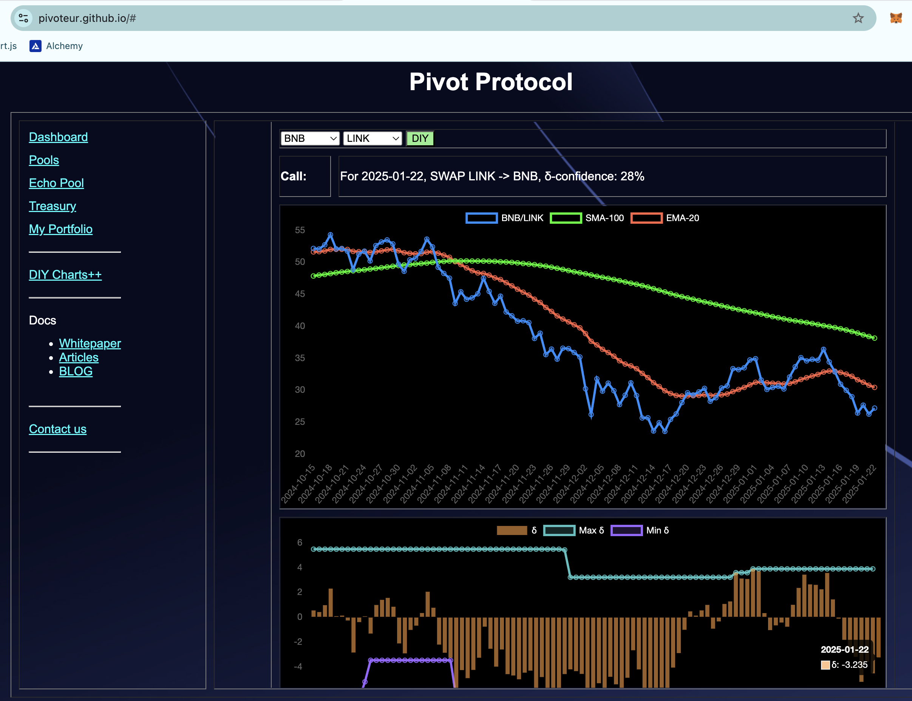

No good close pivots. I already have an open-pivot at this δ-band.

No action.

## LTC+LINK

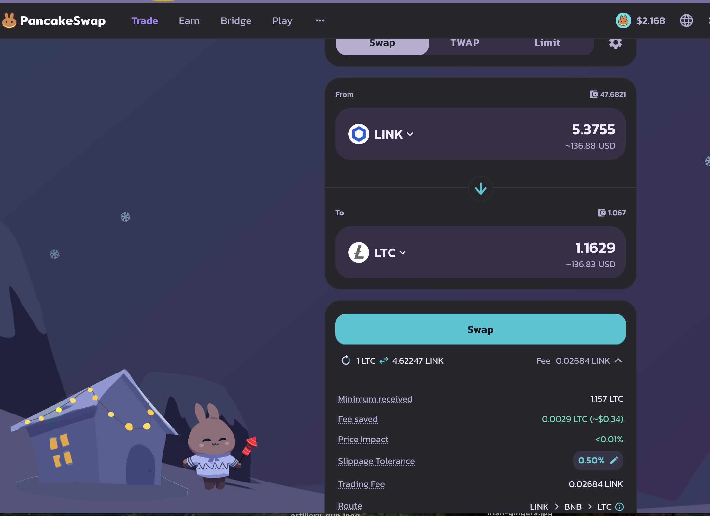

BOOM! 💥 A LTC-on-LINK close gets us

* actual ROI: 10.44% / 317.50% APR projected
* or: 1 $LTC -> $LINK -> 1.16 $LTC

And it's just that simple! 

The δ calls for opening a LINK-on-LTC pivot, and that is exactly what I do.

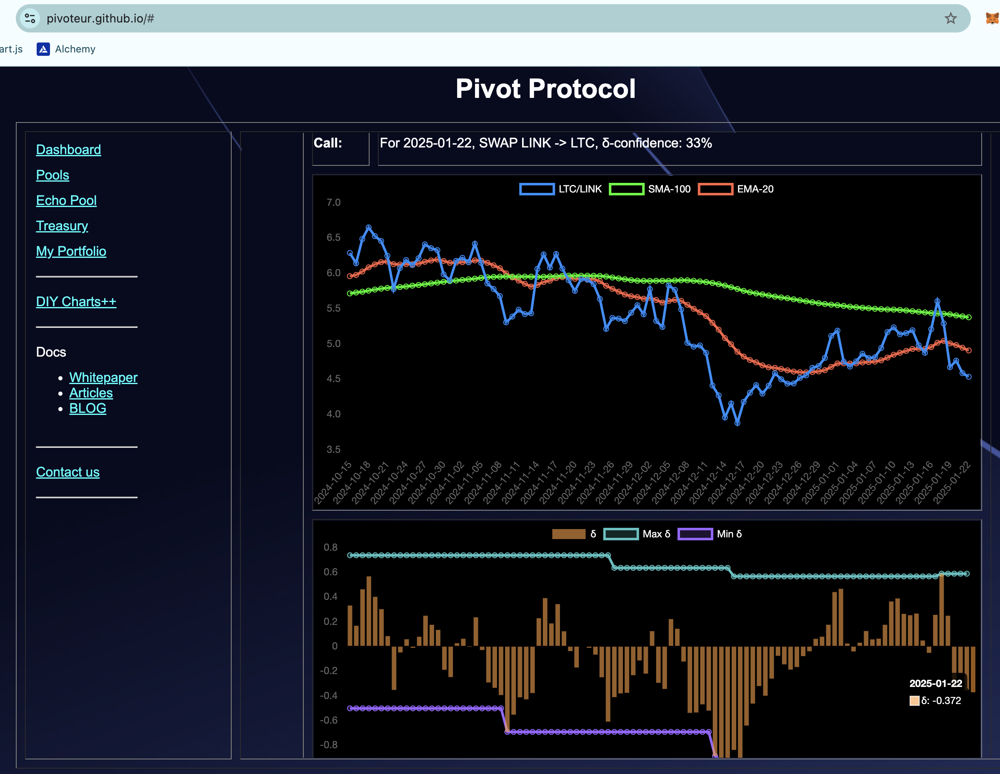
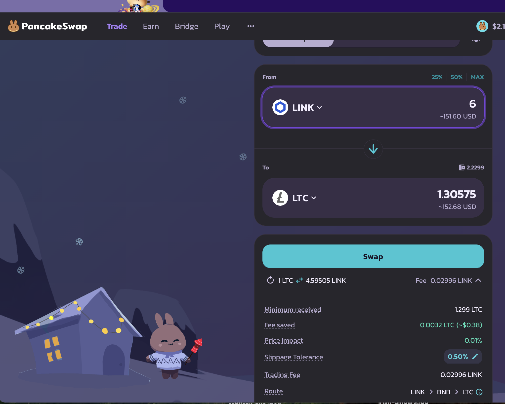

The LTC+LINK pivot pool composition and γ-apportionment are as charted.

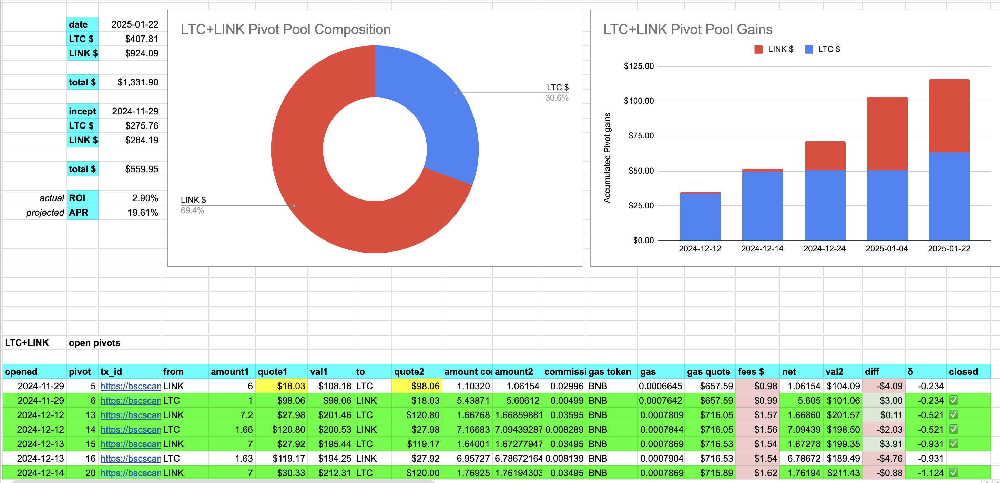
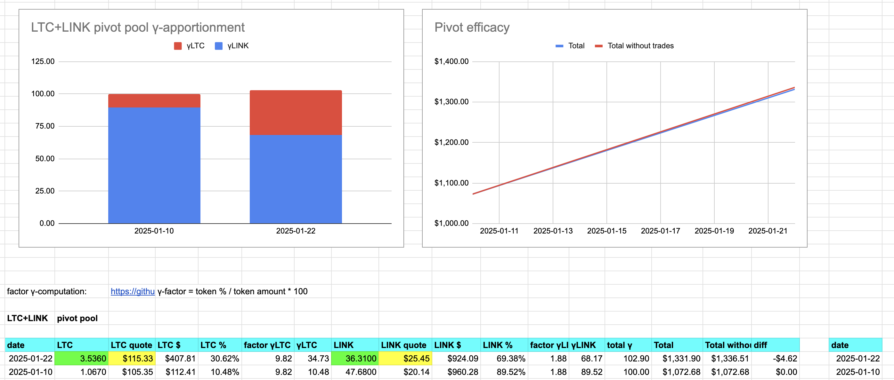

If you want to know what these terms mean, read the [whitepaper](https://github.com/pivoteur/biz/blob/main/README.md).

## AVAX+QI

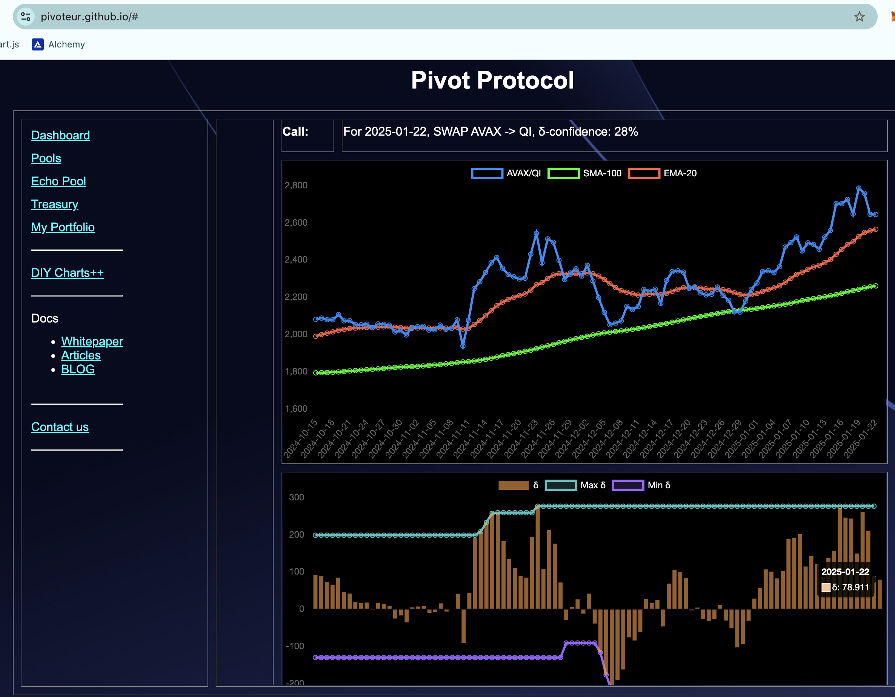

No good close pivots. The δ calls for AVAX-on-QI pivot, but I have one open at this δ-band already.

No action.

This concludes [Pivot protocol](https://pivoteur.github.io/#) activity for the day.

