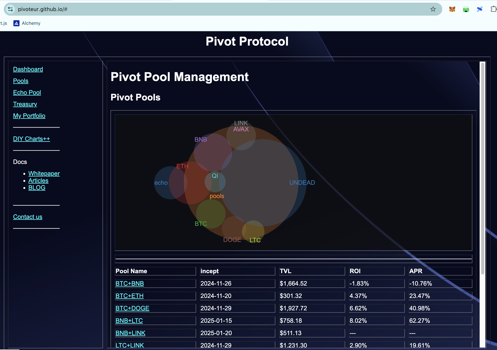
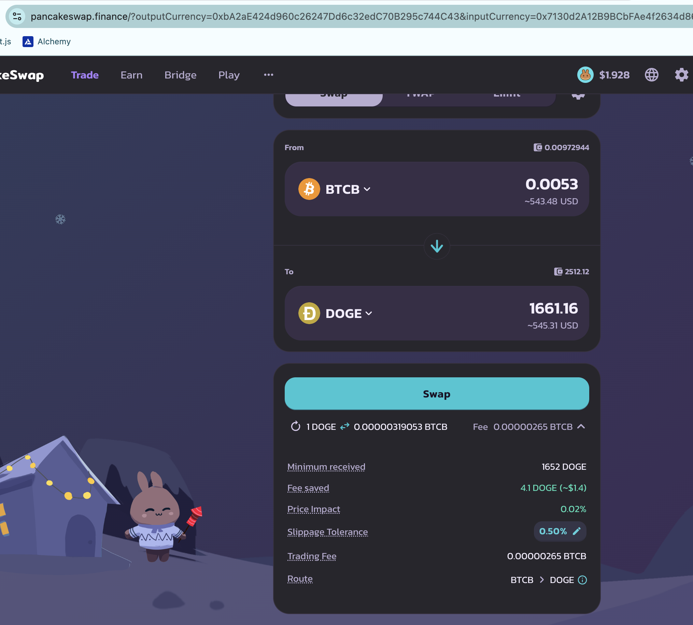
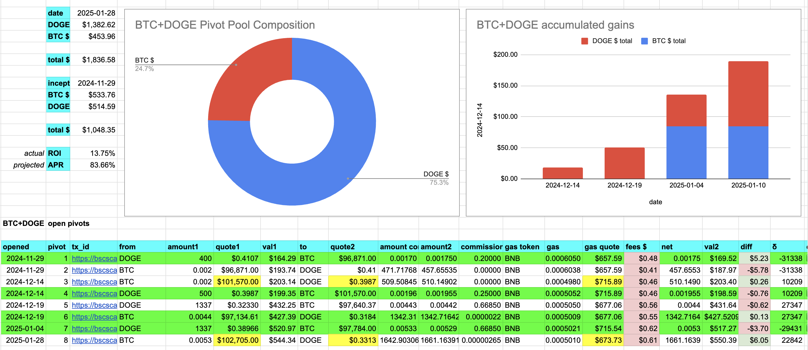
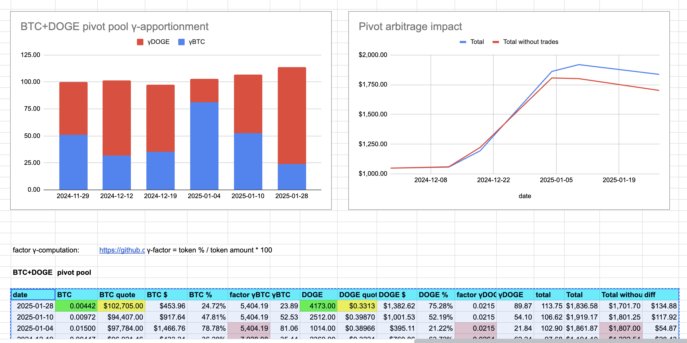
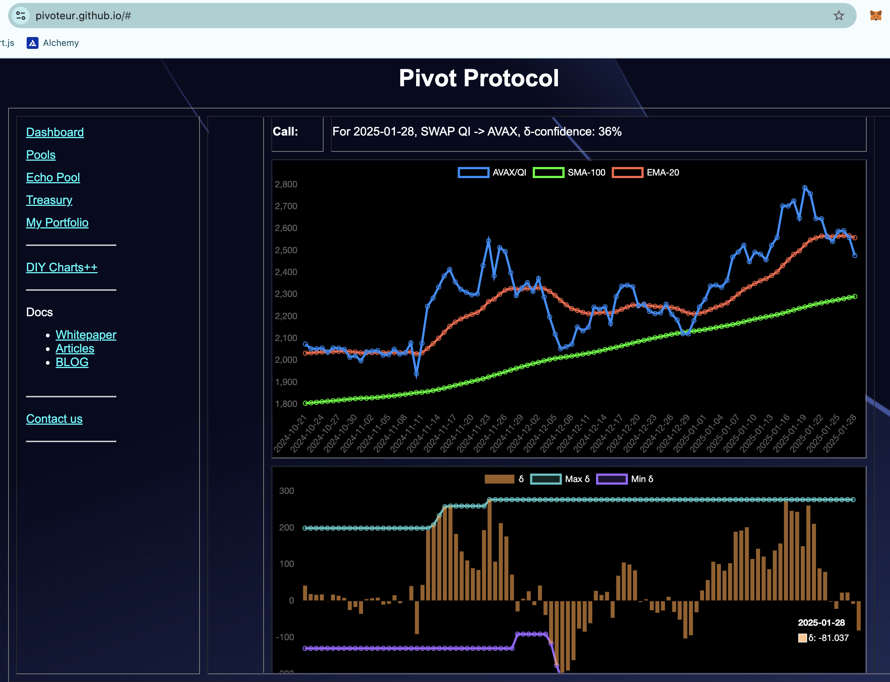
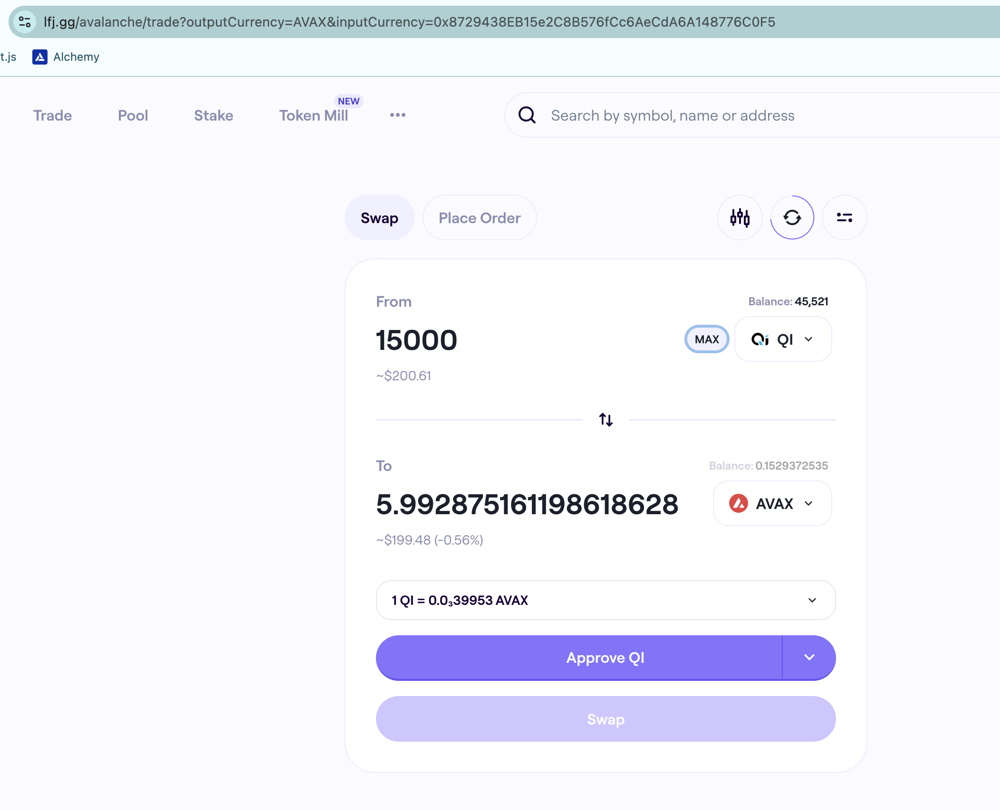
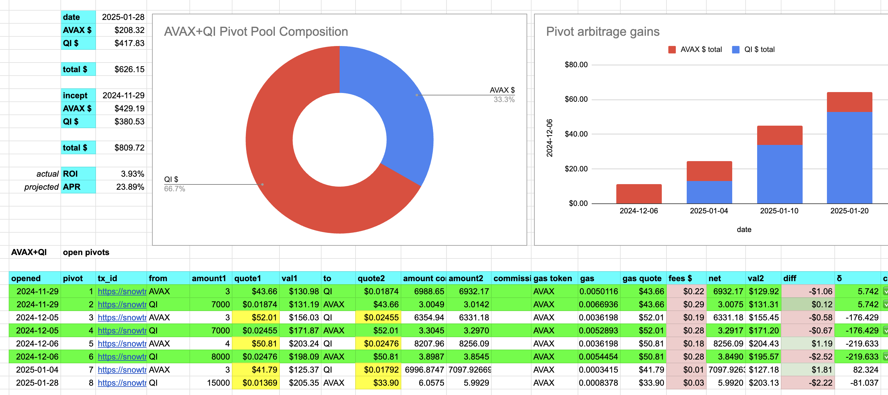
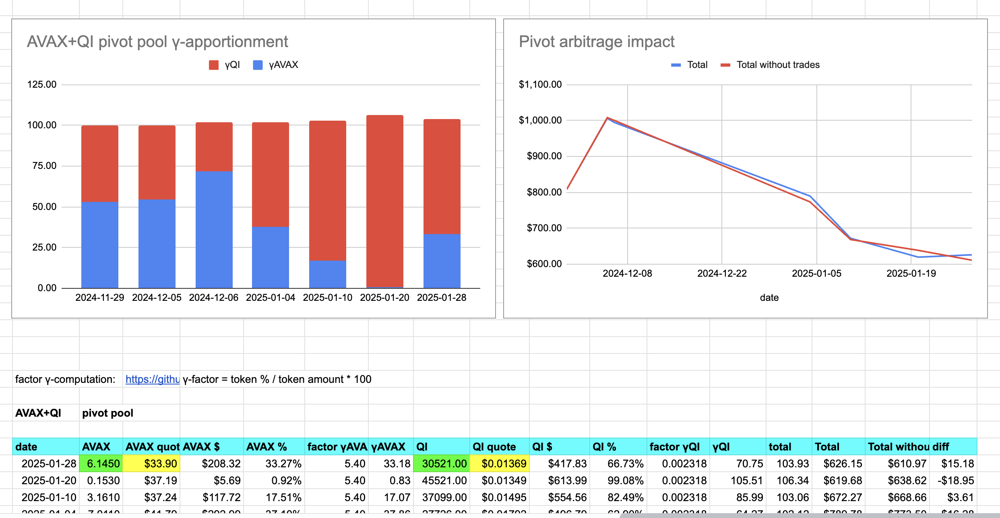

# ANNOUNCEMENT

New data-visualization up! [Pivot pool assets as a Venn Diagram](https://pivoteur.github.io/#)

# PIVOTS

BTC+DOGE

No close pivots today, but the positive δ calls to open a BTC-on-DOGE pivot, so I do this. 

The BTC+DOGE composition and γ-apportionment is as charted.

$DOGE's price has harmonic properties to $BTC's that makes this pivot pool interesting and profitable.

## AVAX+QI

No close pivots today, but the negative δ (new after a while) calls to open a QI-on-AVAX pivot, so I do this.

The AVAX+QI composition and γ-apportionment are as charted. 

The AVAX+QI pivot harmonics is interesting to me, in fact: AVAX+QI is the first pool I executed pivots on to develop this technology.

That said: I'm exploring offline other $AVAX pivot pools to see if there are profitable pivots with $AVAX against other tokens.

