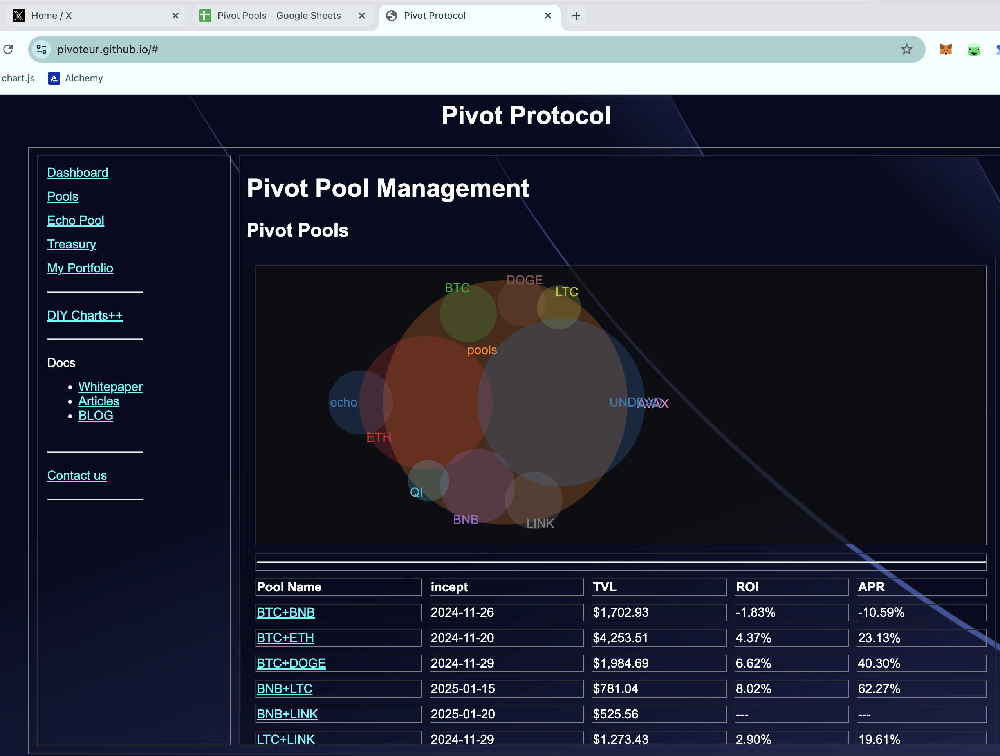
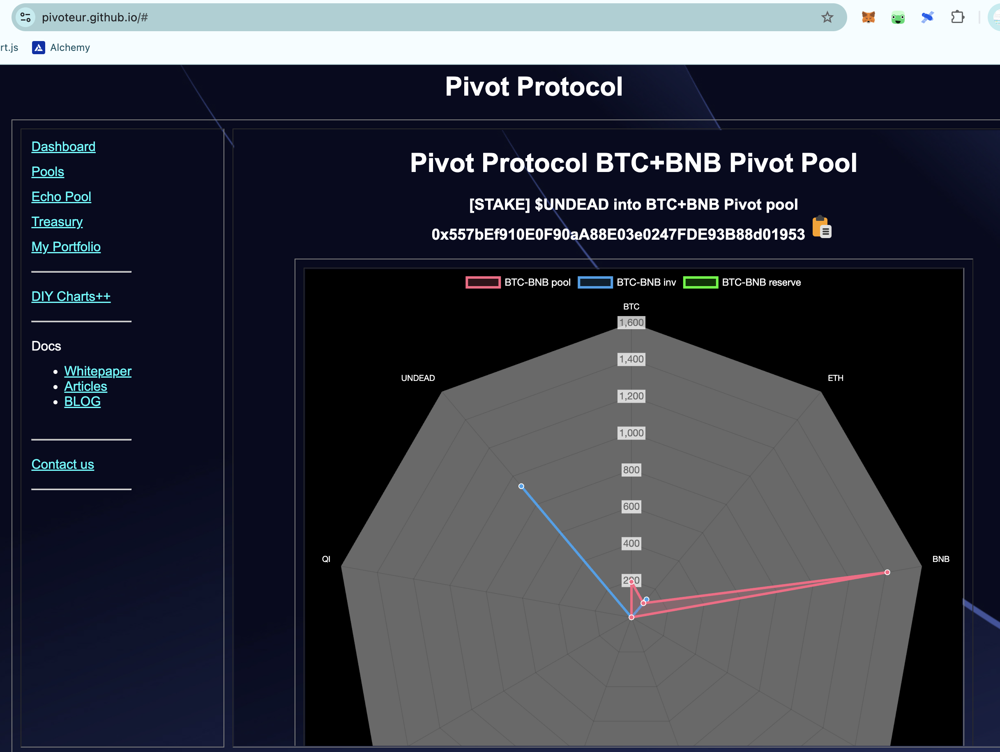
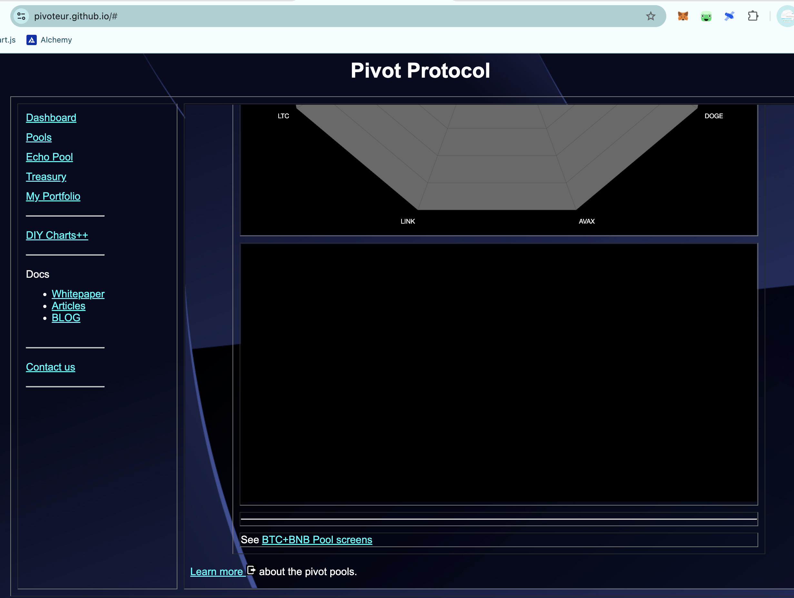
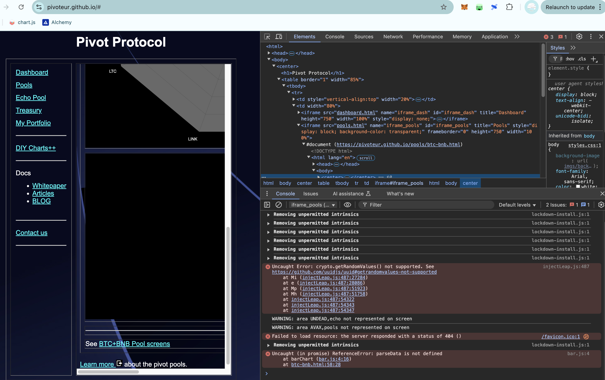

# Development

2025-01-30 

*sigh* I have 7 pivot pools,

... and I have seven webpages that represent each pool, each pool-page is basically a photocopy of the others.

*sigh*

Time to templatetize and parameterize down to one page, eh?

*sigh* 

Also, I have an error on the bar-chart.

FIXME.

Fixing the error is easy enough, on one page, but there are seven (very) similar pages with the same error, so this calls for an infrastructure change.

I have what you would call a 'hate-hate'-relationship with infrastructure coding, ...

1. I hate coding infrastructure, as an infrastruture, and infrastructure-improvements, show as nothing on the UX, so it looks like it's a(n awful) lot of work for nothing.

2. I HATE coding with poor infrastructure as it leads to convoluted and duplicated code. I HATE that.

So, there you have it. I'm going to be coding away for more hours than I want, grumbling at every moment of me doing it, ... and when the changes are in, I'm going to save tons of time and eliminate tons of duplication, ... and being ungrateful at all the time I save later. 😭

# ANNOUNCEMENT!

Pools-page Venn Diagram now has an interactive tooltip that shows USD-amount of crypto in play for pivot arbitrage. 
[Pivot Protocol](https://pivoteur.github.io/#)
