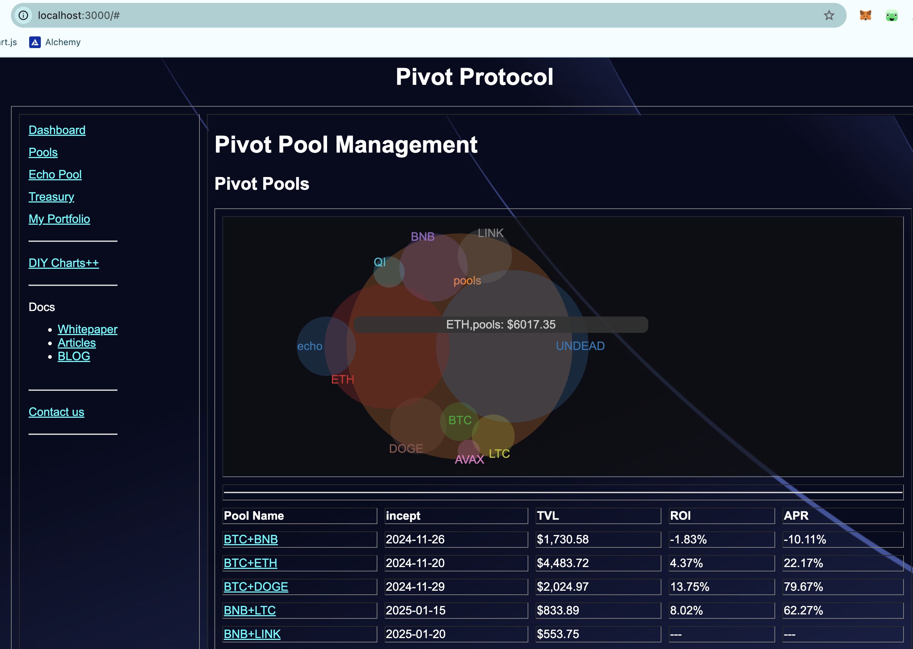
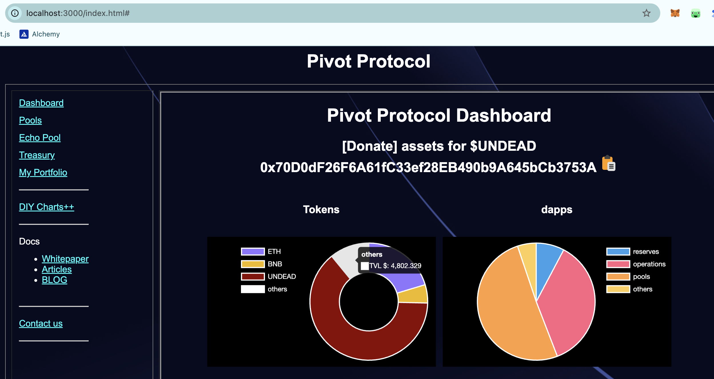
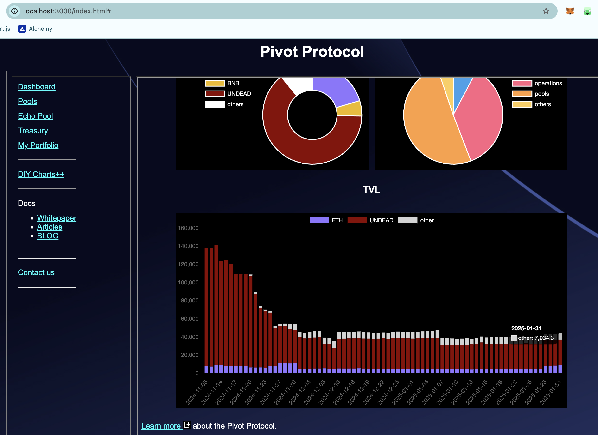
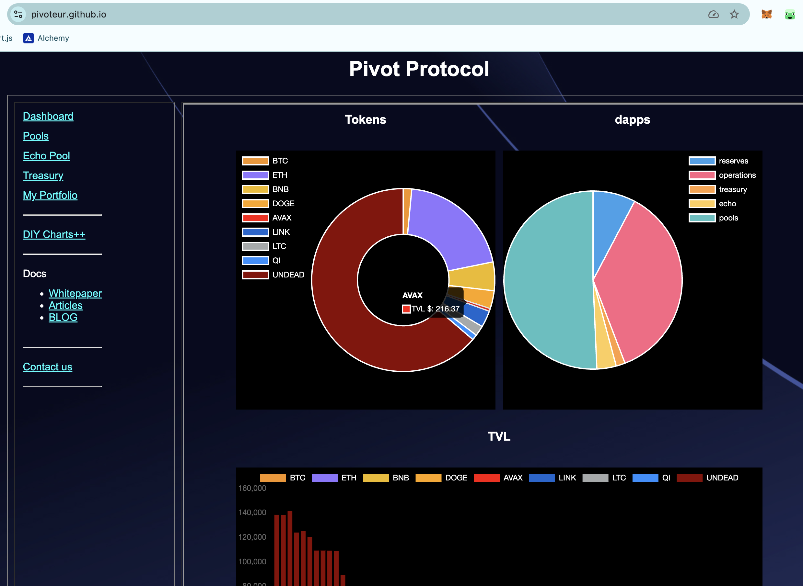

# Greetings

Happy last-day-of-January!

The month of January is named after the [Roman god Janus](https://en.wikipedia.org/wiki/January), facing the old and the new. 

Janus has no Greek-equivalent, but I find a striking resemblance to [Gemini (Δίδυμοι)](https://en.wikipedia.org/wiki/Gemini_(astrology)), ...

so [@Gemini](https://www.gemini.com/) should be happy today.

# ANNOUNCEMENT

The Venn Diagram tooltips now include the token-sets for the amounts show, so, e.g.: it not only shows how much $ETH the protocol has but how much $ETH is apportioned to the echo-pool and how much is apportioned to the pivot-pools.

# ANNOUNCEMENT

Both pie-charts and bar-charts now group assets that are less than 5% of total value into an 'others'-category, reducing the labels to the relevant/impactful ones. 

The original UX included every asset-kind, no matter how little liquidity there was for that asset, leading to a busy UX. 

