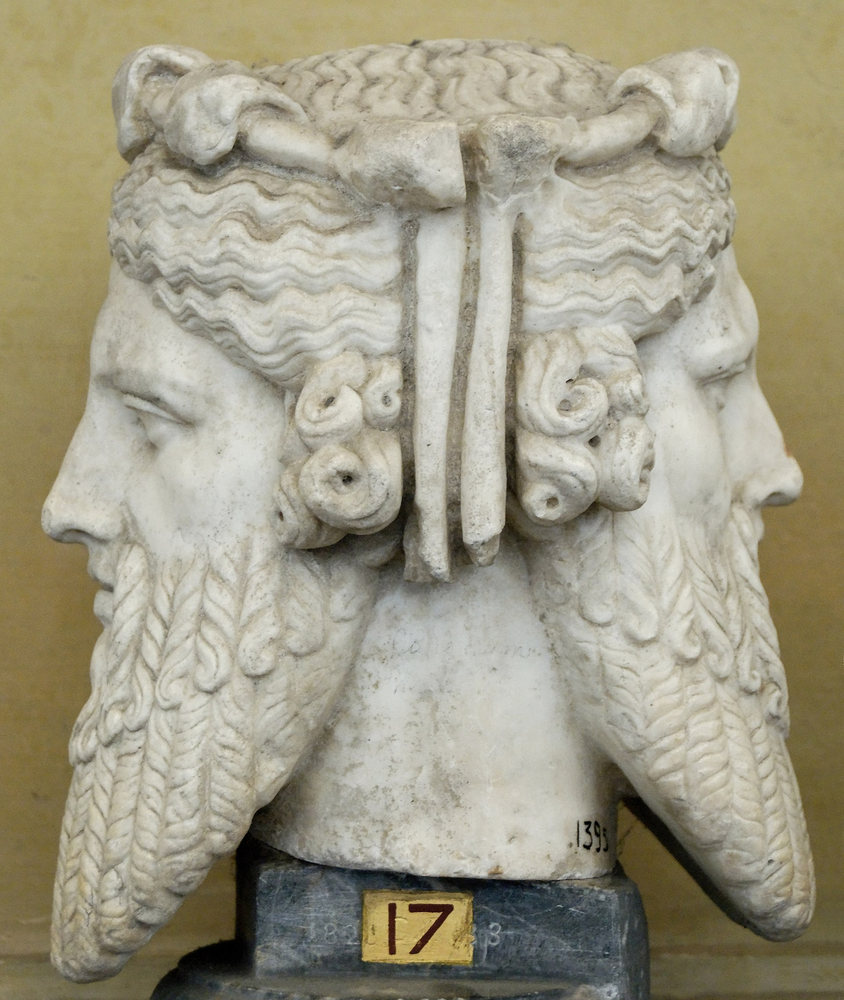

# Greetings

Happy last-day-of-January!

The month of January is named after the [Roman god Janus](https://en.wikipedia.org/wiki/January), facing the old and the new. 

Janus has no Greek-equivalent, but I find a striking resemblance to [Gemini (Δίδυμοι)](https://en.wikipedia.org/wiki/Gemini_(astrology)), ...

so [@Gemini](https://www.gemini.com/) should be happy today.
