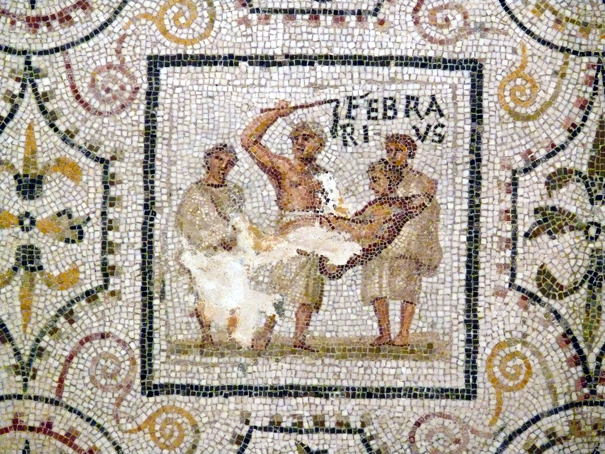

# Salutations

Happy February, all!

The [month of February](https://en.wikipedia.org/wiki/February) is named after the Roman ritual of purification that happened in this month. 

It being February means it's time to report on the protocol's activities for January. So, oft! I go to do just that.
