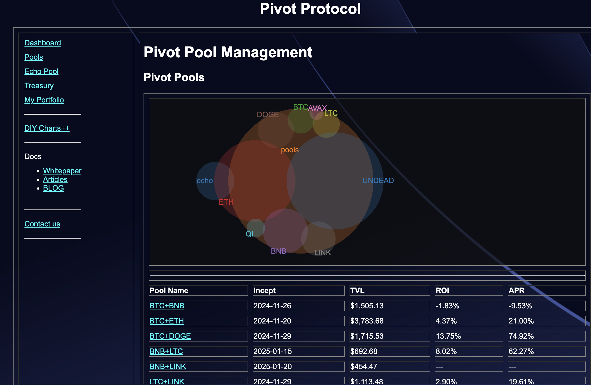
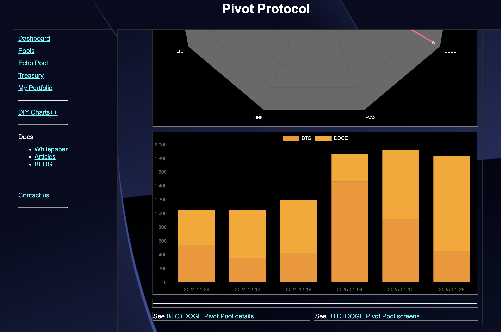
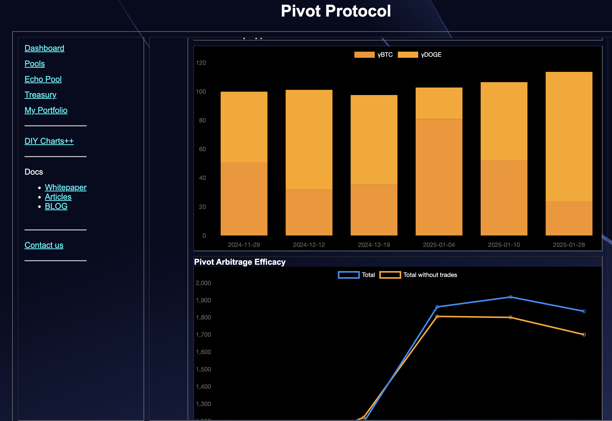
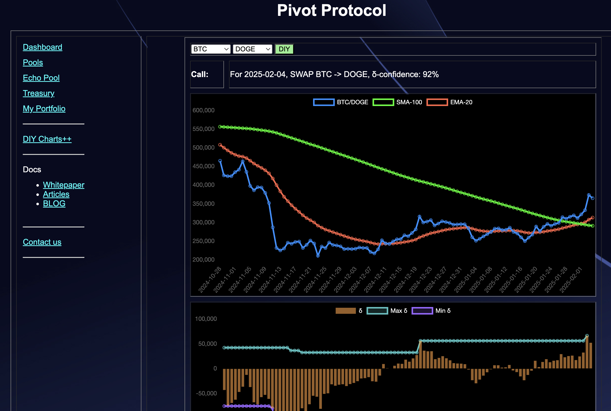

# 💥💥💥 ANNOUNCEMENT!💥💥💥

The Pivot Pool UX, including the pivot pool pages for the index, the pool-page, details, and DIY++ screens are now totally automated and data-driven.

This means that by adding a wallet addy to a pivot pool adds the four pages to Pivot protocol UX.
