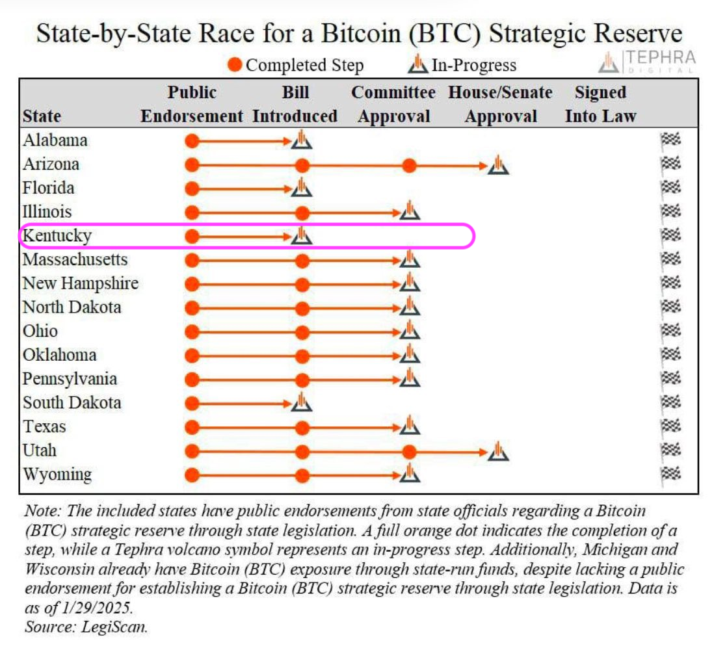

# BTC Reserve pensées

2025-02-05

Good morning, all! Feeling very motivated after completing pivot pool UX automation. YAY!

I've been thinking about creating a $BTC-reserve. Hey, if Kentucky can, so can I!

This requires I have $BTC to reserve, which means I need to get to work.

Let's get to work.

BUT FIRST! I'm going to go on a walk. Because I can do that. kthxbai 😘 #OwnYourOwnBusiness 

