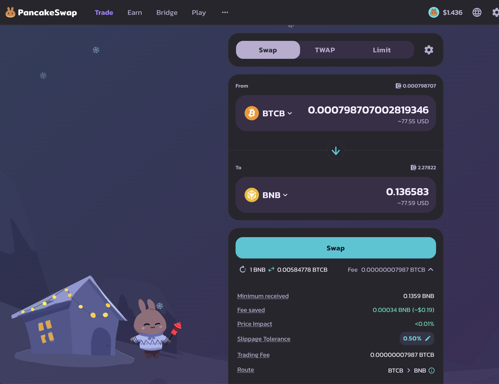
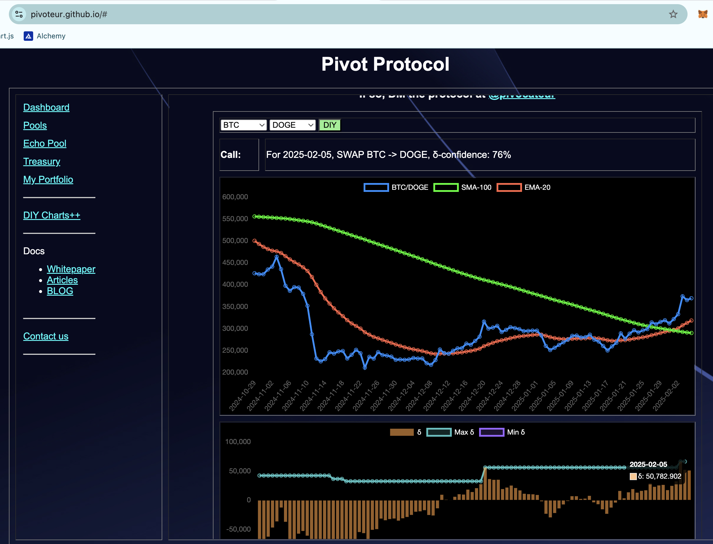

# BTC Reserve pensées

2025-02-05

Good morning, all! Feeling very motivated after completing pivot pool UX automation. YAY!

I've been thinking about creating a $BTC-reserve. Hey, if Kentucky can, so can I!

This requires I have $BTC to reserve, which means I need to get to work.

Let's get to work.

# Walk

BUT FIRST! I'm going to go on a walk. Because I can do that. kthxbai 😘 #OwnYourOwnBusiness 

Walk completed. Winter means it's gray and cold, BUT there were fuzzy-wuzzies to be patted, so I had that going for my walk. 

# Pivots

## BTC+BNB

I get back from my walk for a nice gain on a BNB-on-BTC pivot:

* actual ROI: 13.07% / 67.18% APR projected

The δ is very positive so I open a BTC-on-BNB pivot. I don't like that I don't have a BNB-on-BTC pivot open now, but I've taken all gains from that side already.

The BTC+BNB pivot pool's composition and γ-apportionment is as charted. 

As you see, I'm all-in on the BTC-on-BNB pivots, so if $BTC reaches escape velocity tomorrow, well: I lose. Maybe I need to have an 'always hedge' rule, but what happens when all the hedge dries up, as here?

This is telling me I have more to learn. I wish I had a perfect system that computes hedge in a strongly one-sided market, but the protocol isn't there yet.

Perfect systems are built by perfect people: I still have a ways to go.

## BTC+DOGE

Another impressive gain on a DOGE-on-BTC pivot:

* actual ROI: 24.41% / 185.65% APR projected
* Or: 1337 $DOGE -> $BTC -> 1662 $DOGE

for an ~$87 gain.

The δ is positive, calling for a BTC-on-DOGE pivot, but all $BTC is committed to pivots already.

The BTC+DOGE pivot pool composition and γ-apportionment are as charted. 

Again, 100% BTC-on-DOGE pivots for this pool with all hedge gone with that last close pivot. 

## LTC+LINK

Another good (very good) close of a LINK-on-LTC pivot:

* actual ROI: 70.69% / 1843.06% APR projected
* or: 6 $LINK -> $LTC -> 6.92 $LINK

for an ~$100 gain. 💥💥

The positive δ calls for a LTC-on-LINK pivot, so I open one with the remaining $LTC.

The LTC+LINK pivot pool composition and γ-apportionment are as charted. 

# Conclusion

This concludes the pivots in the [Pivot Protocol](https://pivoteur.github.io/#) for today.

* pivot-gains today: ~ $200 in. real. crypto. assets. 
