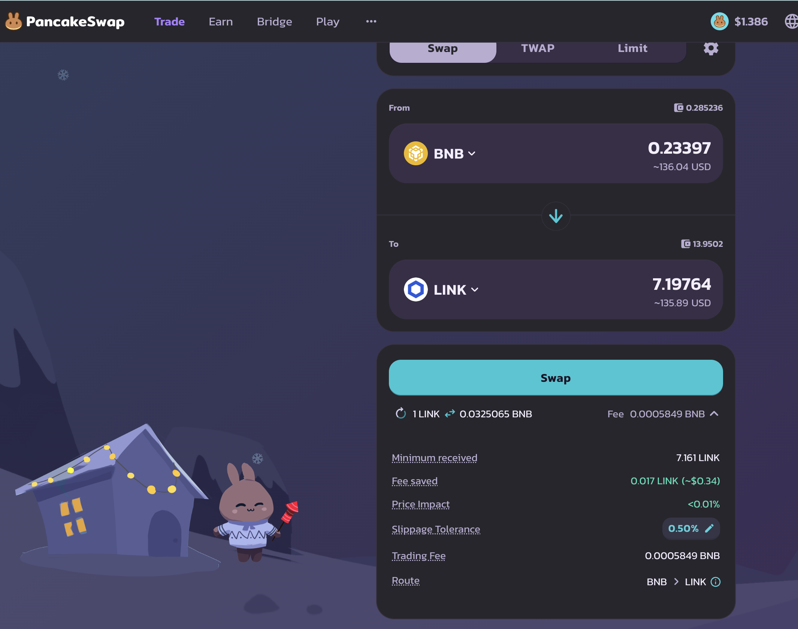
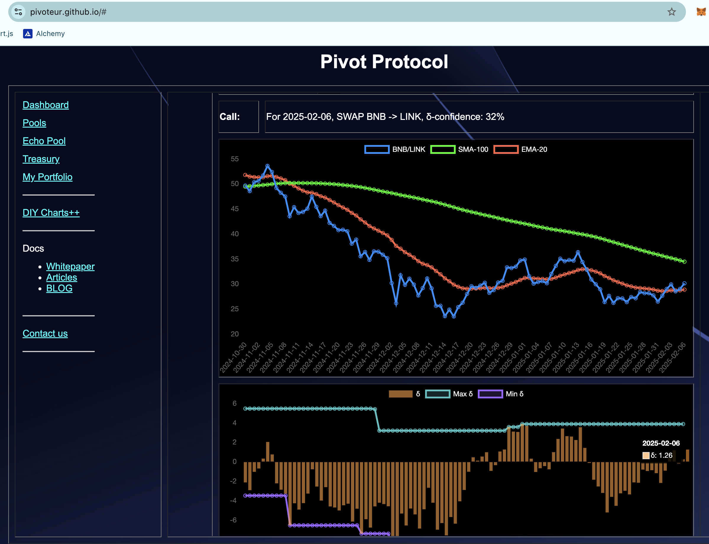
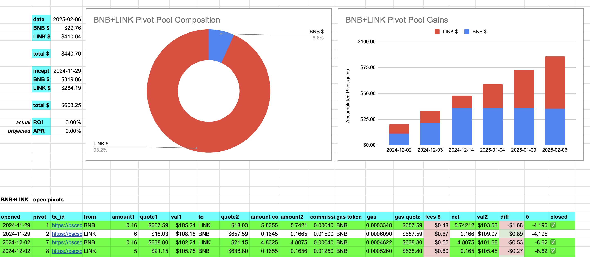
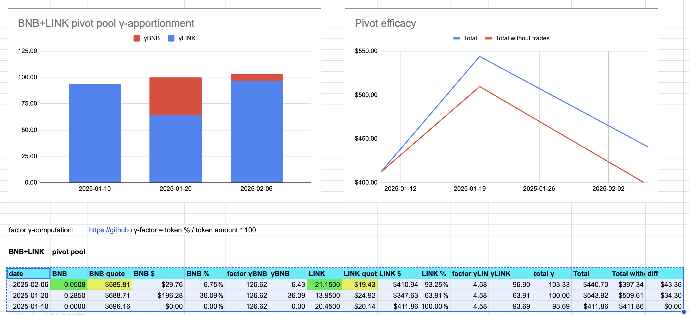
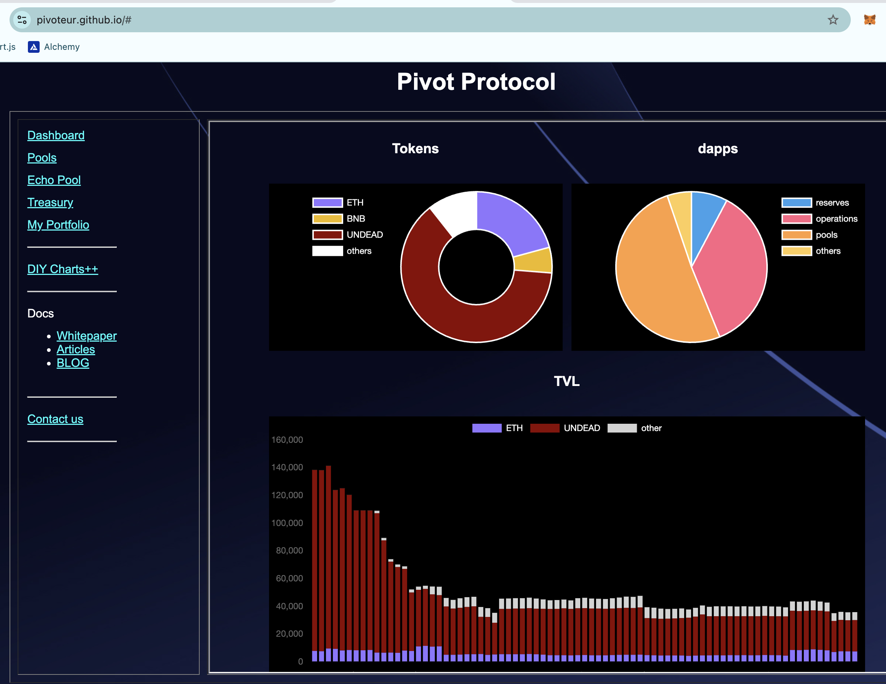

# PIVOTS

2025-02-06

Hello, all

## BNB+LINK

A nice close on a LINK-on-BNB pivot:

* actual ROI: 10.47% / 58.80% APR projected
* or: 6.5 $LINK -> $BNB -> 7.2 $LINK

for an ~ $13 gain

The positive δ says open a BNB-on-LINK pivot, but we're already fully (over, actually) committed.

The BNB+LINK pivot pool composition and γ-apportionment are as charted.

Take a second to study the γ-apportionment: what does it tell us? It's saying that the total γ is increasing, pivot-to-pivot, ...meaning: no matter which-way the prices go, the intrinsic worth is increasing.

# Conclusion

Thus endeð pivots for today, and look at me ending my work-day at 5 pm like some kind of psychopath!

The [pivot protocol](https://pivoteur.github.io/#) 
