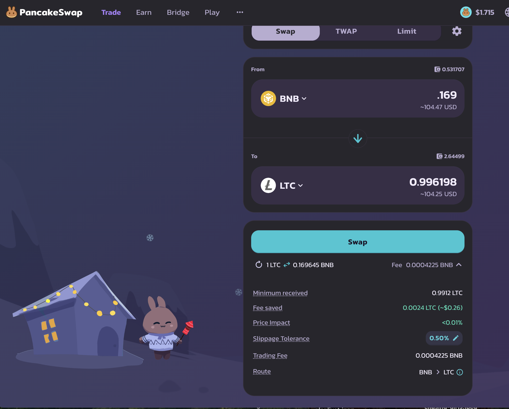

# Pivots

2025-02-08

## BNB+LTC

Not quite close pivots on the $BTC pivots (not shown), and no close pivots here, but there's a δ-upswing that calls to open a BNB-on-LTC pivot, so I do that.

The BNB+LTC composition and γ-apportionment are as charted.

As more pivots come into play, we create a continuous flow of liquidity.

## AVAX+QI

No close pivots today, but the negative δ calls to open a QI-on-AVAX pivot, so I do that. 

The AVAX+QI composition and γ-apportionment are as charted.

# Conclusion

Crypto is down. But am I? Nurpe. Pivots shine after a market down-turn. Crypto goes up. It goes down. Pivots let you ride these waves and come out on top.

I'm BUIDL, so I'm not down: I'm UP. 

[Pivot Protocol](https://pivoteur.github.io/#)
