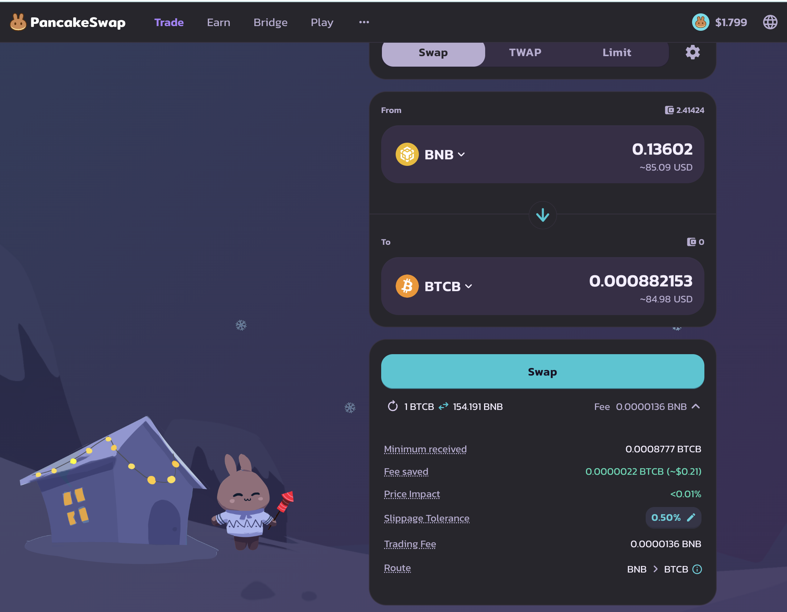
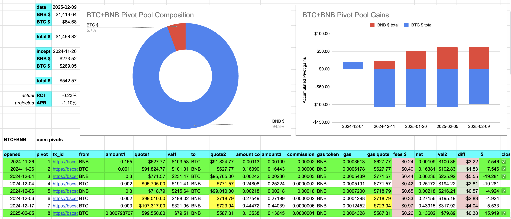
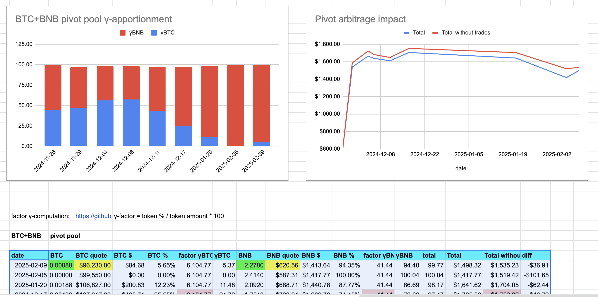
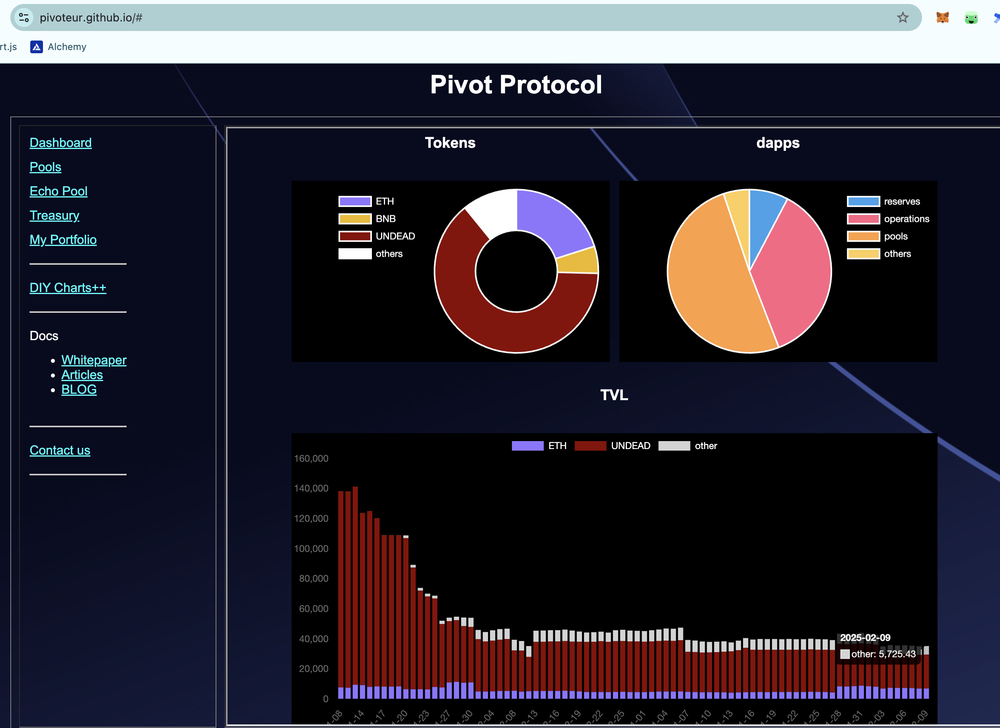

# Pivots

2025-02-09

## BTC+BNB

Question: is your $BTC getting 

* actual ROI: 10.15% / 926.33% APR projected?

Because the Pivot Protocol's is on closing a BTC-on-BNB pivot. 

There's no significant δ today, so we rest.

The BTC+BNB pivot pool composition and γ-apportionment are as charted.

# Conclusion

This concludes pivots for today. YAY!

The [Pivot Protocol](https://pivoteur.github.io/#)
