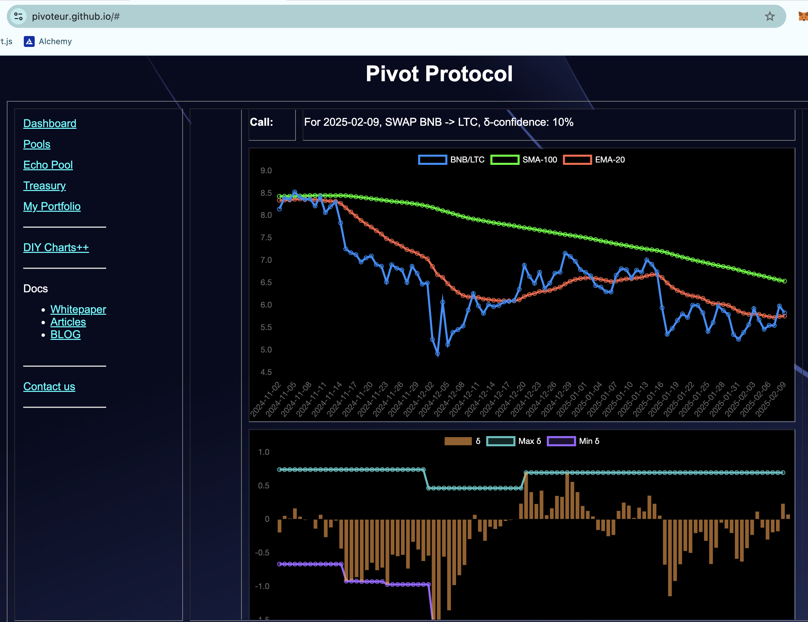
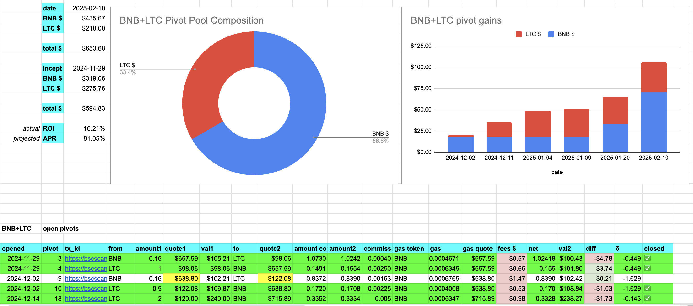
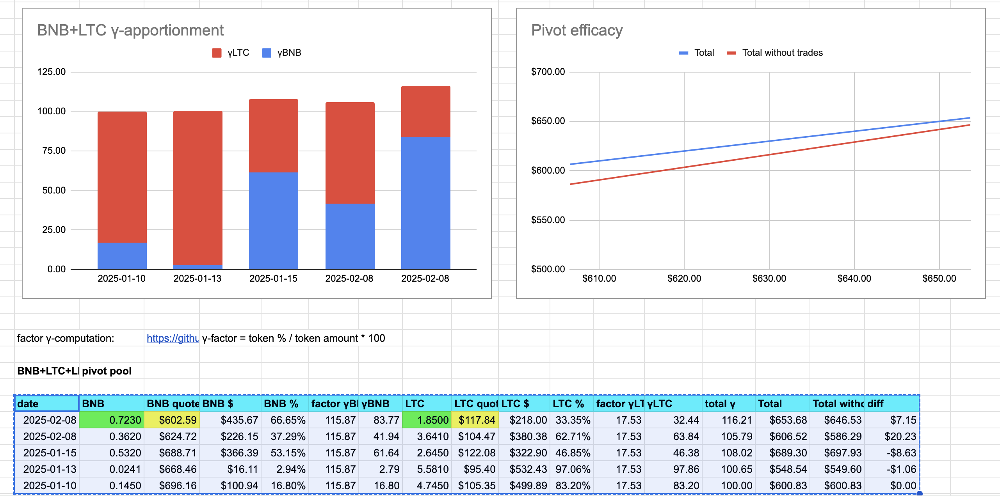
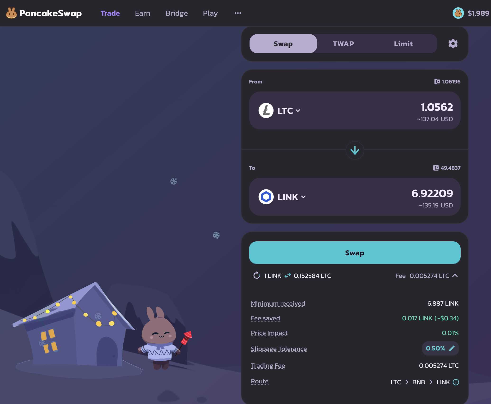
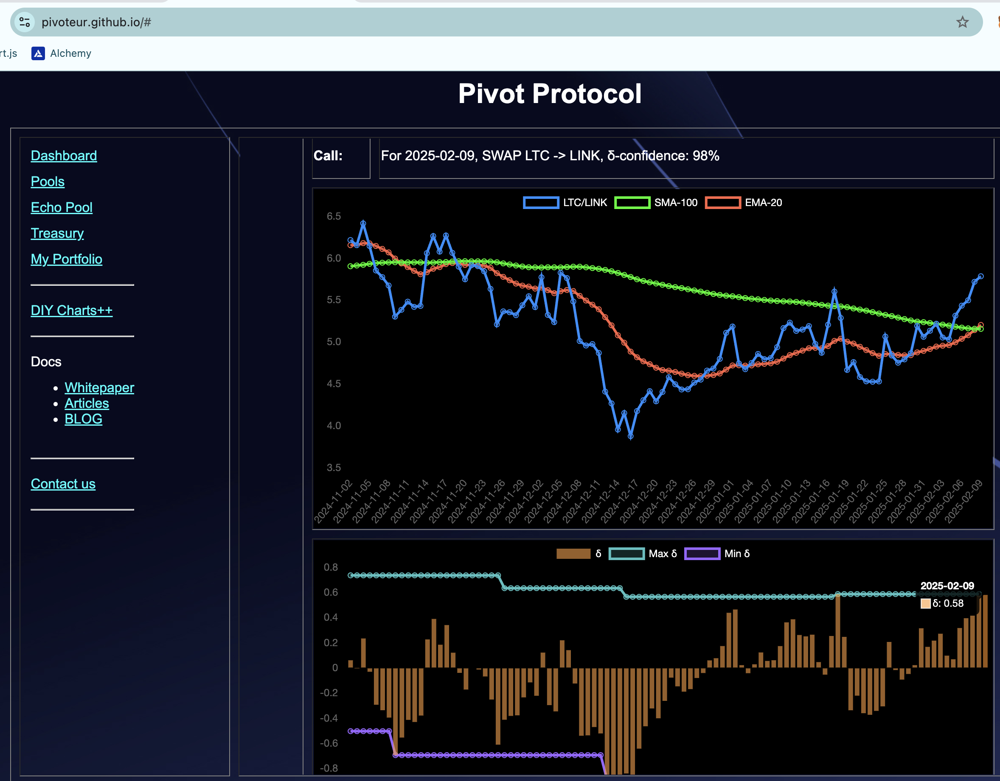
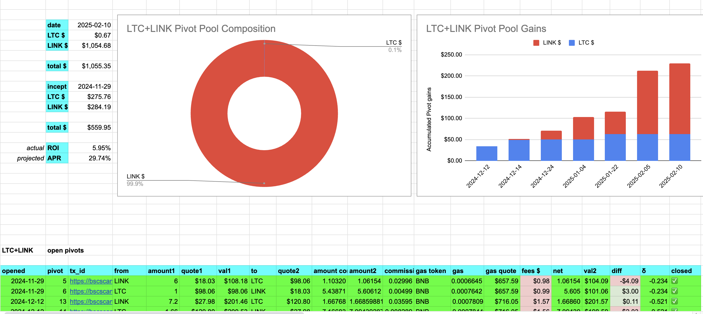
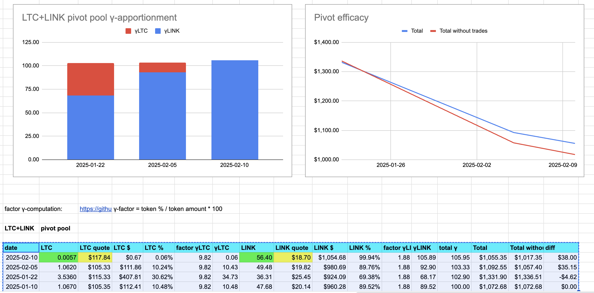
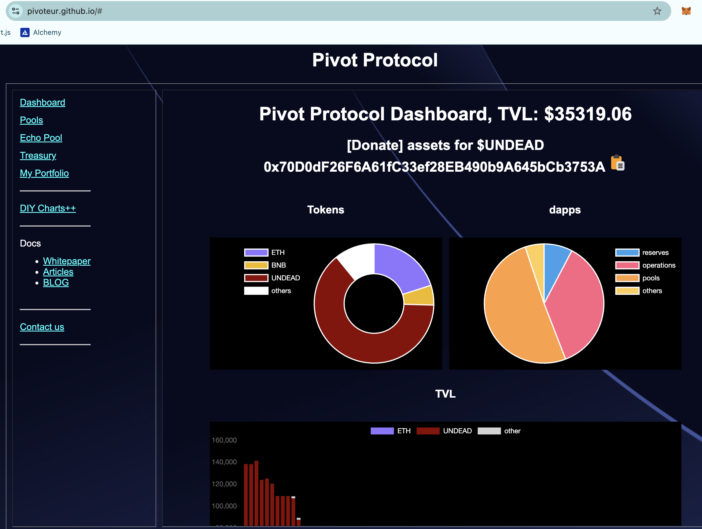

# Pivots

## BNB+LTC

$LTC is in the news, and I just closed a BNB-on-LTC pivot for gains of:

* actual ROI: 20.81% / 130.97% APR projected
* or: 0.3 $BNB -> $LTC -> 0.362 $LTC
* or ~$40 gain on a $215 pivot

The δ is meh, so we don't open a new BNB+LTC pivot. 

The BNB+LTC pivot pool composition and γ-apportionment is as charted. 

## LTC+LINK

A winning close pivot, this time LINK-on-LTC, for gains of:

* actual ROI: 15.25% / 76.24% APR projected
* or: 6 $LINK -> $LTC -> 6.91 $LINK
* or: ~$17 gain on ~$100 pivot

The δ is strongly positive, calling for a LTC-on-LINK pivot, but all $LTC is currently committed.

The LTC+LINK pivot pool composition and γ-apportionment are as follows.

This pivot pool continues to do well. 

# Conclusion

This concludes pivot arbitrage for today.

Gains: ~$57 on ~$315 pivoted.

The [Pivot protocol](https://pivoteur.github.io/#)
