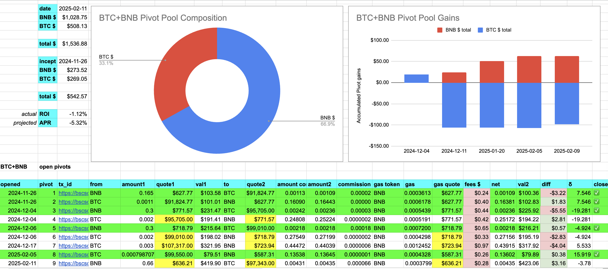

2025-02-11

Good morning, all! What amazing adventures lie in wait for us to discover TODAY?

They, themselves, must wait upon my breakfast and neighborhood walk, because #priorities. Since crypto is a medium of exchange, like money, it isn't everything: it's a means (medium).

# PIVOTS

BTC+BNB

I don't have a good close pivot today, but a wide swing to a negative δ calls for opening a BNB-on-BTC pivot, which I do. 

I am now hedged, both ways, on the BTC+BNB pivot pool with pivots open in both directions.

The BTC+BNB composition and γ-apportionment.

## BNB+LTC

I close a BNB-on-LTC pivot for gains of:

* actual ROI: 14.03% / 💥1707.01% APR💥 projected
* or: 0.169 $BNB -> $LTC -> 0.191 $BNB WHAAA??

The δ is negative, calling for a LTC-on-BNB pivot, but all $LTC is already committed.

The BNB+LTC composition and γ-apportionment:

# Conclusion

This concludes today's pivot arbitrage.

gains: ~ $15 on $105-worth assets pivoted. 

The [Pivot protocol](https://pivoteur.github.io/#)
