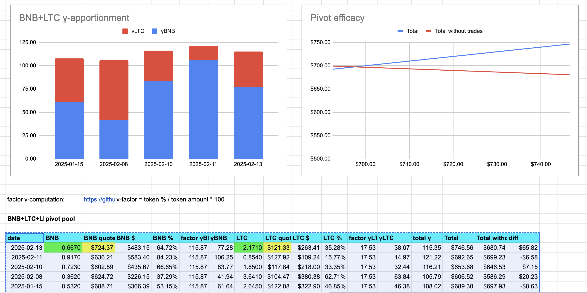

# Pivots

Hello, all

## BTC+BNB

Is there something wrong with the @binance smart chain? BSCScan is taking 10-20 minutes and the transaction is still not verified, [tx_id](https://bscscan.com/tx/0xfe11093e1b566b6ba5dba3b7a6c7c265e531d070315db0eeae1246f2df61a50d).

Anyway, a very negative δ calls to open a BNB-to-BTC pivot, and this I do.

The BTC+BNB pivot pool composition and γ-apportionment are as charted. 

## BNB+LTC

No close pivots today, but a positive δ calls to open a BNB-on-LTC pivot, which I do. 

I use half the available $BNB, the other half I keep in reserve for future (better?) BNB-on-LTC pivots.

The BNB+LTC composition and γ-apportionment are as charted. 

# Conclusion

This concludes pivots for today.

The [Pivot protocol](https://pivoteur.github.io/#)
