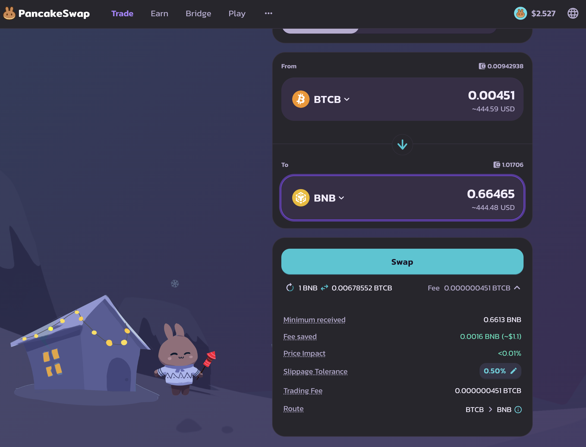
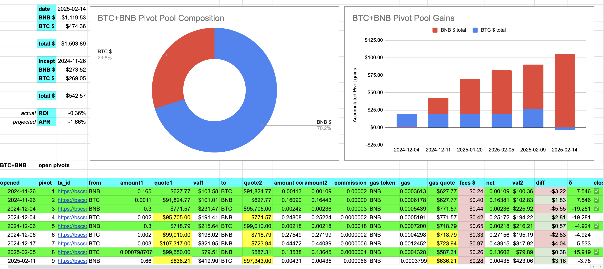
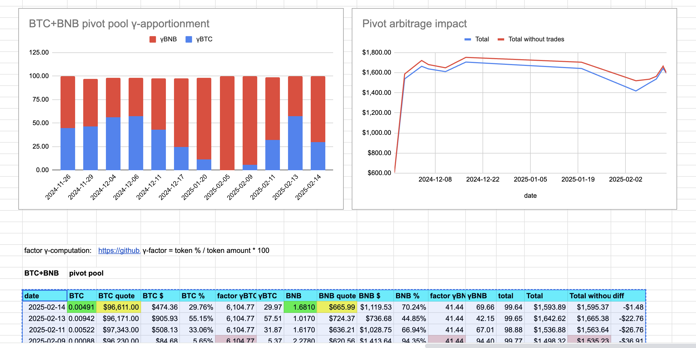

# Pivots

Unfortunately, we start the day poorly because of a delayed transaction misrepresented a trade-amount to me on a BTC+BNB pivot.

> Dear @binance @cz_binance @PancakeSwap:

> Saying that you're going to give me 0.00451 $BTC swapped for 0.6 $BNB, but then, because of INORDINATELY DELAYED transactions ([tx_id](https://bscscan.com/tx/0xfe11093e1b566b6ba5dba3b7a6c7c265e531d070315db0eeae1246f2df61a50d)) giving me only 0.0042 $BTC is a 7.5% difference. This is unacceptable.

> Do better.

## BTC+BNB

Huh.

"Maintenance"? 

I have a transaction pending today, as well, more than 24 hours later. 

@binance, where can I read about this maintenance? Are there times/days I should avoid trading? BSCScan doesn't have a link to what this maintenance is. Where do I get completion-status?

Before I knew BSC was going to be under "maintenance" I executed a trade closing the BNB-on-BTC pivot.

As I found out today, values can vary as much as 7.5%, or more, LOSING ME $BTC, I'm not going to report on this pivot until the transaction finalizes.

I'm done with BSC today.

15 minutes later, the transaction ([tx_id](https://bscscan.com/tx/0x4fae904ccc10fc0c407d2c811d25d68dca75ada2c8af341c1fe92fb82743c934)) is still not finalized on BSC. Is this acceptable transaction speed, @binance? 

$BTC and $BNB totals seem to be up-to-date, so I can report on the BTC+BNB pivot pool composition and γ-apportionment.

As you can see, ALL $BTC profits were wiped out and now I even owe a bit of $BTC, thanks to the delayed transaction finalization on BSC on @PancakeSwap @binance
