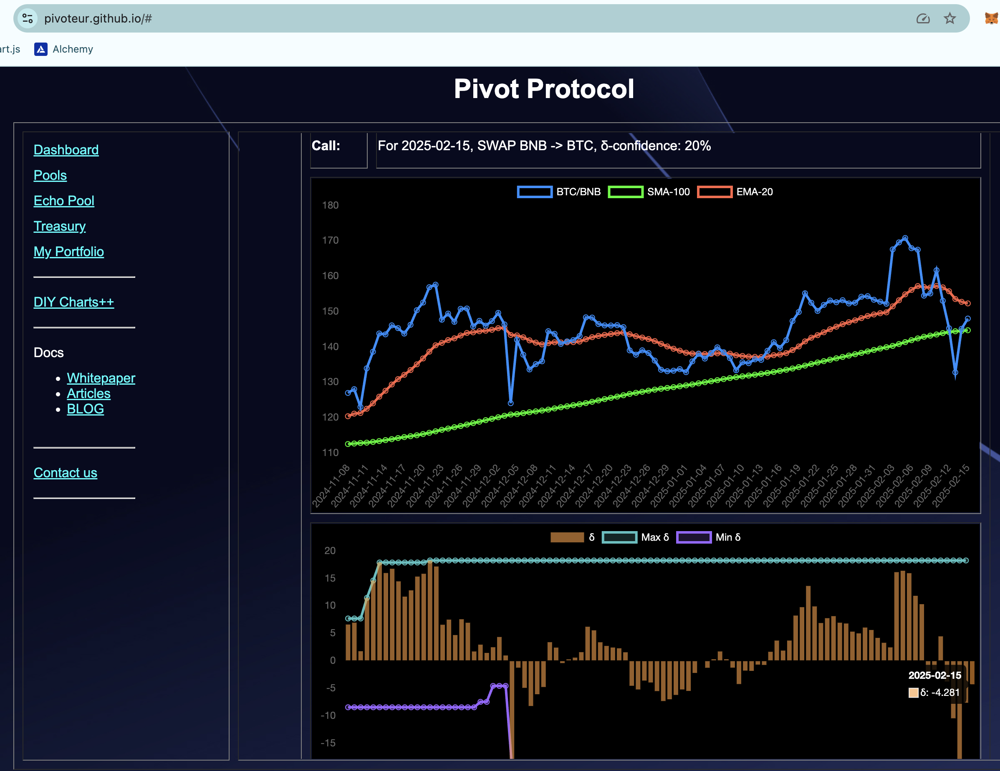
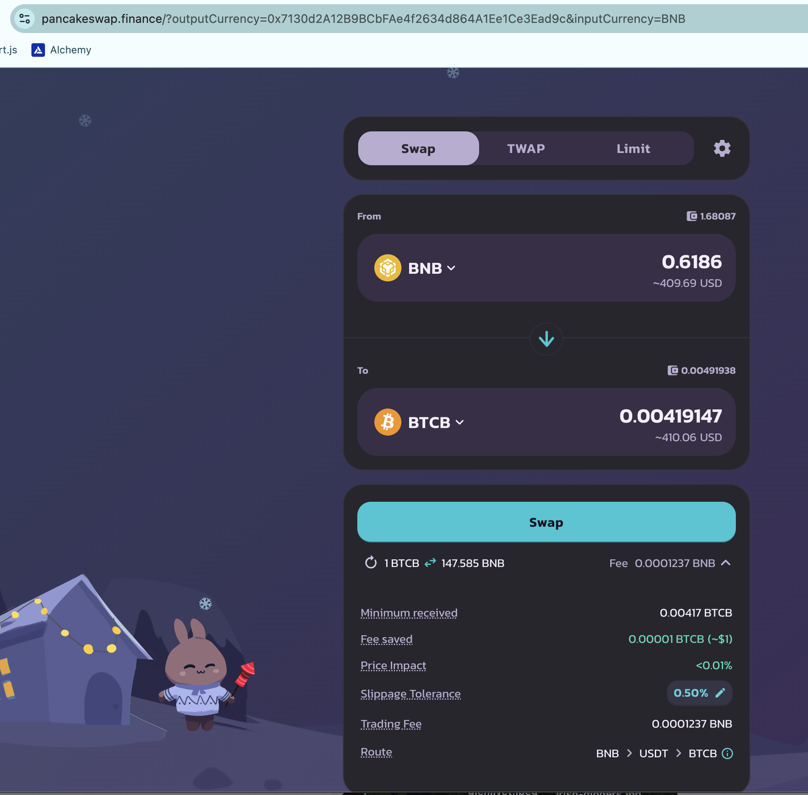
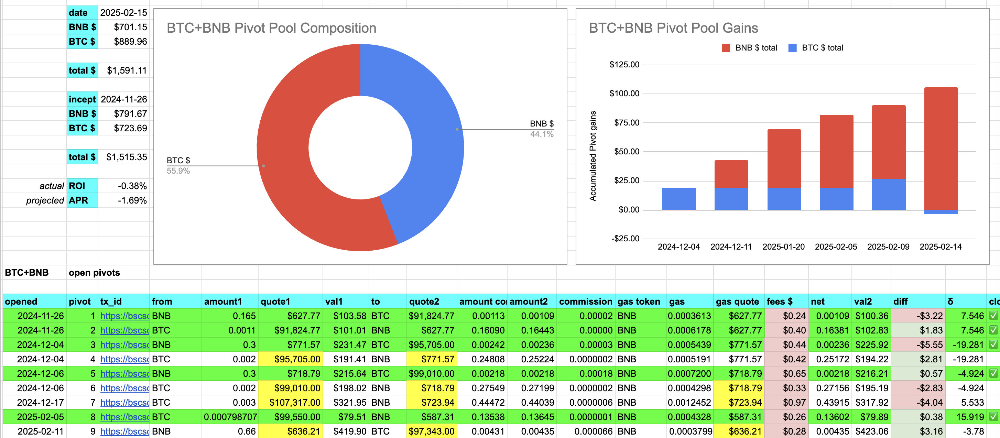
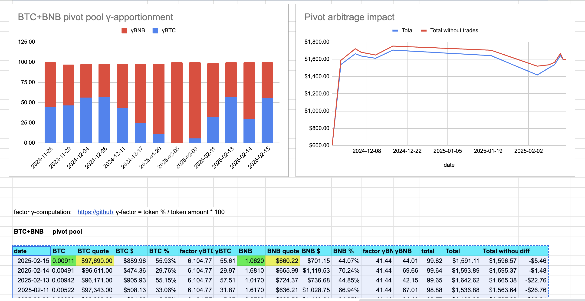
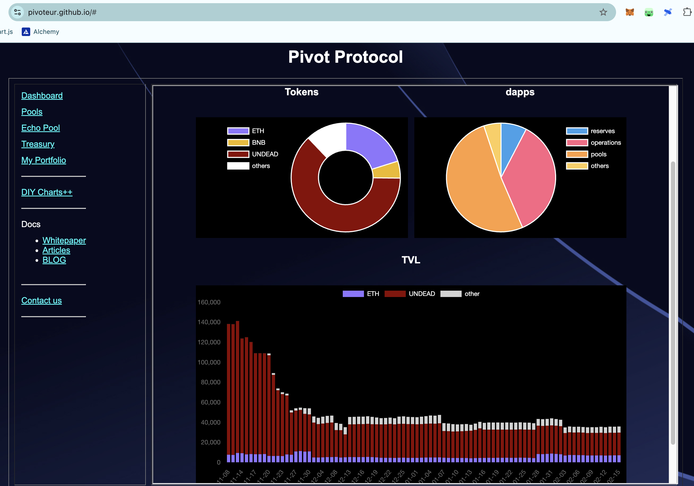

# PIVOTS

Good morning, all! @binance smart chain is responsive again now.

## BTC+BNB

No good close pivots. A negative δ calls to open a BNB-on-BTC pivot, so I do that.

The BTC+BNB pivot pool composition and γ-apportionment are as charted. 

# Conclusion

This concludes pivot arbitrage on the [Pivot protocol](https://pivoteur.github.io/#) for today.

HAND: Have A Nice Day! 😊
