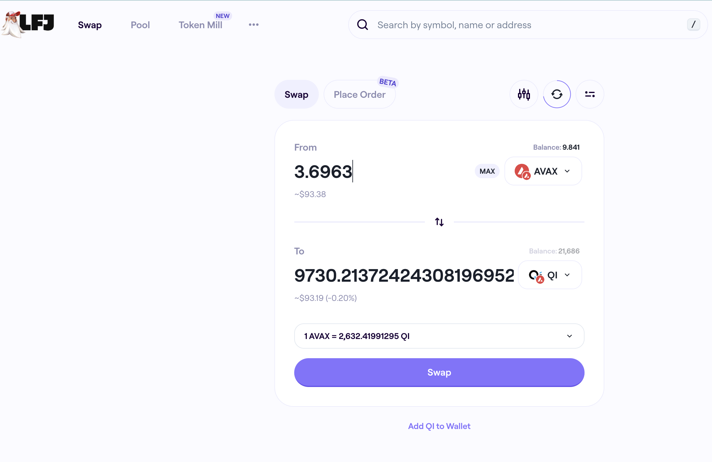
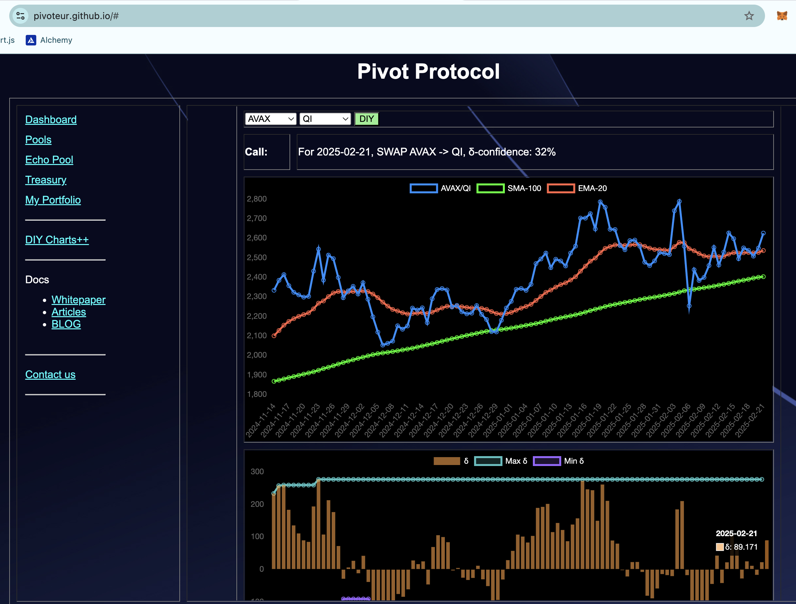
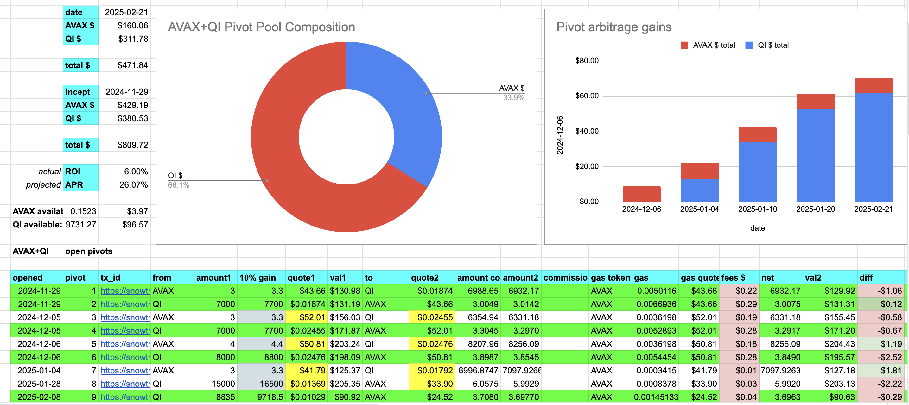
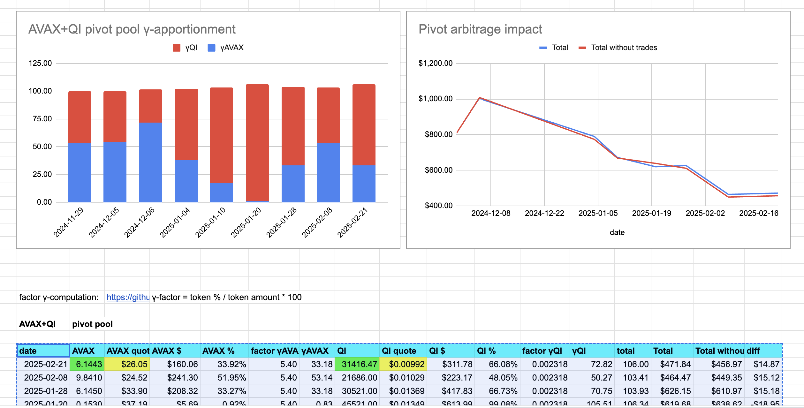
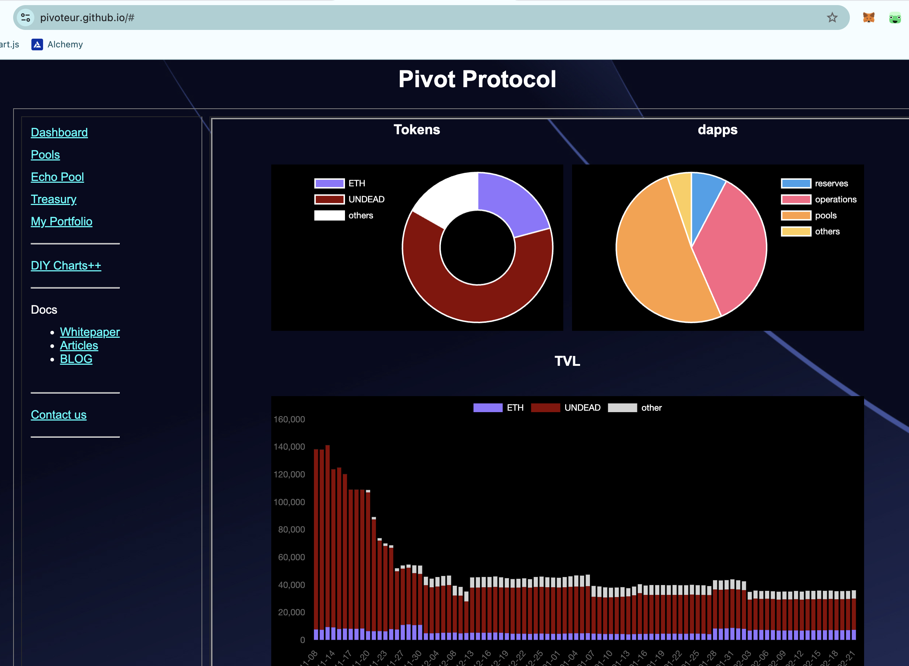

# PIVOTS

## AVAX+QI

WOOT! I close a QI-on-AVAX pivot for gains of:

* actual ROI: 10.10% / 283.55% APR projected
* or: 8875 $QI -> $AVAX -> 9730 $QI
* or: $8.80 gain on $90 traded

The δ is positive, calling to open an AVAX-on-QI pivot, but all $AVAX is already committed, so we rest.

# Conclusion

This concludes the pivots for today.

The [Pivot Protocol](https://pivoteur.github.io/#)
