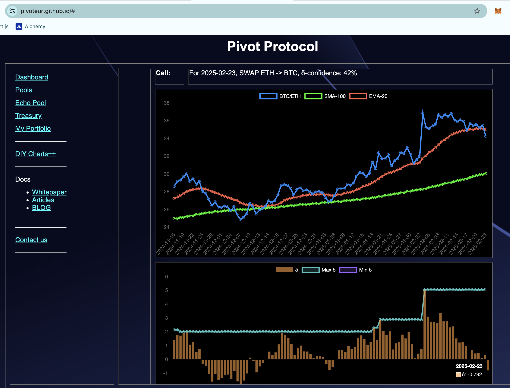
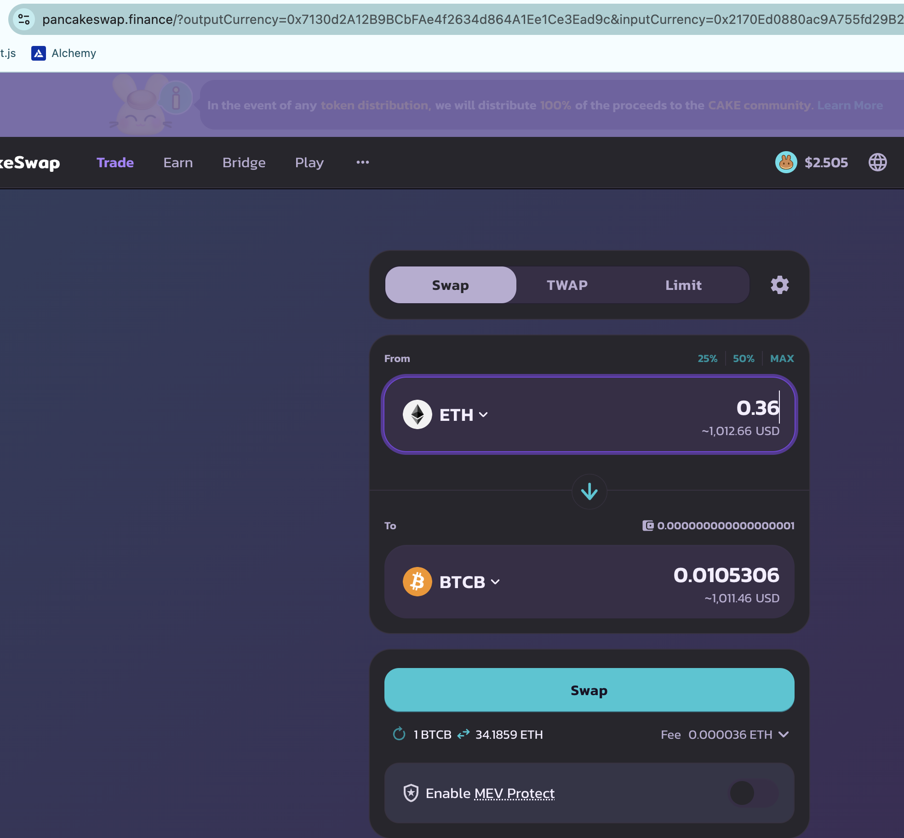
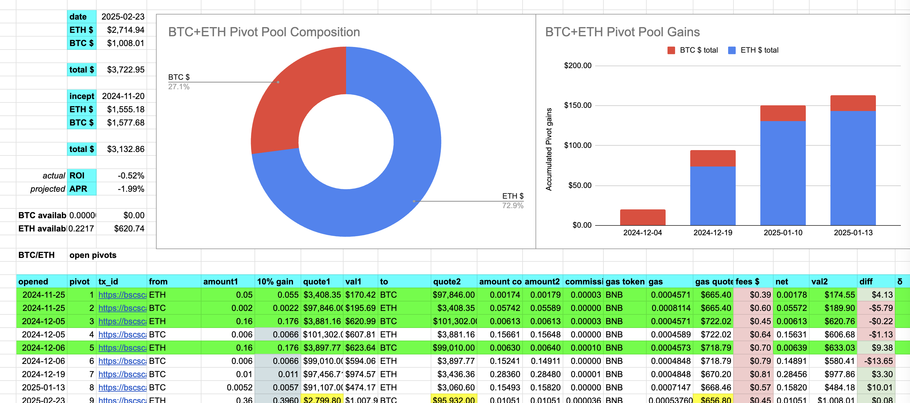
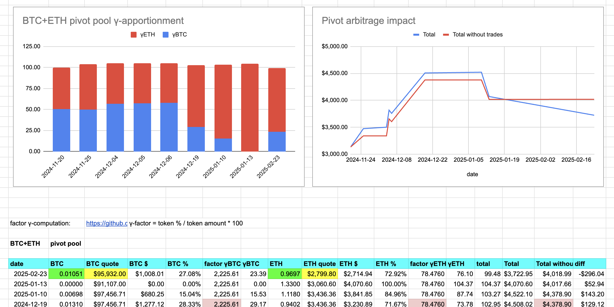
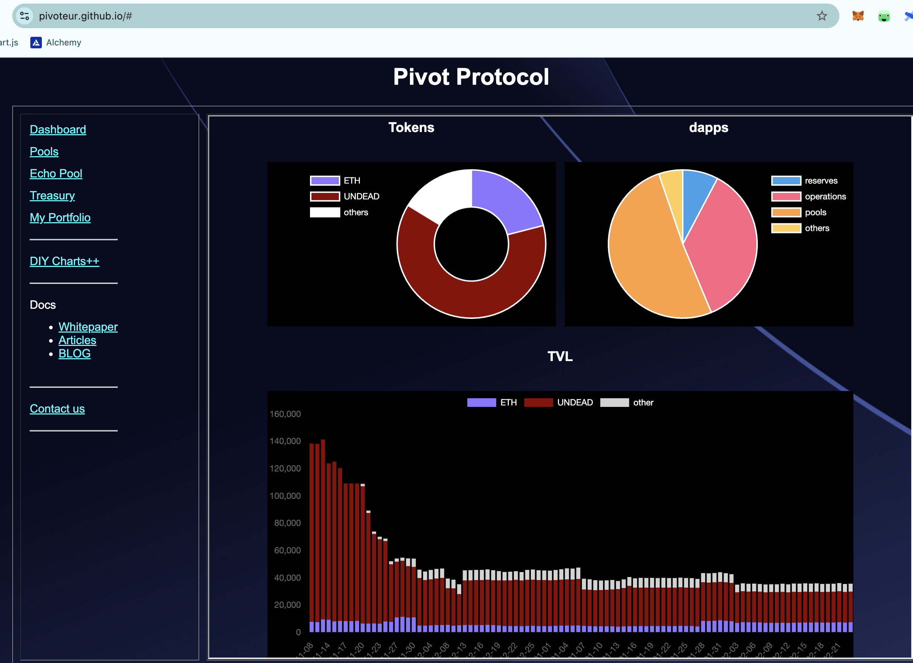

2025-02-23

Good morning, all! And innit a LOVELY MORNING??

# PIVOTS

## BTC+ETH

No close pivots, but – FINALLY! – a negative δ makes $BTC worth buying with $ETH to open an ETH-on-BTC pivot. You BETCHA I open this pivot!

The BTC+ETH pivot pool composition and γ-apportionment charts

# Conclusion

This concludes pivots for the protocol for today.

The [Pivot protocol](https://pivoteur.github.io/#)
