# PIVOTS

2025-02-28 Last day of February and we have a

## BTC+ETH

close pivot success for gains of:

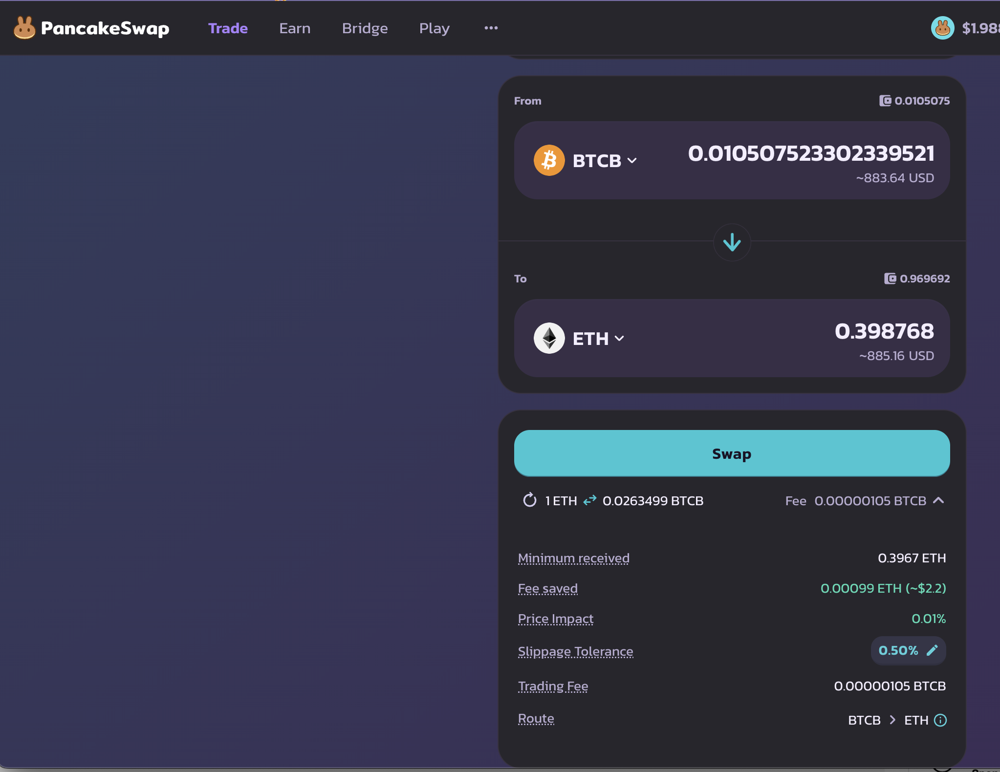

* actual ROI: 10.77% / 41.38% APR projected
* or: 0.36 $ETH -> $BTC -> 0.399 $ETH
* or: $82-gain on ~ $1000 pivot 

The positive δ calls to open an BTC-on-ETH pivot, but all $BTC is engaged

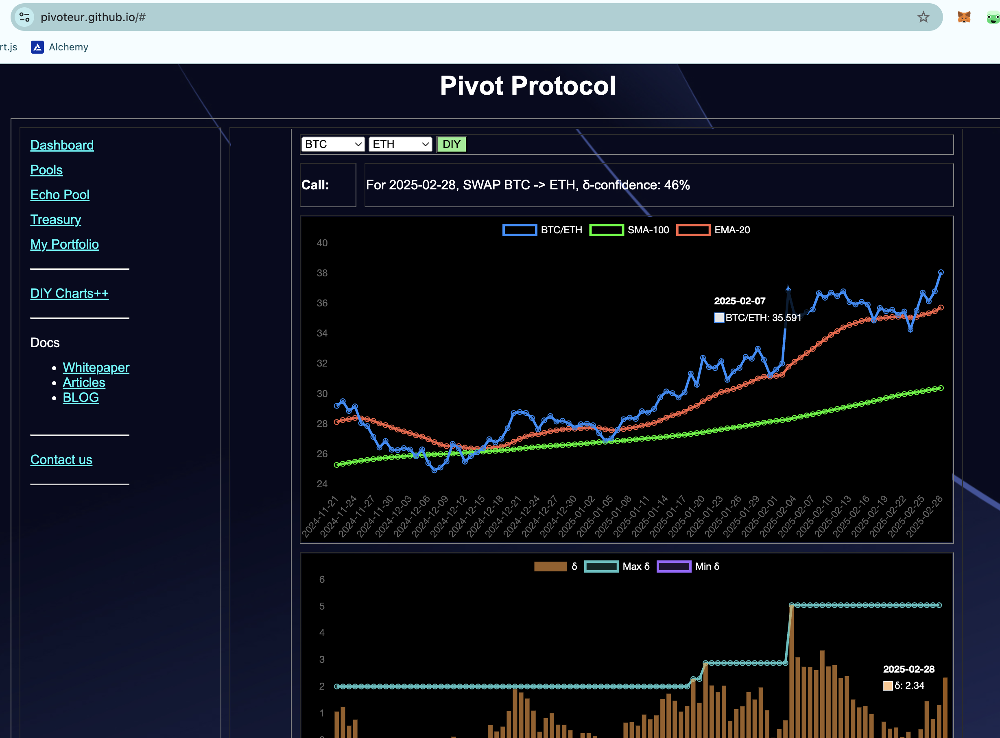
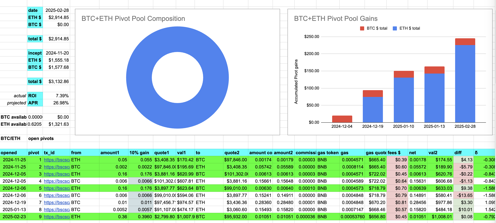
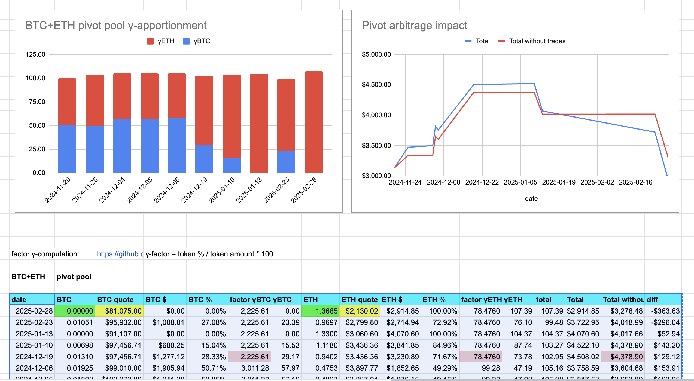

## BNB+LTC

I close a BNB-on-LTC pivot for gains of:

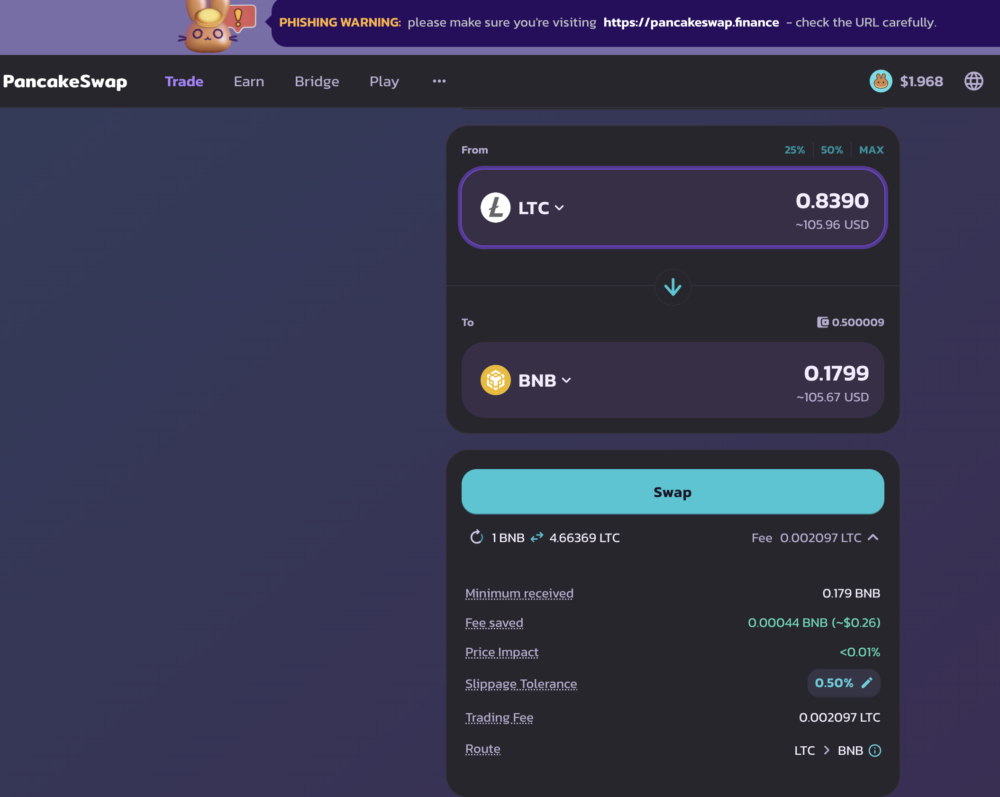

* actual ROI: 11.82% / 49.04% APR projected
* or: ~$11-gain on $100 pivot
* or: 0.16 $BNB -> $LTC -> 0.179 $BNB

Pivots BUIDL token bags using the tokens themselves. NEAT!

The BNB+LTC composition and γ-apportionment charted. 

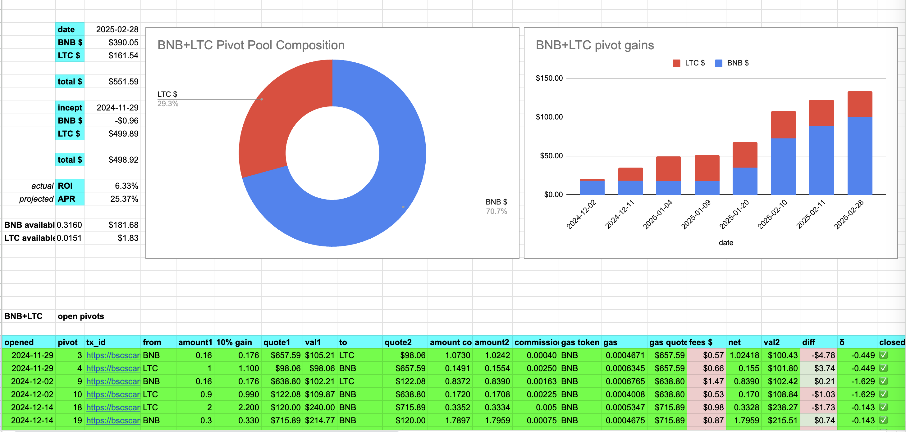
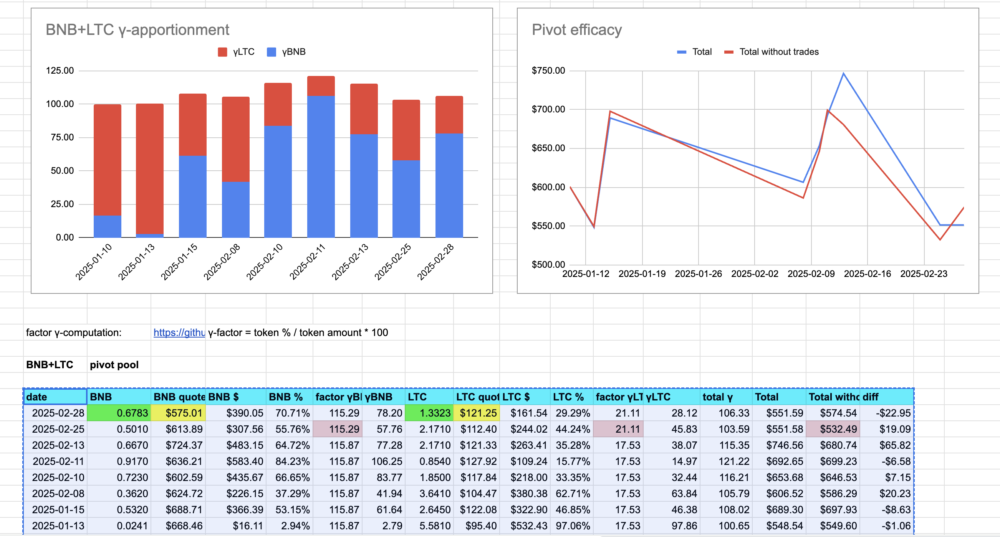

As shown on the EMA20-chart (highlighted here), ...

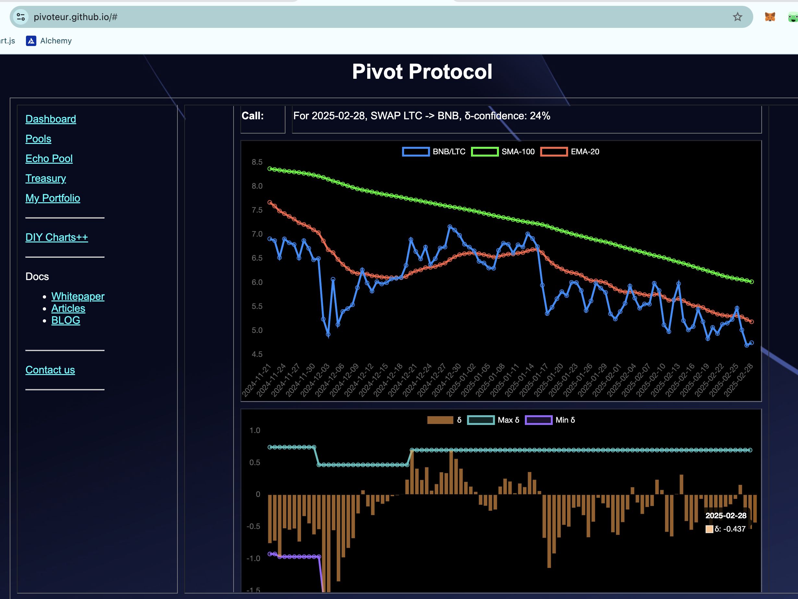

... the negative δ calls to open an LTC-on-BNB pivot, but all $LTC is already committed to pivots already.

So, there! 

## AVAX+QI

No close pivots today, but a negative δ calls to open a QI-on-AVAX pivot, which I do.

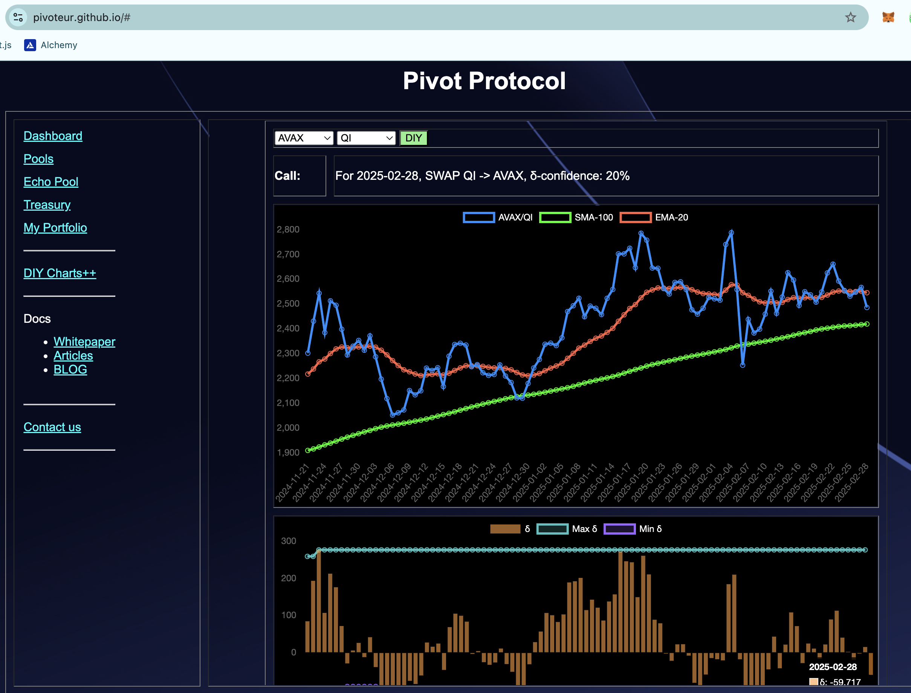
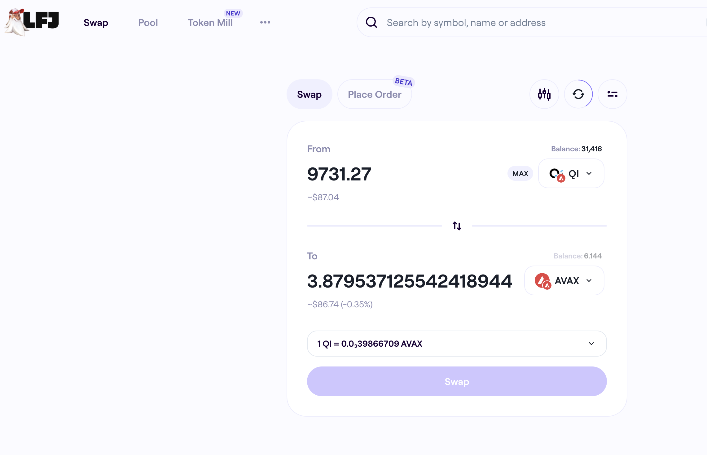

The AVAX+QI pivot pool composition and γ-apportionment are as charted. 

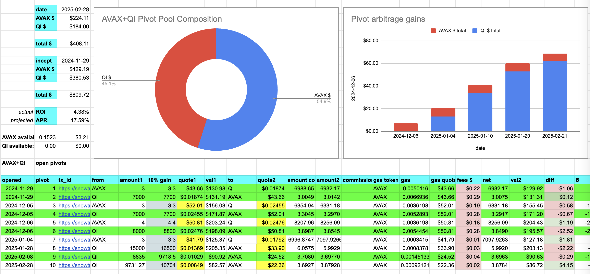
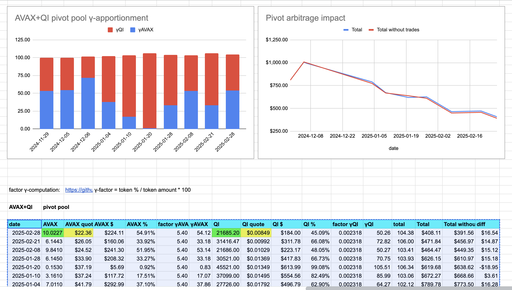

# Conclusion

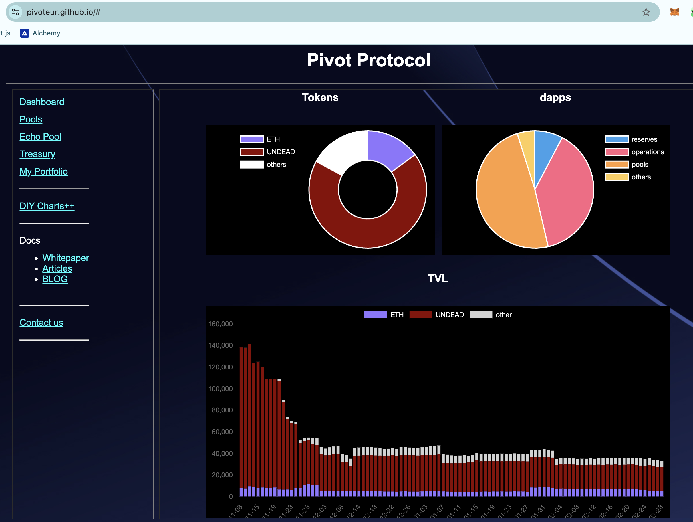

This concludes pivoting for today on the protocol

The [Pivot protocol](https://pivoteur.github.io/#)
