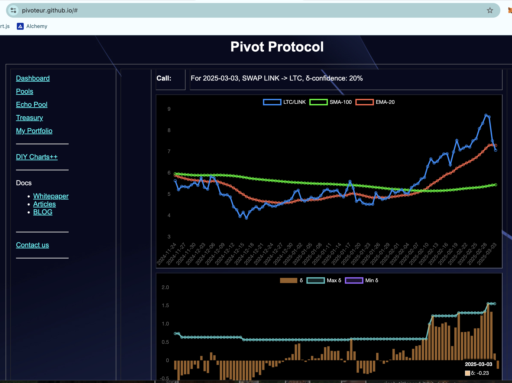
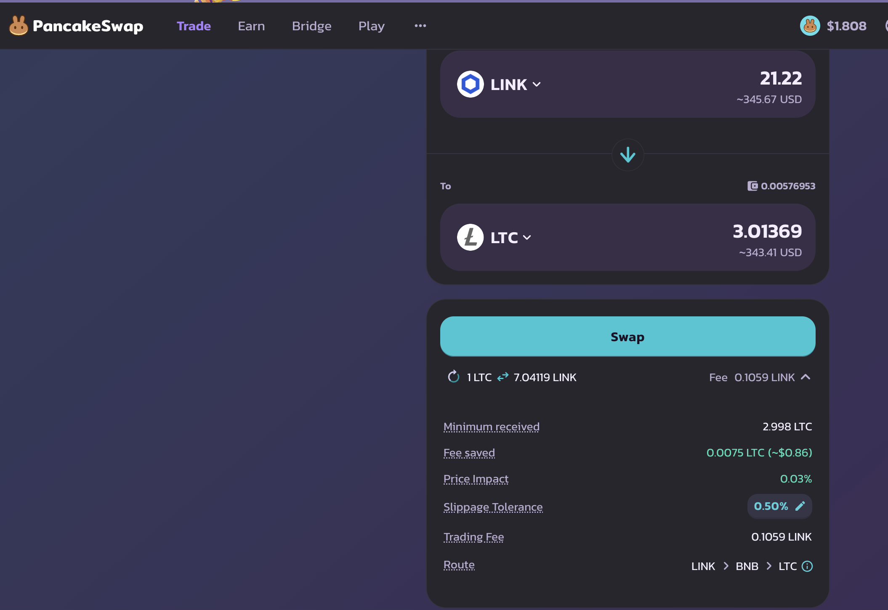
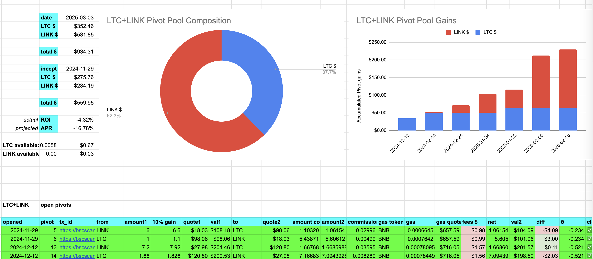
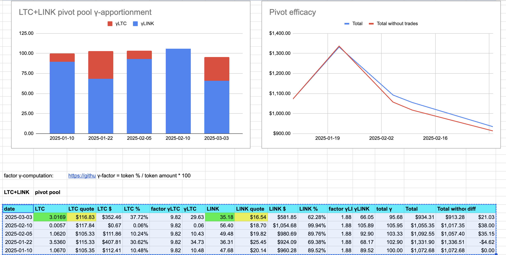
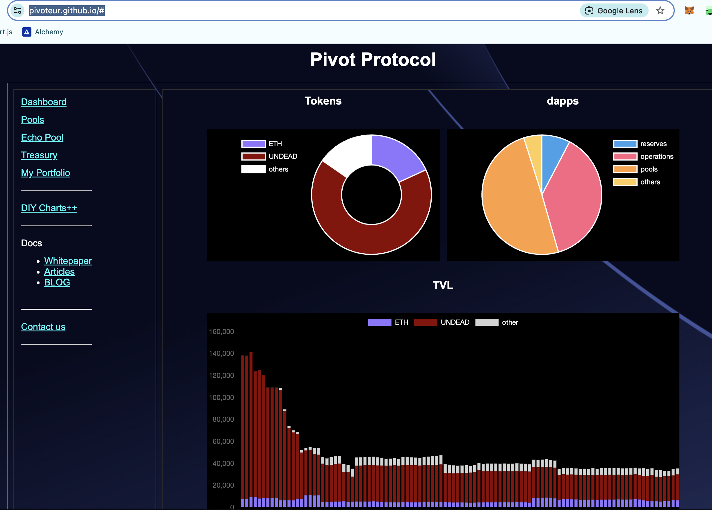

2025-03-03

Hello, all.

# PIVOTS

## LTC+LINK

No close pivots today but a negative δ calls to open a LINK-on-LTC pivot, so I do that.

The LTC+LINK pivot pool composition and γ-apportionment are as charted.

# Conclusion

This concludes pivoting for today. HAND! 😊

The [Pivot protocol](https://pivoteur.github.io/#)
